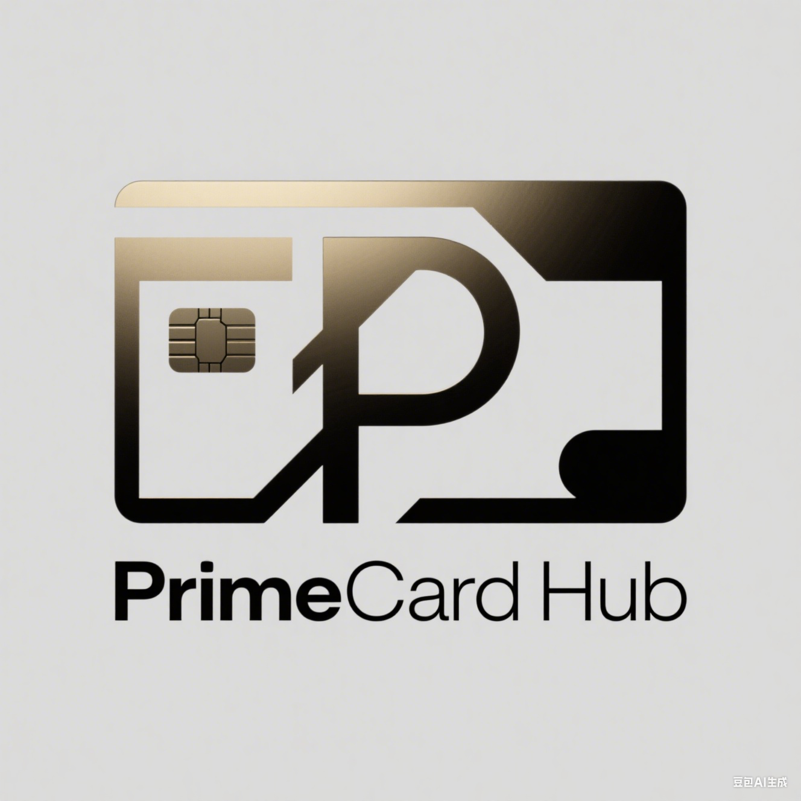

# PrimeCardHub(优卡汇)

## 概述

PrimeCard Hub 是一个为信用卡用户打造的开源信用卡资讯与管理平台。我们聚焦信用卡领域的实用信息整合与便捷服务，旨在帮助用户充分利用信用卡，实现获取优惠、获取有用资讯、便捷管理卡片等需求，让每一位用户都能充分享受信用卡带来的福利。

## 核心功能

### 1. 全面的信用卡资讯聚合&#xA;

*   **实用开卡信息**：汇集各大银行的信用卡产品，包括普通卡、金卡等，清晰解读各卡种的申请条件、基础权益、年费政策及常用服务，助您轻松找到适合自己的信用卡。

*   **实时优惠更新**：搜罗银行各类优惠活动，如购物折扣、餐饮优惠券、返现活动、分期福利等，让您及时把握获取更多价值的最佳时机。

*   **易懂行业资讯**：提供通俗易懂的信用卡行业动态、政策变化及银行福利调整解读，让您随时了解最新情况。

### 2. 智能用卡小技巧&#xA;

*   **个性化使用建议**：根据用户的消费习惯和持卡类型，生成实用的信用卡使用技巧，包括积分累积方法、账单还款提醒、免息期利用等，提升信用卡使用效率。

*   **优惠激活指南**：针对各类优惠福利，提供详细的激活步骤和使用方法，确保您能顺利享受到各种折扣和好处。

### 3. 便捷的卡片管理&#xA;

*   **多卡绑定与管理**：支持绑定多张信用卡，集中展示各卡的账单信息、可用额度、还款日期等关键数据，实现一站式卡片管理。

*   **安全绑定机制**：采用可靠的数据加密技术，支持通过官方授权接口绑定卡片，确保用户信息与金融数据的安全，让您用卡更放心。

## 产品优势

*   **实用性**：团队密切关注用户的实际需求，所有信息和技巧都注重实用、易操作，确保用户能真正从中受益。

*   **以用户为中心定位**：聚焦满足信用卡用户的日常需求，主打实用资讯和优惠信息，避免繁杂无用的内容。

*   **智能化**：借助简单的数据分析，为用户提供个性化服务，让每一位用户都能获得贴合自身情况的使用体验。

*   **安全性**：遵循相关安全标准，对用户数据进行加密存储与传输，保障用户的信息和资金安全。

## 适用人群

*   日常生活中使用信用卡的用户

*   追求性价比消费、关注优惠活动的用户

*   希望了解更多信用卡资讯、更好地使用信用卡的人群

*   经常使用信用卡进行购物、餐饮等日常消费的消费者

## 使用流程（规划中）

1.  下载并安装 PrimeCard Hub APP

2.  完成注册（保障账户安全）

3.  绑定您的信用卡（支持多家银行各类卡种，可选择官方授权接口绑定或手动添加）

4.  进入首页即可查看实用资讯、实时优惠及个性化使用技巧

**说明**：本项目目前处于构思和开发阶段。如果您有兴趣加入开发团队，欢迎通过 QQ：546253846 与我们联系。我们诚邀具备前端 / 后端开发、UI/UX 设计、金融产品分析等相关领域专业能力的开发者参与项目建设。

PrimeCard Hub，让您的信用卡使用更便捷、更具价值。