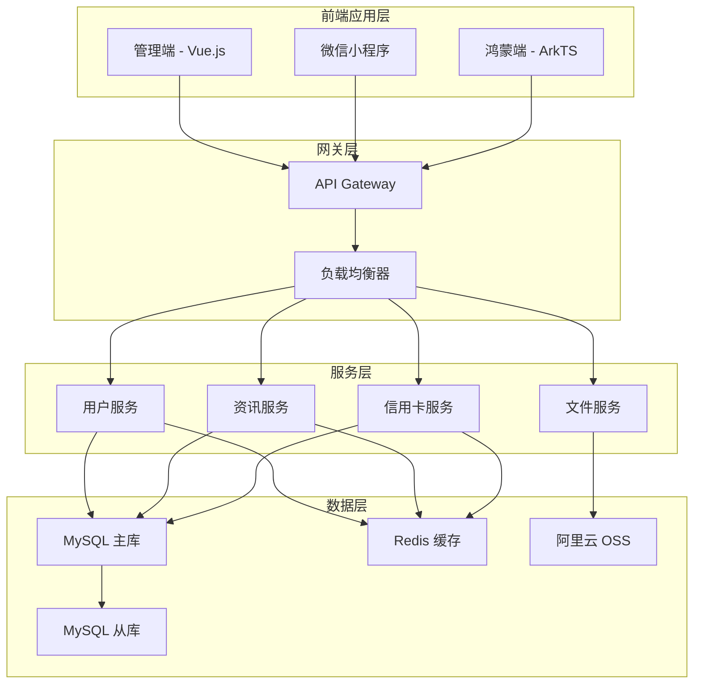
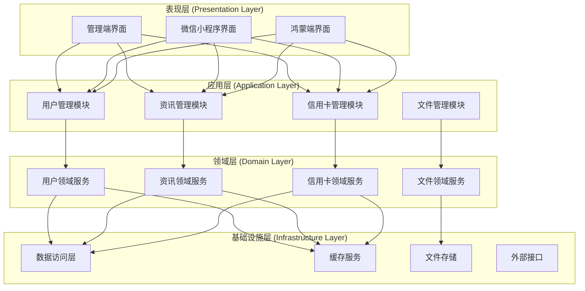
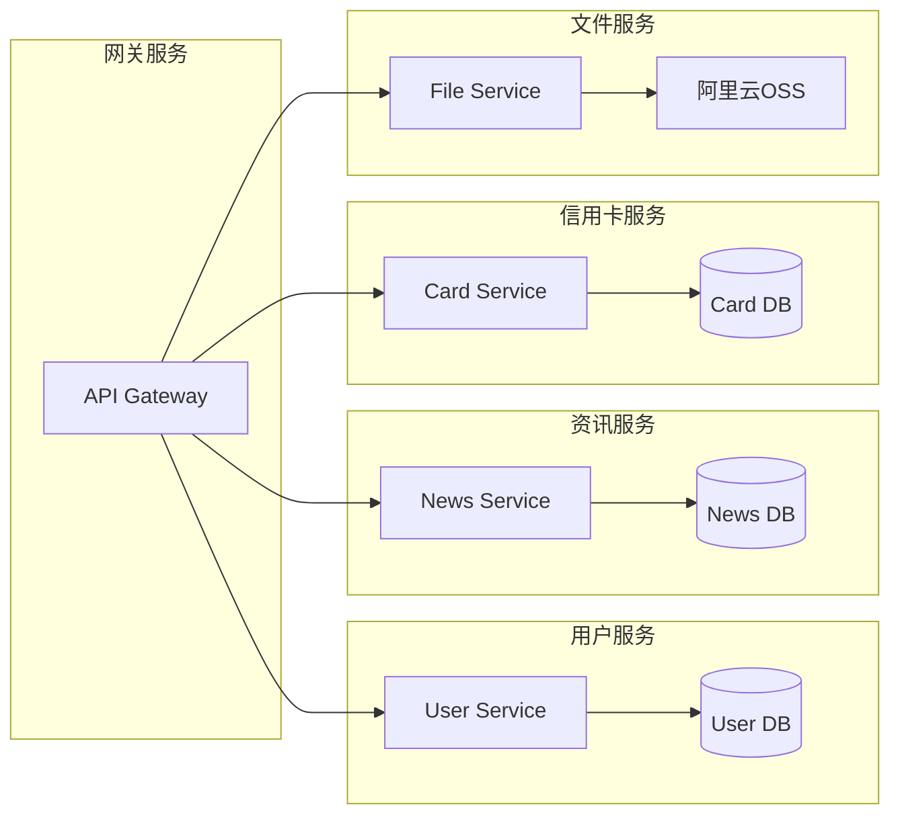
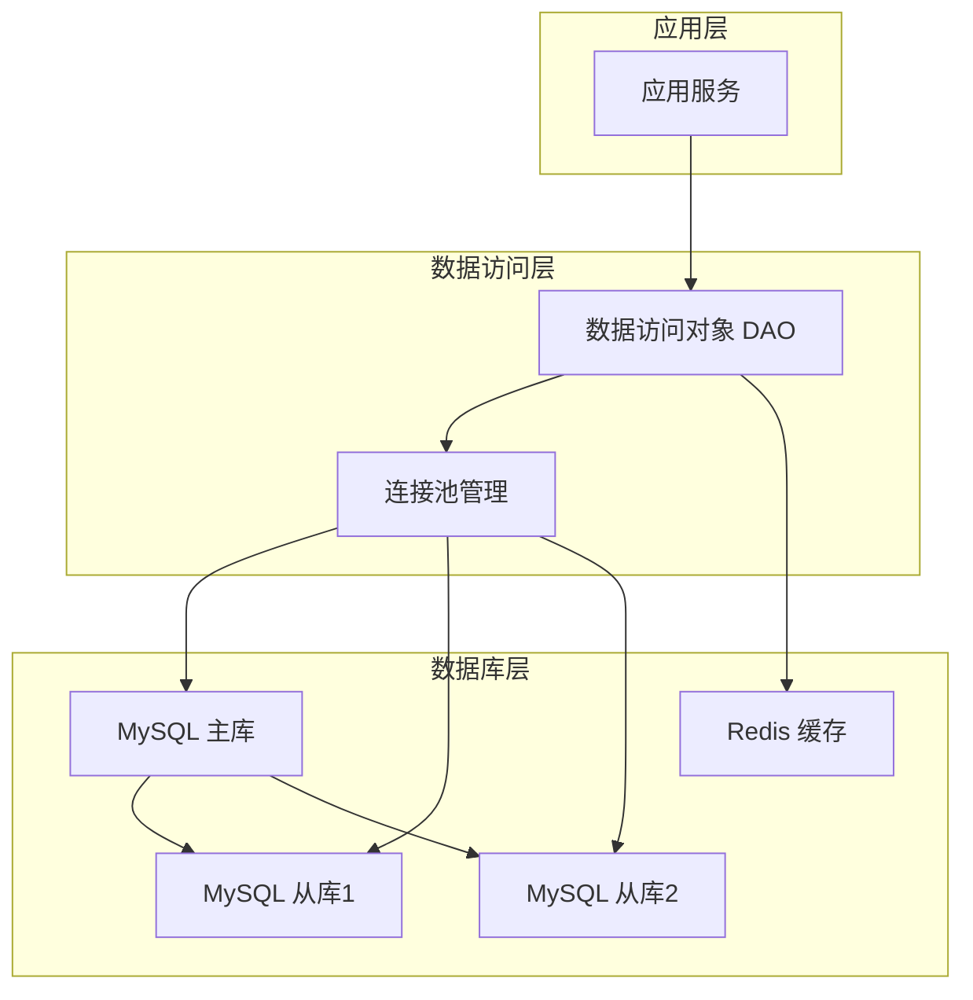
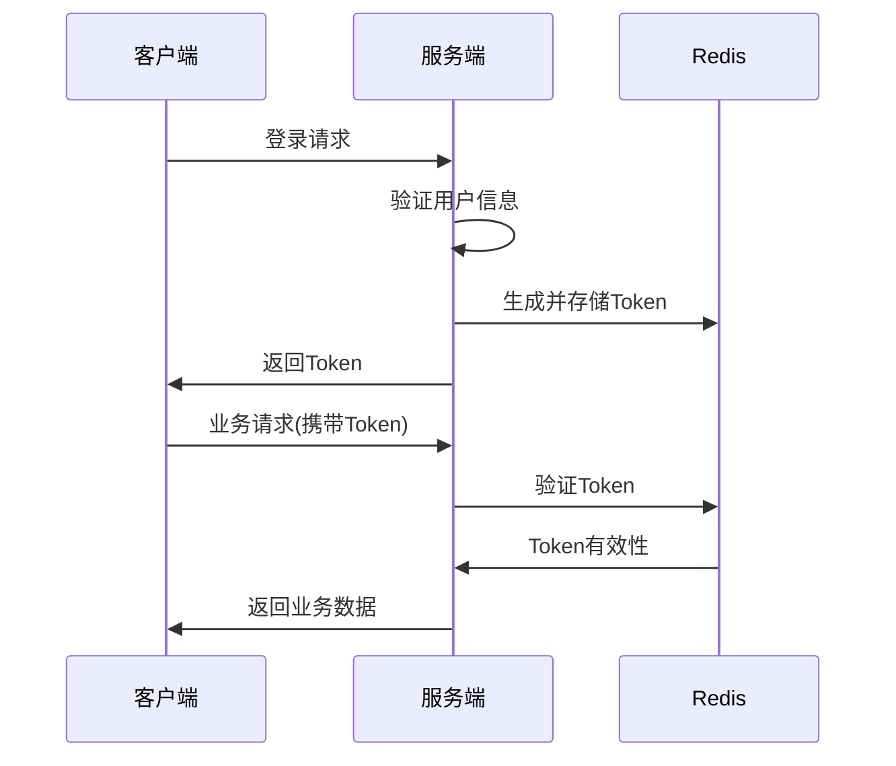
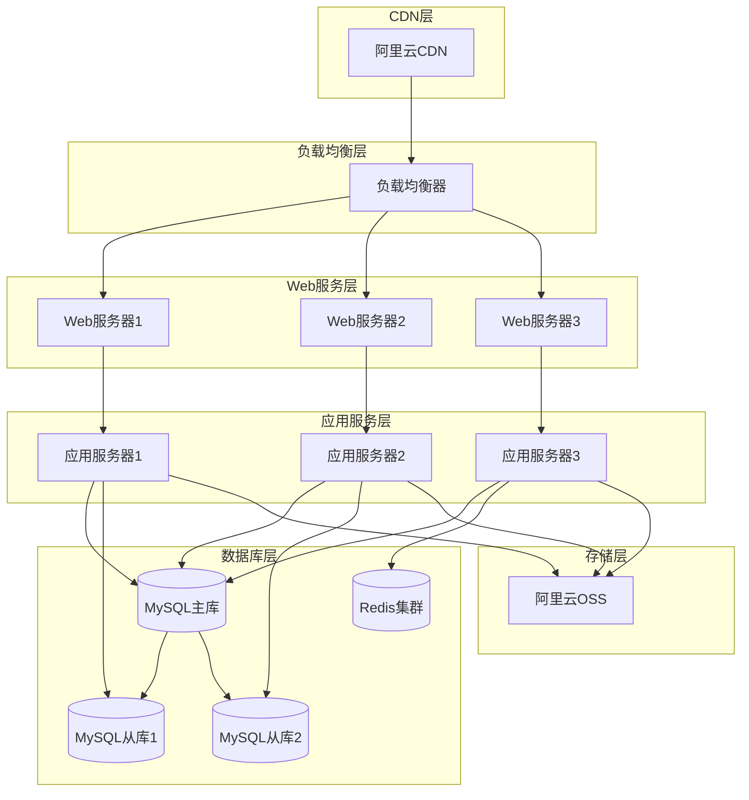
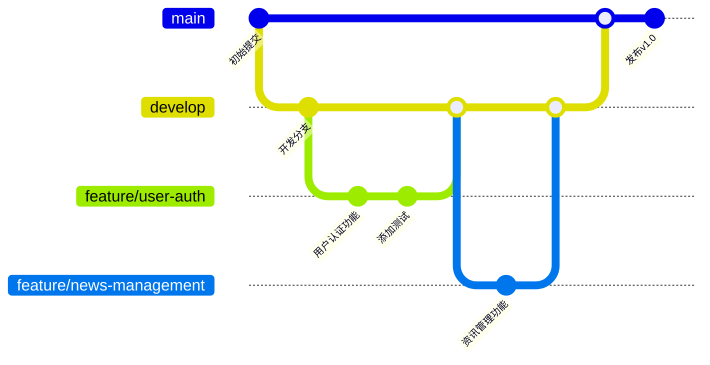

# PrimeCard Hub 技术设计文档

## 文档信息

| 项目 | 内容 |
|------|------|
| 文档名称 | PrimeCard Hub 技术设计文档 |
| 版本号 | V1.0 |
| 创建日期 | 2024-12-20 |
| 更新日期 | 2024-12-20 |
| 技术负责人 | 技术团队 |
| 产品经理 | 产品团队 |

---

# 1. 技术概述

## 1.1 项目架构

PrimeCard Hub 采用前后端分离的微服务架构，支持多端应用（管理端、微信小程序、鸿蒙端）。



## 1.2 技术选型

### 1.2.1 前端技术栈

| 应用端 | 框架/语言 | UI库 | 状态管理 | 构建工具 |
|--------|-----------|------|----------|----------|
| 管理端 | Vue.js 3.x | Element Plus | Pinia | Vite |
| 微信小程序 | 原生小程序 | WeUI | 自定义Store | 微信开发者工具 |
| 鸿蒙端 | ArkTS | ArkUI | 自定义Store | DevEco Studio |

### 1.2.2 后端技术栈

| 技术分类 | 技术选型 | 版本 | 说明 |
|----------|----------|------|------|
| 开发语言 | Node.js | 18.x | 服务端开发语言 |
| Web框架 | Express.js | 4.18.x | RESTful API框架 |
| 数据库 | MySQL | 8.0.x | 主数据库 |
| 缓存 | Redis | 7.0.x | 缓存和会话存储 |
| 消息队列 | Redis | 7.0.x | 异步任务处理 |
| 文件存储 | 阿里云OSS | - | 对象存储服务 |
| 容器化 | Docker | 20.x | 应用容器化 |
| 编排工具 | Docker Compose | 2.x | 本地开发环境 |

### 1.2.3 开发工具

| 工具类型 | 工具名称 | 用途 |
|----------|----------|------|
| 代码编辑器 | VS Code | 前端开发 |
| API测试 | Postman | 接口测试 |
| 数据库管理 | Navicat | 数据库管理 |
| 版本控制 | Git | 代码版本管理 |
| CI/CD | GitHub Actions | 持续集成部署 |

---

# 2. 系统架构设计

## 2.1 整体架构

### 2.1.1 分层架构



### 2.1.2 微服务架构



## 2.2 数据库设计

### 2.2.1 数据库架构



### 2.2.2 核心数据表设计

**用户表 (users)**

| 字段名 | 类型 | 长度 | 是否为空 | 默认值 | 说明 |
|--------|------|------|----------|--------|------|
| id | BIGINT | - | NO | AUTO_INCREMENT | 主键 |
| username | VARCHAR | 50 | NO | - | 用户名 |
| password | VARCHAR | 255 | YES | - | 密码(管理员) |
| email | VARCHAR | 100 | YES | - | 邮箱 |
| phone | VARCHAR | 20 | YES | - | 手机号 |
| avatar | VARCHAR | 255 | YES | - | 头像URL |
| user_type | TINYINT | - | NO | 1 | 用户类型(1:C端用户,2:管理员) |
| openid | VARCHAR | 100 | YES | - | 微信openid |
| unionid | VARCHAR | 100 | YES | - | 微信unionid |
| harmony_id | VARCHAR | 100 | YES | - | 鸿蒙用户ID |
| status | TINYINT | - | NO | 1 | 状态(1:正常,0:禁用) |
| created_at | TIMESTAMP | - | NO | CURRENT_TIMESTAMP | 创建时间 |
| updated_at | TIMESTAMP | - | NO | CURRENT_TIMESTAMP | 更新时间 |

**资讯表 (news)**

| 字段名 | 类型 | 长度 | 是否为空 | 默认值 | 说明 |
|--------|------|------|----------|--------|------|
| id | BIGINT | - | NO | AUTO_INCREMENT | 主键 |
| title | VARCHAR | 200 | NO | - | 标题 |
| content | LONGTEXT | - | NO | - | 内容(Markdown) |
| summary | TEXT | - | YES | - | 摘要 |
| cover_image | VARCHAR | 255 | YES | - | 封面图片 |
| category_id | BIGINT | - | YES | - | 分类ID |
| author_id | BIGINT | - | NO | - | 作者ID |
| view_count | INT | - | NO | 0 | 浏览次数 |
| like_count | INT | - | NO | 0 | 点赞次数 |
| status | TINYINT | - | NO | 1 | 状态(1:已发布,2:草稿,0:已删除) |
| is_top | TINYINT | - | NO | 0 | 是否置顶 |
| published_at | TIMESTAMP | - | YES | - | 发布时间 |
| created_at | TIMESTAMP | - | NO | CURRENT_TIMESTAMP | 创建时间 |
| updated_at | TIMESTAMP | - | NO | CURRENT_TIMESTAMP | 更新时间 |

**信用卡表 (credit_cards)**

| 字段名 | 类型 | 长度 | 是否为空 | 默认值 | 说明 |
|--------|------|------|----------|--------|------|
| id | BIGINT | - | NO | AUTO_INCREMENT | 主键 |
| bank_name | VARCHAR | 100 | NO | - | 银行名称 |
| card_name | VARCHAR | 100 | NO | - | 卡片名称 |
| card_type | VARCHAR | 50 | NO | - | 卡片类型 |
| annual_fee | DECIMAL | 10,2 | YES | - | 年费 |
| credit_limit | DECIMAL | 12,2 | YES | - | 信用额度 |
| application_condition | TEXT | - | YES | - | 申请条件 |
| benefits | TEXT | - | YES | - | 权益介绍 |
| features | JSON | - | YES | - | 特色功能 |
| bank_logo | VARCHAR | 255 | YES | - | 银行Logo |
| card_image | VARCHAR | 255 | YES | - | 卡片图片 |
| apply_url | VARCHAR | 500 | YES | - | 申请链接 |
| status | TINYINT | - | NO | 1 | 状态(1:正常,0:下架) |
| sort_order | INT | - | NO | 0 | 排序 |
| created_at | TIMESTAMP | - | NO | CURRENT_TIMESTAMP | 创建时间 |
| updated_at | TIMESTAMP | - | NO | CURRENT_TIMESTAMP | 更新时间 |

**用户信用卡表 (user_credit_cards)**

| 字段名 | 类型 | 长度 | 是否为空 | 默认值 | 说明 |
|--------|------|------|----------|--------|------|
| id | BIGINT | - | NO | AUTO_INCREMENT | 主键 |
| user_id | BIGINT | - | NO | - | 用户ID |
| card_id | BIGINT | - | NO | - | 信用卡ID |
| card_number | VARCHAR | 100 | YES | - | 卡号(加密存储) |
| card_holder | VARCHAR | 100 | YES | - | 持卡人姓名 |
| expiry_date | VARCHAR | 10 | YES | - | 有效期 |
| credit_limit | DECIMAL | 12,2 | YES | - | 个人信用额度 |
| bill_date | TINYINT | - | YES | - | 账单日 |
| due_date | TINYINT | - | YES | - | 还款日 |
| card_status | TINYINT | - | NO | 1 | 卡片状态(1:正常,2:冻结,0:注销) |
| notes | TEXT | - | YES | - | 备注 |
| created_at | TIMESTAMP | - | NO | CURRENT_TIMESTAMP | 创建时间 |
| updated_at | TIMESTAMP | - | NO | CURRENT_TIMESTAMP | 更新时间 |

### 2.2.3 索引设计

```sql
-- 用户表索引
CREATE INDEX idx_users_username ON users(username);
CREATE INDEX idx_users_phone ON users(phone);
CREATE INDEX idx_users_openid ON users(openid);
CREATE INDEX idx_users_status ON users(status);

-- 资讯表索引
CREATE INDEX idx_news_category_id ON news(category_id);
CREATE INDEX idx_news_author_id ON news(author_id);
CREATE INDEX idx_news_status ON news(status);
CREATE INDEX idx_news_published_at ON news(published_at);
CREATE INDEX idx_news_is_top ON news(is_top);

-- 信用卡表索引
CREATE INDEX idx_credit_cards_bank_name ON credit_cards(bank_name);
CREATE INDEX idx_credit_cards_card_type ON credit_cards(card_type);
CREATE INDEX idx_credit_cards_status ON credit_cards(status);
CREATE INDEX idx_credit_cards_sort_order ON credit_cards(sort_order);

-- 用户信用卡表索引
CREATE INDEX idx_user_credit_cards_user_id ON user_credit_cards(user_id);
CREATE INDEX idx_user_credit_cards_card_id ON user_credit_cards(card_id);
CREATE INDEX idx_user_credit_cards_status ON user_credit_cards(card_status);
```

---

# 3. API设计

## 3.1 API规范

### 3.1.1 RESTful API设计原则

- 使用HTTP动词表示操作：GET(查询)、POST(创建)、PUT(更新)、DELETE(删除)
- 使用名词表示资源：/users、/news、/cards
- 使用HTTP状态码表示结果
- 统一的响应格式

### 3.1.2 API响应格式

```json
{
  "code": 200,
  "message": "success",
  "data": {
    // 具体数据
  },
  "timestamp": 1703123456789
}
```

### 3.1.3 错误响应格式

```json
{
  "code": 400,
  "message": "参数错误",
  "error": "用户名不能为空",
  "timestamp": 1703123456789
}
```

## 3.2 核心API接口

### 3.2.1 用户管理API

**用户登录**
```http
POST /api/auth/login
Content-Type: application/json

{
  "username": "admin",
  "password": "123456"
}
```

**微信小程序登录**
```http
POST /api/auth/wechat/login
Content-Type: application/json

{
  "code": "wx_code",
  "userInfo": {
    "nickName": "用户昵称",
    "avatarUrl": "头像URL"
  }
}
```

**鸿蒙端登录**
```http
POST /api/auth/harmony/login
Content-Type: application/json

{
  "authCode": "harmony_auth_code",
  "userInfo": {
    "nickName": "用户昵称",
    "avatar": "头像URL"
  }
}
```

### 3.2.2 资讯管理API

**获取资讯列表**
```http
GET /api/news?page=1&size=10&category=1&status=1
```

**创建资讯**
```http
POST /api/news
Content-Type: application/json

{
  "title": "资讯标题",
  "content": "Markdown内容",
  "summary": "摘要",
  "categoryId": 1,
  "coverImage": "封面图片URL",
  "isTop": false
}
```

**更新资讯**
```http
PUT /api/news/:id
Content-Type: application/json

{
  "title": "更新后的标题",
  "content": "更新后的内容"
}
```

**删除资讯**
```http
DELETE /api/news/:id
```

### 3.2.3 信用卡管理API

**获取信用卡列表**
```http
GET /api/cards?page=1&size=10&bankName=招商银行&cardType=金卡
```

**创建信用卡**
```http
POST /api/cards
Content-Type: application/json

{
  "bankName": "招商银行",
  "cardName": "Young卡",
  "cardType": "普卡",
  "annualFee": 0,
  "applicationCondition": "18-30岁",
  "benefits": "餐饮5倍积分",
  "features": ["免年费", "积分永久有效"]
}
```

**用户添加信用卡**
```http
POST /api/user/cards
Content-Type: application/json

{
  "cardId": 1,
  "cardNumber": "encrypted_card_number",
  "cardHolder": "持卡人姓名",
  "expiryDate": "12/28",
  "creditLimit": 50000,
  "billDate": 5,
  "dueDate": 23
}
```

### 3.2.4 文件上传API

**上传图片**
```http
POST /api/upload/image
Content-Type: multipart/form-data

file: [图片文件]
```

**批量上传**
```http
POST /api/upload/batch
Content-Type: multipart/form-data

files: [多个文件]
```

## 3.3 API安全设计

### 3.3.1 认证机制



### 3.3.2 权限控制

```javascript
// 权限中间件
const authMiddleware = (requiredRole) => {
  return (req, res, next) => {
    const token = req.headers.authorization;
    const user = verifyToken(token);
    
    if (!user) {
      return res.status(401).json({
        code: 401,
        message: '未授权访问'
      });
    }
    
    if (requiredRole && user.role !== requiredRole) {
      return res.status(403).json({
        code: 403,
        message: '权限不足'
      });
    }
    
    req.user = user;
    next();
  };
};

// 使用示例
app.get('/api/admin/users', authMiddleware('admin'), getUserList);
```

### 3.3.3 数据加密

```javascript
// 敏感数据加密
const crypto = require('crypto');

class EncryptionService {
  constructor() {
    this.algorithm = 'aes-256-gcm';
    this.secretKey = process.env.ENCRYPTION_KEY;
  }
  
  encrypt(text) {
    const iv = crypto.randomBytes(16);
    const cipher = crypto.createCipher(this.algorithm, this.secretKey);
    cipher.setAAD(Buffer.from('additional data'));
    
    let encrypted = cipher.update(text, 'utf8', 'hex');
    encrypted += cipher.final('hex');
    
    const authTag = cipher.getAuthTag();
    
    return {
      encrypted,
      iv: iv.toString('hex'),
      authTag: authTag.toString('hex')
    };
  }
  
  decrypt(encryptedData) {
    const decipher = crypto.createDecipher(this.algorithm, this.secretKey);
    decipher.setAAD(Buffer.from('additional data'));
    decipher.setAuthTag(Buffer.from(encryptedData.authTag, 'hex'));
    
    let decrypted = decipher.update(encryptedData.encrypted, 'hex', 'utf8');
    decrypted += decipher.final('utf8');
    
    return decrypted;
  }
}
```

---

# 4. 前端技术实现

## 4.1 管理端技术实现

### 4.1.1 项目结构

```
admin-frontend/
├── public/
│   ├── index.html
│   └── favicon.ico
├── src/
│   ├── api/                 # API接口
│   ├── assets/             # 静态资源
│   ├── components/         # 公共组件
│   ├── layouts/            # 布局组件
│   ├── pages/              # 页面组件
│   ├── router/             # 路由配置
│   ├── store/              # 状态管理
│   ├── styles/             # 样式文件
│   ├── utils/              # 工具函数
│   ├── App.vue
│   └── main.js
├── package.json
└── vite.config.js
```

### 4.1.2 核心组件实现

**Markdown编辑器组件**

```vue
<template>
  <div class="markdown-editor">
    <div class="editor-toolbar">
      <button @click="insertBold">粗体</button>
      <button @click="insertItalic">斜体</button>
      <button @click="insertLink">链接</button>
      <button @click="insertImage">图片</button>
      <button @click="togglePreview">{{ showPreview ? '编辑' : '预览' }}</button>
    </div>
    
    <div class="editor-content" :class="{ 'split-view': showPreview }">
      <textarea
        v-if="!showPreview || showPreview"
        v-model="content"
        class="editor-textarea"
        placeholder="请输入Markdown内容..."
        @input="handleInput"
      ></textarea>
      
      <div
        v-if="showPreview"
        class="preview-content"
        v-html="renderedContent"
      ></div>
    </div>
  </div>
</template>

<script>
import { marked } from 'marked';
import { ref, computed, watch } from 'vue';

export default {
  name: 'MarkdownEditor',
  props: {
    modelValue: {
      type: String,
      default: ''
    }
  },
  emits: ['update:modelValue'],
  setup(props, { emit }) {
    const content = ref(props.modelValue);
    const showPreview = ref(false);
    
    const renderedContent = computed(() => {
      return marked(content.value);
    });
    
    const handleInput = () => {
      emit('update:modelValue', content.value);
    };
    
    const insertBold = () => {
      insertText('**', '**');
    };
    
    const insertItalic = () => {
      insertText('*', '*');
    };
    
    const insertLink = () => {
      insertText('[链接文字](', ')');
    };
    
    const insertImage = () => {
      insertText('');
    };
    
    const insertText = (before, after) => {
      const textarea = document.querySelector('.editor-textarea');
      const start = textarea.selectionStart;
      const end = textarea.selectionEnd;
      const selectedText = content.value.substring(start, end);
      
      const newText = before + selectedText + after;
      content.value = content.value.substring(0, start) + newText + content.value.substring(end);
      
      emit('update:modelValue', content.value);
    };
    
    const togglePreview = () => {
      showPreview.value = !showPreview.value;
    };
    
    watch(() => props.modelValue, (newValue) => {
      content.value = newValue;
    });
    
    return {
      content,
      showPreview,
      renderedContent,
      handleInput,
      insertBold,
      insertItalic,
      insertLink,
      insertImage,
      togglePreview
    };
  }
};
</script>
```

**数据表格组件**

```vue
<template>
  <div class="data-table">
    <div class="table-header">
      <div class="table-actions">
        <el-button type="primary" @click="handleAdd">新增</el-button>
        <el-button type="danger" @click="handleBatchDelete" :disabled="!selectedRows.length">
          批量删除
        </el-button>
      </div>
      <div class="table-search">
        <el-input
          v-model="searchKeyword"
          placeholder="搜索..."
          @input="handleSearch"
          clearable
        >
          <template #prefix>
            <el-icon><Search /></el-icon>
          </template>
        </el-input>
      </div>
    </div>
    
    <el-table
      :data="tableData"
      @selection-change="handleSelectionChange"
      v-loading="loading"
    >
      <el-table-column type="selection" width="55" />
      <el-table-column
        v-for="column in columns"
        :key="column.prop"
        :prop="column.prop"
        :label="column.label"
        :width="column.width"
        :formatter="column.formatter"
      />
      <el-table-column label="操作" width="150">
        <template #default="{ row }">
          <el-button size="small" @click="handleEdit(row)">编辑</el-button>
          <el-button size="small" type="danger" @click="handleDelete(row)">删除</el-button>
        </template>
      </el-table-column>
    </el-table>
    
    <div class="table-pagination">
      <el-pagination
        v-model:current-page="currentPage"
        v-model:page-size="pageSize"
        :total="total"
        :page-sizes="[10, 20, 50, 100]"
        layout="total, sizes, prev, pager, next, jumper"
        @size-change="handleSizeChange"
        @current-change="handleCurrentChange"
      />
    </div>
  </div>
</template>

<script>
import { ref, reactive, onMounted } from 'vue';
import { ElMessage, ElMessageBox } from 'element-plus';

export default {
  name: 'DataTable',
  props: {
    columns: {
      type: Array,
      required: true
    },
    api: {
      type: Object,
      required: true
    }
  },
  emits: ['add', 'edit'],
  setup(props, { emit }) {
    const tableData = ref([]);
    const selectedRows = ref([]);
    const loading = ref(false);
    const searchKeyword = ref('');
    const currentPage = ref(1);
    const pageSize = ref(10);
    const total = ref(0);
    
    const loadData = async () => {
      loading.value = true;
      try {
        const params = {
          page: currentPage.value,
          size: pageSize.value,
          keyword: searchKeyword.value
        };
        
        const response = await props.api.getList(params);
        tableData.value = response.data.list;
        total.value = response.data.total;
      } catch (error) {
        ElMessage.error('数据加载失败');
      } finally {
        loading.value = false;
      }
    };
    
    const handleAdd = () => {
      emit('add');
    };
    
    const handleEdit = (row) => {
      emit('edit', row);
    };
    
    const handleDelete = async (row) => {
      try {
        await ElMessageBox.confirm('确定要删除这条记录吗？', '提示', {
          confirmButtonText: '确定',
          cancelButtonText: '取消',
          type: 'warning'
        });
        
        await props.api.delete(row.id);
        ElMessage.success('删除成功');
        loadData();
      } catch (error) {
        if (error !== 'cancel') {
          ElMessage.error('删除失败');
        }
      }
    };
    
    const handleBatchDelete = async () => {
      try {
        await ElMessageBox.confirm(`确定要删除选中的 ${selectedRows.value.length} 条记录吗？`, '提示', {
          confirmButtonText: '确定',
          cancelButtonText: '取消',
          type: 'warning'
        });
        
        const ids = selectedRows.value.map(row => row.id);
        await props.api.batchDelete(ids);
        ElMessage.success('批量删除成功');
        loadData();
      } catch (error) {
        if (error !== 'cancel') {
          ElMessage.error('批量删除失败');
        }
      }
    };
    
    const handleSelectionChange = (selection) => {
      selectedRows.value = selection;
    };
    
    const handleSearch = () => {
      currentPage.value = 1;
      loadData();
    };
    
    const handleSizeChange = () => {
      currentPage.value = 1;
      loadData();
    };
    
    const handleCurrentChange = () => {
      loadData();
    };
    
    onMounted(() => {
      loadData();
    });
    
    return {
      tableData,
      selectedRows,
      loading,
      searchKeyword,
      currentPage,
      pageSize,
      total,
      handleAdd,
      handleEdit,
      handleDelete,
      handleBatchDelete,
      handleSelectionChange,
      handleSearch,
      handleSizeChange,
      handleCurrentChange
    };
  }
};
</script>
```

### 4.1.3 状态管理

```javascript
// store/modules/user.js
import { defineStore } from 'pinia';
import { login, logout, getUserInfo } from '@/api/auth';

export const useUserStore = defineStore('user', {
  state: () => ({
    token: localStorage.getItem('token') || '',
    userInfo: null,
    permissions: []
  }),
  
  getters: {
    isLoggedIn: (state) => !!state.token,
    hasPermission: (state) => (permission) => {
      return state.permissions.includes(permission);
    }
  },
  
  actions: {
    async login(credentials) {
      try {
        const response = await login(credentials);
        const { token, userInfo } = response.data;
        
        this.token = token;
        this.userInfo = userInfo;
        localStorage.setItem('token', token);
        
        return response;
      } catch (error) {
        throw error;
      }
    },
    
    async logout() {
      try {
        await logout();
      } finally {
        this.token = '';
        this.userInfo = null;
        this.permissions = [];
        localStorage.removeItem('token');
      }
    },
    
    async getUserInfo() {
      try {
        const response = await getUserInfo();
        this.userInfo = response.data.userInfo;
        this.permissions = response.data.permissions;
        return response;
      } catch (error) {
        throw error;
      }
    }
  }
});
```

## 4.2 微信小程序技术实现

### 4.2.1 项目结构

```
wechat-miniprogram/
├── pages/
│   ├── index/              # 首页
│   ├── cards/              # 我的卡片
│   ├── news/               # 资讯列表
│   ├── profile/            # 个人中心
│   └── detail/             # 详情页
├── components/             # 自定义组件
├── utils/                  # 工具函数
├── api/                    # API接口
├── store/                  # 状态管理
├── styles/                 # 样式文件
├── app.js
├── app.json
└── app.wxss
```

### 4.2.2 核心页面实现

**首页实现**

```javascript
// pages/index/index.js
Page({
  data: {
    userStats: {
      cardCount: 0,
      newsCount: 0,
      favoriteCount: 0,
      pointCount: 0
    },
    hotCards: [],
    latestNews: [],
    loading: true
  },
  
  onLoad() {
    this.loadPageData();
  },
  
  onPullDownRefresh() {
    this.loadPageData().finally(() => {
      wx.stopPullDownRefresh();
    });
  },
  
  async loadPageData() {
    try {
      this.setData({ loading: true });
      
      const [statsRes, cardsRes, newsRes] = await Promise.all([
        this.getUserStats(),
        this.getHotCards(),
        this.getLatestNews()
      ]);
      
      this.setData({
        userStats: statsRes.data,
        hotCards: cardsRes.data.list,
        latestNews: newsRes.data.list,
        loading: false
      });
    } catch (error) {
      console.error('页面数据加载失败:', error);
      wx.showToast({
        title: '数据加载失败',
        icon: 'none'
      });
    }
  },
  
  async getUserStats() {
    return await wx.request({
      url: `${app.globalData.apiBase}/api/user/stats`,
      header: {
        'Authorization': `Bearer ${app.globalData.token}`
      }
    });
  },
  
  async getHotCards() {
    return await wx.request({
      url: `${app.globalData.apiBase}/api/cards/hot`,
      data: { size: 5 }
    });
  },
  
  async getLatestNews() {
    return await wx.request({
      url: `${app.globalData.apiBase}/api/news/latest`,
      data: { size: 3 }
    });
  },
  
  onCardTap(e) {
    const cardId = e.currentTarget.dataset.id;
    wx.navigateTo({
      url: `/pages/card-detail/index?id=${cardId}`
    });
  },
  
  onNewsTap(e) {
    const newsId = e.currentTarget.dataset.id;
    wx.navigateTo({
      url: `/pages/news-detail/index?id=${newsId}`
    });
  },
  
  onSearchTap() {
    wx.navigateTo({
      url: '/pages/search/index'
    });
  }
});
```

**信用卡列表页面**

```javascript
// pages/cards/index.js
Page({
  data: {
    cardList: [],
    loading: false,
    hasMore: true,
    page: 1,
    size: 10
  },
  
  onLoad() {
    this.loadCardList();
  },
  
  onReachBottom() {
    if (this.data.hasMore && !this.data.loading) {
      this.loadMoreCards();
    }
  },
  
  onPullDownRefresh() {
    this.refreshCardList();
  },
  
  async loadCardList() {
    try {
      this.setData({ loading: true });
      
      const response = await wx.request({
        url: `${app.globalData.apiBase}/api/user/cards`,
        header: {
          'Authorization': `Bearer ${app.globalData.token}`
        },
        data: {
          page: 1,
          size: this.data.size
        }
      });
      
      this.setData({
        cardList: response.data.list,
        hasMore: response.data.hasMore,
        page: 1,
        loading: false
      });
    } catch (error) {
      console.error('卡片列表加载失败:', error);
      wx.showToast({
        title: '加载失败',
        icon: 'none'
      });
    }
  },
  
  async loadMoreCards() {
    try {
      this.setData({ loading: true });
      
      const nextPage = this.data.page + 1;
      const response = await wx.request({
        url: `${app.globalData.apiBase}/api/user/cards`,
        header: {
          'Authorization': `Bearer ${app.globalData.token}`
        },
        data: {
          page: nextPage,
          size: this.data.size
        }
      });
      
      this.setData({
        cardList: [...this.data.cardList, ...response.data.list],
        hasMore: response.data.hasMore,
        page: nextPage,
        loading: false
      });
    } catch (error) {
      console.error('加载更多失败:', error);
      this.setData({ loading: false });
    }
  },
  
  async refreshCardList() {
    await this.loadCardList();
    wx.stopPullDownRefresh();
  },
  
  onAddCard() {
    wx.navigateTo({
      url: '/pages/add-card/index'
    });
  },
  
  onCardManage(e) {
    const cardId = e.currentTarget.dataset.id;
    wx.navigateTo({
      url: `/pages/card-manage/index?id=${cardId}`
    });
  }
});
```

### 4.2.3 自定义组件

**信用卡组件**

```javascript
// components/credit-card/index.js
Component({
  properties: {
    cardData: {
      type: Object,
      value: {}
    },
    showManage: {
      type: Boolean,
      value: true
    }
  },
  
  methods: {
    onCardTap() {
      this.triggerEvent('cardtap', {
        cardData: this.properties.cardData
      });
    },
    
    onManageTap() {
      this.triggerEvent('managetap', {
        cardData: this.properties.cardData
      });
    },
    
    formatCardNumber(cardNumber) {
      if (!cardNumber) return '';
      return cardNumber.replace(/(\d{4})(?=\d)/g, '$1 ');
    },
    
    getStatusColor(status) {
      const colorMap = {
        1: '#52c41a', // 正常
        2: '#ff4d4f', // 冻结
        0: '#8c8c8c'  // 注销
      };
      return colorMap[status] || '#8c8c8c';
    }
  }
});
```

## 4.3 鸿蒙端技术实现

### 4.3.1 项目结构

```
harmony-app/
├── entry/
│   └── src/
│       ├── main/
│       │   ├── ets/
│       │   │   ├── pages/          # 页面
│       │   │   ├── components/     # 组件
│       │   │   ├── common/         # 公共模块
│       │   │   ├── model/          # 数据模型
│       │   │   ├── service/        # 服务层
│       │   │   └── MainAbility.ts
│       │   └── resources/          # 资源文件
│       └── ohosTest/
├── build-profile.json5
└── hvigorfile.ts
```

### 4.3.2 核心页面实现

**首页实现**

```typescript
// pages/Index.ets
import router from '@ohos.router';
import { UserStatsModel, CreditCardModel, NewsModel } from '../model/DataModel';
import { ApiService } from '../service/ApiService';

@Entry
@Component
struct Index {
  @State userStats: UserStatsModel = new UserStatsModel();
  @State hotCards: CreditCardModel[] = [];
  @State latestNews: NewsModel[] = [];
  @State loading: boolean = true;
  
  private apiService = new ApiService();
  
  aboutToAppear() {
    this.loadPageData();
  }
  
  async loadPageData() {
    try {
      this.loading = true;
      
      const [statsResult, cardsResult, newsResult] = await Promise.all([
        this.apiService.getUserStats(),
        this.apiService.getHotCards(5),
        this.apiService.getLatestNews(3)
      ]);
      
      this.userStats = statsResult.data;
      this.hotCards = cardsResult.data.list;
      this.latestNews = newsResult.data.list;
    } catch (error) {
      console.error('页面数据加载失败:', error);
    } finally {
      this.loading = false;
    }
  }
  
  build() {
    Column() {
      // 搜索框
      Row() {
        TextInput({ placeholder: '搜索信用卡' })
          .width('100%')
          .height(40)
          .backgroundColor('#f7f7f7')
          .borderRadius(20)
          .padding({ left: 16, right: 16 })
          .onClick(() => {
            router.pushUrl({ url: 'pages/Search' });
          })
      }
      .width('100%')
      .padding({ left: 16, right: 16, top: 16 })
      
      // 数据统计
      Row() {
        this.StatCard('我的卡片', this.userStats.cardCount.toString())
        this.StatCard('浏览资讯', this.userStats.newsCount.toString())
        this.StatCard('收藏', this.userStats.favoriteCount.toString())
        this.StatCard('积分', this.userStats.pointCount.toString())
      }
      .width('100%')
      .justifyContent(FlexAlign.SpaceAround)
      .padding(16)
      
      // 热门推荐
      Column() {
        Row() {
          Text('🔥 热门推荐')
            .fontSize(18)
            .fontWeight(FontWeight.Bold)
          Blank()
          Text('更多 >')
            .fontSize(14)
            .fontColor('#1890ff')
            .onClick(() => {
              router.pushUrl({ url: 'pages/CardList' });
            })
        }
        .width('100%')
        .padding({ left: 16, right: 16 })
        
        List() {
          ForEach(this.hotCards, (card: CreditCardModel) => {
            ListItem() {
              this.CreditCardItem(card)
            }
          })
        }
        .width('100%')
        .height(200)
        .scrollBar(BarState.Off)
      }
      .width('100%')
      .margin({ top: 16 })
      
      // 最新资讯
      Column() {
        Row() {
          Text('📰 最新资讯')
            .fontSize(18)
            .fontWeight(FontWeight.Bold)
          Blank()
          Text('更多 >')
            .fontSize(14)
            .fontColor('#1890ff')
            .onClick(() => {
              router.pushUrl({ url: 'pages/NewsList' });
            })
        }
        .width('100%')
        .padding({ left: 16, right: 16 })
        
        List() {
          ForEach(this.latestNews, (news: NewsModel) => {
            ListItem() {
              this.NewsItem(news)
            }
          })
        }
        .width('100%')
        .layoutWeight(1)
      }
      .width('100%')
      .margin({ top: 16 })
    }
    .width('100%')
    .height('100%')
    .backgroundColor('#fafafa')
  }
  
  @Builder StatCard(title: string, value: string) {
    Column() {
      Text(value)
        .fontSize(24)
        .fontWeight(FontWeight.Bold)
        .fontColor('#262626')
      Text(title)
        .fontSize(12)
        .fontColor('#8c8c8c')
        .margin({ top: 4 })
    }
    .width(80)
    .height(80)
    .backgroundColor('#ffffff')
    .borderRadius(8)
    .justifyContent(FlexAlign.Center)
    .shadow({
      radius: 4,
      color: 'rgba(0, 0, 0, 0.1)',
      offsetX: 0,
      offsetY: 2
    })
  }
  
  @Builder CreditCardItem(card: CreditCardModel) {
    Row() {
      Image(card.bankLogo)
        .width(40)
        .height(40)
        .borderRadius(20)
      
      Column() {
        Text(card.cardName)
          .fontSize(16)
          .fontWeight(FontWeight.Medium)
        Text(`年费：${card.annualFee === 0 ? '免年费' : '¥' + card.annualFee}`)
          .fontSize(14)
          .fontColor('#8c8c8c')
          .margin({ top: 4 })
      }
      .alignItems(HorizontalAlign.Start)
      .margin({ left: 12 })
      .layoutWeight(1)
      
      Text('>')
        .fontSize(16)
        .fontColor('#bfbfbf')
    }
    .width('100%')
    .height(60)
    .padding({ left: 16, right: 16 })
    .backgroundColor('#ffffff')
    .borderRadius(8)
    .margin({ left: 16, right: 16, bottom: 8 })
    .onClick(() => {
      router.pushUrl({
        url: 'pages/CardDetail',
        params: { cardId: card.id }
      });
    })
  }
  
  @Builder NewsItem(news: NewsModel) {
    Row() {
      Column() {
        Text(news.title)
          .fontSize(16)
          .fontWeight(FontWeight.Medium)
          .maxLines(2)
          .textOverflow({ overflow: TextOverflow.Ellipsis })
        
        Row() {
          Text(news.publishTime)
            .fontSize(12)
            .fontColor('#8c8c8c')
          Text(`${news.viewCount} 阅读`)
            .fontSize(12)
            .fontColor('#8c8c8c')
            .margin({ left: 16 })
        }
        .margin({ top: 8 })
      }
      .alignItems(HorizontalAlign.Start)
      .layoutWeight(1)
      
      if (news.coverImage) {
        Image(news.coverImage)
          .width(80)
          .height(60)
          .borderRadius(4)
          .margin({ left: 12 })
      }
    }
    .width('100%')
    .padding(16)
    .backgroundColor('#ffffff')
    .borderRadius(8)
    .margin({ left: 16, right: 16, bottom: 8 })
    .onClick(() => {
      router.pushUrl({
        url: 'pages/NewsDetail',
        params: { newsId: news.id }
      });
    })
  }
}
```

### 4.3.3 数据模型

```typescript
// model/DataModel.ets
export class UserStatsModel {
  cardCount: number = 0;
  newsCount: number = 0;
  favoriteCount: number = 0;
  pointCount: number = 0;
}

export class CreditCardModel {
  id: number = 0;
  bankName: string = '';
  cardName: string = '';
  cardType: string = '';
  annualFee: number = 0;
  creditLimit: number = 0;
  applicationCondition: string = '';
  benefits: string = '';
  bankLogo: string = '';
  cardImage: string = '';
  applyUrl: string = '';
  status: number = 1;
}

export class UserCreditCardModel extends CreditCardModel {
  userCardId: number = 0;
  cardNumber: string = '';
  cardHolder: string = '';
  expiryDate: string = '';
  billDate: number = 0;
  dueDate: number = 0;
  cardStatus: number = 1;
  notes: string = '';
}

export class NewsModel {
  id: number = 0;
  title: string = '';
  content: string = '';
  summary: string = '';
  coverImage: string = '';
  categoryId: number = 0;
  authorId: number = 0;
  viewCount: number = 0;
  likeCount: number = 0;
  status: number = 1;
  isTop: boolean = false;
  publishTime: string = '';
  createTime: string = '';
  updateTime: string = '';
}
```

---

# 5. 部署与运维

## 5.1 部署架构

### 5.1.1 生产环境架构



### 5.1.2 Docker容器化部署

**Dockerfile (后端服务)**

```dockerfile
# 使用官方Node.js运行时作为基础镜像
FROM node:18-alpine

# 设置工作目录
WORKDIR /app

# 复制package.json和package-lock.json
COPY package*.json ./

# 安装依赖
RUN npm ci --only=production

# 复制应用代码
COPY . .

# 暴露端口
EXPOSE 3000

# 创建非root用户
RUN addgroup -g 1001 -S nodejs
RUN adduser -S nodejs -u 1001

# 切换到非root用户
USER nodejs

# 启动应用
CMD ["node", "server.js"]
```

**docker-compose.yml**

```yaml
version: '3.8'

services:
  # 后端API服务
  api:
    build: ./backend
    ports:
      - "3000:3000"
    environment:
      - NODE_ENV=production
      - DB_HOST=mysql
      - DB_PORT=3306
      - DB_NAME=primecard_hub
      - DB_USER=root
      - DB_PASSWORD=password
      - REDIS_HOST=redis
      - REDIS_PORT=6379
    depends_on:
      - mysql
      - redis
    restart: unless-stopped
    networks:
      - app-network

  # 管理端前端
  admin:
    build: ./admin-frontend
    ports:
      - "8080:80"
    restart: unless-stopped
    networks:
      - app-network

  # MySQL数据库
  mysql:
    image: mysql:8.0
    environment:
      - MYSQL_ROOT_PASSWORD=password
      - MYSQL_DATABASE=primecard_hub
    volumes:
      - mysql_data:/var/lib/mysql
      - ./sql/init.sql:/docker-entrypoint-initdb.d/init.sql
    ports:
      - "3306:3306"
    restart: unless-stopped
    networks:
      - app-network

  # Redis缓存
  redis:
    image: redis:7-alpine
    ports:
      - "6379:6379"
    volumes:
      - redis_data:/data
    restart: unless-stopped
    networks:
      - app-network

  # Nginx反向代理
  nginx:
    image: nginx:alpine
    ports:
      - "80:80"
      - "443:443"
    volumes:
      - ./nginx/nginx.conf:/etc/nginx/nginx.conf
      - ./nginx/ssl:/etc/nginx/ssl
    depends_on:
      - api
      - admin
    restart: unless-stopped
    networks:
      - app-network

volumes:
  mysql_data:
  redis_data:

networks:
  app-network:
    driver: bridge
```

### 5.1.3 Nginx配置

```nginx
# nginx/nginx.conf
events {
    worker_connections 1024;
}

http {
    upstream api_backend {
        server api:3000;
    }
    
    upstream admin_backend {
        server admin:80;
    }
    
    # 管理端
    server {
        listen 80;
        server_name admin.primecardhub.com;
        
        location / {
            proxy_pass http://admin_backend;
            proxy_set_header Host $host;
            proxy_set_header X-Real-IP $remote_addr;
            proxy_set_header X-Forwarded-For $proxy_add_x_forwarded_for;
            proxy_set_header X-Forwarded-Proto $scheme;
        }
    }
    
    # API服务
    server {
        listen 80;
        server_name api.primecardhub.com;
        
        # API接口
        location /api/ {
            proxy_pass http://api_backend;
            proxy_set_header Host $host;
            proxy_set_header X-Real-IP $remote_addr;
            proxy_set_header X-Forwarded-For $proxy_add_x_forwarded_for;
            proxy_set_header X-Forwarded-Proto $scheme;
            
            # 跨域配置
            add_header Access-Control-Allow-Origin *;
            add_header Access-Control-Allow-Methods 'GET, POST, PUT, DELETE, OPTIONS';
            add_header Access-Control-Allow-Headers 'DNT,X-Mx-ReqToken,Keep-Alive,User-Agent,X-Requested-With,If-Modified-Since,Cache-Control,Content-Type,Authorization';
            
            if ($request_method = 'OPTIONS') {
                return 204;
            }
        }
        
        # 文件上传
        location /upload/ {
            proxy_pass http://api_backend;
            client_max_body_size 10M;
        }
    }
    
    # HTTPS重定向
    server {
        listen 443 ssl;
        server_name admin.primecardhub.com api.primecardhub.com;
        
        ssl_certificate /etc/nginx/ssl/cert.pem;
        ssl_certificate_key /etc/nginx/ssl/key.pem;
        
        # SSL配置
        ssl_protocols TLSv1.2 TLSv1.3;
        ssl_ciphers ECDHE-RSA-AES128-GCM-SHA256:ECDHE-RSA-AES256-GCM-SHA384;
        ssl_prefer_server_ciphers on;
        
        # 其他配置同HTTP
    }
}
```

## 5.2 CI/CD流程

### 5.2.1 GitHub Actions配置

```yaml
# .github/workflows/deploy.yml
name: Deploy to Production

on:
  push:
    branches: [ main ]
  pull_request:
    branches: [ main ]

jobs:
  test:
    runs-on: ubuntu-latest
    
    steps:
    - uses: actions/checkout@v3
    
    - name: Setup Node.js
      uses: actions/setup-node@v3
      with:
        node-version: '18'
        cache: 'npm'
    
    - name: Install dependencies
      run: npm ci
    
    - name: Run tests
      run: npm test
    
    - name: Run linting
      run: npm run lint

  build-and-deploy:
    needs: test
    runs-on: ubuntu-latest
    if: github.ref == 'refs/heads/main'
    
    steps:
    - uses: actions/checkout@v3
    
    - name: Setup Docker Buildx
      uses: docker/setup-buildx-action@v2
    
    - name: Login to Docker Registry
      uses: docker/login-action@v2
      with:
        registry: ${{ secrets.DOCKER_REGISTRY }}
        username: ${{ secrets.DOCKER_USERNAME }}
        password: ${{ secrets.DOCKER_PASSWORD }}
    
    - name: Build and push backend image
      uses: docker/build-push-action@v3
      with:
        context: ./backend
        push: true
        tags: ${{ secrets.DOCKER_REGISTRY }}/primecard-hub-api:latest
    
    - name: Build and push frontend image
      uses: docker/build-push-action@v3
      with:
        context: ./admin-frontend
        push: true
        tags: ${{ secrets.DOCKER_REGISTRY }}/primecard-hub-admin:latest
    
    - name: Deploy to production
      uses: appleboy/ssh-action@v0.1.5
      with:
        host: ${{ secrets.HOST }}
        username: ${{ secrets.USERNAME }}
        key: ${{ secrets.SSH_KEY }}
        script: |
          cd /opt/primecard-hub
          docker-compose pull
          docker-compose up -d
          docker system prune -f
```

## 5.3 监控与日志

### 5.3.1 应用监控

```javascript
// 性能监控中间件
const performanceMonitor = (req, res, next) => {
  const startTime = Date.now();
  
  res.on('finish', () => {
    const duration = Date.now() - startTime;
    console.log(`${req.method} ${req.url} - ${res.statusCode} - ${duration}ms`);
    
    // 记录慢查询
    if (duration > 1000) {
      console.warn(`Slow request: ${req.method} ${req.url} took ${duration}ms`);
    }
  });
  
  next();
};

// 错误监控
const errorHandler = (err, req, res, next) => {
  console.error('Error:', err);
  
  // 发送错误到监控系统
  if (process.env.NODE_ENV === 'production') {
    // 这里可以集成第三方监控服务
    // 如：Sentry, DataDog等
  }
  
  res.status(500).json({
    code: 500,
    message: '服务器内部错误',
    error: process.env.NODE_ENV === 'development' ? err.message : undefined
  });
};

module.exports = {
  performanceMonitor,
  errorHandler
};
```

### 5.3.2 日志管理

```javascript
// utils/logger.js
const winston = require('winston');
const path = require('path');

const logger = winston.createLogger({
  level: 'info',
  format: winston.format.combine(
    winston.format.timestamp(),
    winston.format.errors({ stack: true }),
    winston.format.json()
  ),
  defaultMeta: { service: 'primecard-hub-api' },
  transports: [
    // 错误日志
    new winston.transports.File({
      filename: path.join(__dirname, '../logs/error.log'),
      level: 'error'
    }),
    // 所有日志
    new winston.transports.File({
      filename: path.join(__dirname, '../logs/combined.log')
    })
  ]
});

// 开发环境下输出到控制台
if (process.env.NODE_ENV !== 'production') {
  logger.add(new winston.transports.Console({
    format: winston.format.simple()
  }));
}

module.exports = logger;
```

### 5.3.3 健康检查

```javascript
// routes/health.js
const express = require('express');
const router = express.Router();
const mysql = require('../utils/database');
const redis = require('../utils/redis');

// 健康检查接口
router.get('/health', async (req, res) => {
  const health = {
    status: 'ok',
    timestamp: new Date().toISOString(),
    services: {}
  };
  
  try {
    // 检查数据库连接
    await mysql.authenticate();
    health.services.database = 'ok';
  } catch (error) {
    health.services.database = 'error';
    health.status = 'error';
  }
  
  try {
    // 检查Redis连接
    await redis.ping();
    health.services.redis = 'ok';
  } catch (error) {
    health.services.redis = 'error';
    health.status = 'error';
  }
  
  const statusCode = health.status === 'ok' ? 200 : 503;
  res.status(statusCode).json(health);
});

module.exports = router;
```

## 5.4 安全配置

### 5.4.1 HTTPS配置

```bash
# 生成SSL证书（开发环境）
openssl req -x509 -newkey rsa:4096 -keyout key.pem -out cert.pem -days 365 -nodes
```

### 5.4.2 安全中间件

```javascript
// middleware/security.js
const helmet = require('helmet');
const rateLimit = require('express-rate-limit');
const cors = require('cors');

// 安全头设置
const securityHeaders = helmet({
  contentSecurityPolicy: {
    directives: {
      defaultSrc: ["'self'"],
      styleSrc: ["'self'", "'unsafe-inline'"],
      scriptSrc: ["'self'"],
      imgSrc: ["'self'", "data:", "https:"],
    },
  },
  hsts: {
    maxAge: 31536000,
    includeSubDomains: true,
    preload: true
  }
});

// 限流配置
const limiter = rateLimit({
  windowMs: 15 * 60 * 1000, // 15分钟
  max: 100, // 限制每个IP 15分钟内最多100个请求
  message: {
    code: 429,
    message: '请求过于频繁，请稍后再试'
  }
});

// CORS配置
const corsOptions = {
  origin: function (origin, callback) {
    const allowedOrigins = [
      'https://admin.primecardhub.com',
      'https://primecardhub.com'
    ];
    
    if (!origin || allowedOrigins.includes(origin)) {
      callback(null, true);
    } else {
      callback(new Error('不允许的跨域请求'));
    }
  },
  credentials: true
};

module.exports = {
  securityHeaders,
  limiter,
  corsOptions
};
```

### 5.4.3 数据备份策略

```bash
#!/bin/bash
# scripts/backup.sh

# 数据库备份
DATE=$(date +"%Y%m%d_%H%M%S")
BACKUP_DIR="/opt/backups"
DB_NAME="primecard_hub"

# 创建备份目录
mkdir -p $BACKUP_DIR

# 备份MySQL数据库
mysqldump -u root -p$MYSQL_PASSWORD $DB_NAME > $BACKUP_DIR/mysql_backup_$DATE.sql

# 压缩备份文件
gzip $BACKUP_DIR/mysql_backup_$DATE.sql

# 删除7天前的备份
find $BACKUP_DIR -name "mysql_backup_*.sql.gz" -mtime +7 -delete

# 备份Redis数据
cp /var/lib/redis/dump.rdb $BACKUP_DIR/redis_backup_$DATE.rdb

echo "备份完成: $DATE"
```

---

# 6. 测试策略

## 6.1 测试框架

### 6.1.1 后端测试

```javascript
// tests/auth.test.js
const request = require('supertest');
const app = require('../src/app');
const { User } = require('../src/models');

describe('认证接口测试', () => {
  beforeEach(async () => {
    // 清理测试数据
    await User.destroy({ where: {}, truncate: true });
  });
  
  describe('POST /auth/login', () => {
    it('应该成功登录并返回token', async () => {
      // 创建测试用户
      await User.create({
        username: 'testuser',
        password: 'hashedpassword',
        email: 'test@example.com'
      });
      
      const response = await request(app)
        .post('/api/auth/login')
        .send({
          username: 'testuser',
          password: 'password'
        })
        .expect(200);
      
      expect(response.body.code).toBe(200);
      expect(response.body.data.token).toBeDefined();
      expect(response.body.data.user.username).toBe('testuser');
    });
    
    it('应该拒绝错误的凭据', async () => {
      const response = await request(app)
        .post('/api/auth/login')
        .send({
          username: 'wronguser',
          password: 'wrongpassword'
        })
        .expect(401);
      
      expect(response.body.code).toBe(401);
      expect(response.body.message).toContain('认证失败');
    });
  });
});
```

### 6.1.2 前端测试

```javascript
// tests/components/MarkdownEditor.test.js
import { mount } from '@vue/test-utils';
import MarkdownEditor from '@/components/MarkdownEditor.vue';

describe('MarkdownEditor', () => {
  it('应该正确渲染编辑器', () => {
    const wrapper = mount(MarkdownEditor, {
      props: {
        modelValue: '# 测试标题'
      }
    });
    
    expect(wrapper.find('.markdown-editor').exists()).toBe(true);
    expect(wrapper.find('.editor-textarea').element.value).toBe('# 测试标题');
  });
  
  it('应该正确处理内容变化', async () => {
    const wrapper = mount(MarkdownEditor);
    const textarea = wrapper.find('.editor-textarea');
    
    await textarea.setValue('新的内容');
    
    expect(wrapper.emitted('update:modelValue')).toBeTruthy();
    expect(wrapper.emitted('update:modelValue')[0]).toEqual(['新的内容']);
  });
});
```

## 6.2 性能测试

### 6.2.1 API性能测试

```javascript
// tests/performance/api.test.js
const autocannon = require('autocannon');

describe('API性能测试', () => {
  it('登录接口性能测试', async () => {
    const result = await autocannon({
      url: 'http://localhost:3000/api/auth/login',
      method: 'POST',
      headers: {
        'Content-Type': 'application/json'
      },
      body: JSON.stringify({
        username: 'testuser',
        password: 'password'
      }),
      connections: 10,
      duration: 10
    });
    
    expect(result.requests.average).toBeGreaterThan(100);
    expect(result.latency.average).toBeLessThan(100);
  });
});
```

---

# 7. 项目管理

## 7.1 开发流程

### 7.1.1 Git工作流



### 7.1.2 代码规范

```javascript
// .eslintrc.js
module.exports = {
  env: {
    node: true,
    es2021: true
  },
  extends: [
    'eslint:recommended',
    '@vue/typescript/recommended'
  ],
  rules: {
    'indent': ['error', 2],
    'quotes': ['error', 'single'],
    'semi': ['error', 'always'],
    'no-console': process.env.NODE_ENV === 'production' ? 'warn' : 'off',
    'no-debugger': process.env.NODE_ENV === 'production' ? 'warn' : 'off'
  }
};
```

## 7.2 项目里程碑

| 阶段 | 时间 | 主要功能 | 负责人 |
|------|------|----------|--------|
| 第一阶段 | Week 1-2 | 项目搭建、用户认证 | 后端团队 |
| 第二阶段 | Week 3-4 | 资讯管理、信用卡管理 | 全栈团队 |
| 第三阶段 | Week 5-6 | 微信小程序开发 | 前端团队 |
| 第四阶段 | Week 7-8 | 鸿蒙端开发 | 移动端团队 |
| 第五阶段 | Week 9-10 | 测试、优化、部署 | 全团队 |

---

# 8. 总结

## 8.1 技术亮点

1. **多端统一**：支持管理端、微信小程序、鸿蒙端三端应用
2. **微服务架构**：采用模块化设计，便于扩展和维护
3. **安全可靠**：完善的认证授权机制和数据加密
4. **高性能**：Redis缓存、数据库读写分离、CDN加速
5. **易维护**：完整的日志监控和自动化部署

## 8.2 扩展规划

1. **功能扩展**：
   - 信用卡账单管理
   - 积分兑换系统
   - 智能推荐算法
   - 数据分析报表

2. **技术升级**：
   - 引入微服务治理（如Istio）
   - 容器编排（Kubernetes）
   - 服务网格架构
   - AI智能客服

3. **平台扩展**：
   - iOS原生应用
   - Android原生应用
   - 桌面端应用
   - API开放平台

本技术设计文档为PrimeCard Hub项目提供了完整的技术实现方案，涵盖了从架构设计到具体实现的各个方面，为项目的成功交付提供了坚实的技术保障。