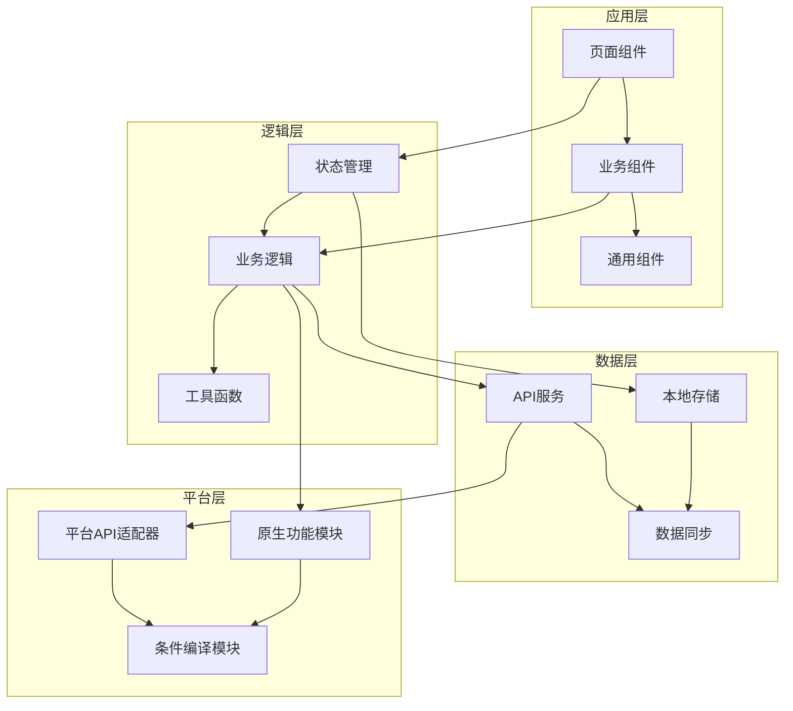
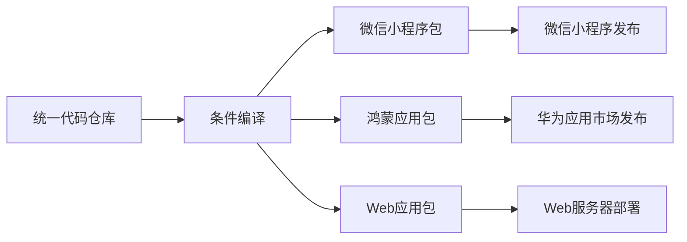

# PrimeCard Hub C端技术栈评审文档

## 文档信息

| 项目 | 内容 |
|------|------|
| 文档名称 | PrimeCard Hub C端技术栈评审文档 |
| 版本号 | V1.0 |
| 创建日期 | 2024-12-25 |
| 更新日期 | 2024-12-25 |
| 技术负责人 | 技术团队 |

---

## 1. 技术栈概述

PrimeCard Hub C端应用需要同时支持微信小程序和鸿蒙应用（OpenHarmony），未来可能扩展至安卓和iOS平台。本文档旨在评估适合项目需求的技术栈选择，并提供相应的技术规范和建议。

### 1.1 需求背景

根据产品需求文档（PRD），PrimeCard Hub C端应用需要实现以下核心功能：

- 用户体系（登录、注册、个人信息管理）
- 信用卡管理（添加、编辑、查看信用卡信息）
- 资讯浏览（查看、搜索、收藏资讯）
- 个人设置（偏好设置、通知管理等）

同时，应用需要在不同平台上提供一致的用户体验，并考虑未来的扩展性。

### 1.2 技术选型关键因素

在选择C端技术栈时，需要考虑以下关键因素：

1. **多端兼容性**：能否同时支持微信小程序和鸿蒙应用，以及未来可能的安卓和iOS平台
2. **开发效率**：是否能提高开发效率，减少重复开发工作
3. **性能表现**：在各平台上的性能表现是否能满足用户体验要求
4. **生态成熟度**：技术栈的生态是否成熟，是否有足够的社区支持和第三方库
5. **学习成本**：团队掌握该技术栈的学习成本
6. **维护成本**：长期维护和迭代的成本
7. **特殊功能支持**：是否支持平台特有的功能（如微信支付、鸿蒙服务等）

## 2. 技术栈评估

### 2.1 前端技术栈选项

#### 2.1.1 跨平台统一框架方案

##### 方案一：Flutter

**优势：**
- 真正的跨平台解决方案，一套代码可运行在Android、iOS、Web、桌面等平台
- 高性能的自绘UI引擎，接近原生的用户体验
- 丰富的组件库和插件生态
- 热重载功能提高开发效率

**劣势：**
- 微信小程序支持有限，需要额外适配
- 鸿蒙平台支持尚在发展中，可能存在兼容性问题
- 学习曲线较陡峭，Dart语言和Flutter框架需要专门学习
- 与原生平台集成时可能存在复杂性

##### 方案二：React Native

**优势：**
- 使用JavaScript/TypeScript开发，前端开发者容易上手
- 可以复用Web前端的技术栈和生态
- 较好的性能表现，接近原生体验
- 活跃的社区和丰富的第三方库

**劣势：**
- 微信小程序支持需要额外适配
- 鸿蒙平台支持有限
- 版本升级可能带来兼容性问题
- 复杂UI和动画实现可能需要原生代码支持

##### 方案三：Taro/uni-app

**优势：**
- 专为多端开发设计，对微信小程序有良好支持
- 使用Vue或React等熟悉的前端框架
- 可复用Web前端的技术栈和开发经验
- 丰富的组件和API，简化多端开发
- uni-app对鸿蒙应用有初步支持

**劣势：**
- 性能可能不如原生开发
- 对鸿蒙平台的深度支持有限
- 复杂功能可能需要条件编译或平台特定代码
- 对原生功能的支持可能不够全面

#### 2.1.2 平台特定开发方案

##### 方案一：分别开发

**优势：**
- 充分利用各平台的特性和能力
- 最佳的性能和用户体验
- 无兼容性问题
- 可以使用平台推荐的最佳实践

**劣势：**
- 开发和维护成本高
- 功能实现需要重复开发
- 需要不同技术栈的开发人员
- 版本迭代同步困难

##### 方案二：共享业务逻辑

**优势：**
- 业务逻辑可以复用，减少重复开发
- UI层可以针对各平台优化
- 较好的性能和用户体验
- 可以充分利用平台特性

**劣势：**
- 需要设计良好的架构来分离UI和业务逻辑
- 仍需要维护多套UI代码
- 需要多种技术栈的开发经验

### 2.2 后端技术栈评估

当前后端技术栈使用Node.js + Express.js + MySQL + Redis，这一技术栈对于支持C端应用有以下优势和挑战：

**优势：**
- JavaScript/TypeScript全栈开发，降低技术栈切换成本
- Express.js轻量级框架，适合构建RESTful API
- 异步非阻塞I/O模型，适合高并发场景
- 丰富的npm生态，可以快速集成各种功能

**挑战：**
- 需要合理设计API以支持多端应用
- 需要考虑不同端的数据同步和一致性
- 安全性和性能优化需要额外关注
- 可能需要增强消息推送、实时通信等功能

## 3. 多端开发策略评估

### 3.1 统一接口层

无论选择何种前端技术栈，都需要设计统一的后端API接口层，确保各端应用可以一致地访问后端服务。

**建议：**
- 采用RESTful API设计原则
- 实现统一的认证和授权机制
- 设计版本化的API，便于迭代和兼容
- 提供完善的API文档和测试用例

### 3.2 数据同步策略

C端应用需要考虑多设备数据同步的问题，特别是用户的信用卡信息和个人设置。

**建议：**
- 采用云端数据为主，本地缓存为辅的策略
- 实现增量同步机制，减少数据传输
- 使用乐观锁或版本控制解决冲突
- 提供离线操作和后续同步功能

### 3.3 UI/UX一致性

在多端开发中，保持UI/UX的一致性是一个挑战，需要在设计阶段就考虑多端适配。

**建议：**
- 建立统一的设计规范和组件库
- 使用响应式设计原则
- 考虑各平台的特性和限制
- 进行用户体验测试，确保各端体验一致

## 4. 推荐技术方案

基于上述评估和项目需求，我们推荐采用以下技术方案：

### 4.1 推荐方案：Taro/uni-app + 原生增强

**核心思路：** 使用Taro或uni-app作为主要开发框架，同时针对特定平台的特殊功能使用原生代码增强。

**技术栈组成：**

1. **基础框架：**
   - Taro 3.x 或 uni-app（推荐使用Vue 3 + TypeScript）
   - 微信小程序原生能力
   - 鸿蒙应用ArkTS/HarmonyOS SDK

2. **状态管理：**
   - Pinia（Vue 3）或 Mobx（React）
   - 本地存储 + 云端同步

3. **UI组件：**
   - 定制化UI组件库，基于微信小程序和鸿蒙设计规范
   - 响应式布局，适配不同屏幕尺寸

4. **网络请求：**
   - Axios/uni-request
   - 请求拦截器和响应处理

5. **原生能力：**
   - 微信支付、分享等微信特有功能
   - 鸿蒙服务和系统集成
   - 条件编译区分平台特定代码

### 4.2 架构设计



### 4.3 打包与发布流程



1. **开发流程：**
   - 使用Git Flow工作流
   - 功能分支开发，合并到开发分支
   - 版本发布前合并到主分支

2. **构建流程：**
   - 使用CI/CD自动化构建
   - 针对不同平台生成对应的构建产物
   - 自动化测试确保质量

3. **发布流程：**
   - 微信小程序通过微信开发者工具上传
   - 鸿蒙应用通过DevEco Studio打包并提交华为应用市场
   - 版本号统一管理，确保各端同步

## 5. 技术栈详细建议

### 5.1 前端技术栈

| 技术类别 | 推荐选择 | 版本 | 说明 |
|----------|----------|------|------|
| 基础框架 | uni-app | 最新版 | 支持多端开发，生态较为成熟 |
| 开发语言 | TypeScript | 4.x+ | 类型安全，提高代码质量 |
| 前端框架 | Vue 3 | 3.x | 响应式UI，易于学习和使用 |
| 状态管理 | Pinia | 2.x | Vue 3官方推荐的状态管理库 |
| UI组件库 | uView | 2.x | uni-app生态中成熟的UI库 |
| 网络请求 | uni-request | - | 统一封装的请求库 |
| 工具库 | lodash-es | - | 常用工具函数 |
| 图表库 | echarts-for-weixin | - | 适配微信小程序的图表库 |

### 5.2 后端技术栈增强

为了更好地支持C端应用，建议对现有后端技术栈进行以下增强：

| 技术类别 | 推荐选择 | 说明 |
|----------|----------|------|
| 实时通信 | Socket.IO | 支持实时消息推送 |
| 消息队列 | Bull | 基于Redis的轻量级队列，处理异步任务 |
| 缓存策略 | Redis + 分层缓存 | 提高API响应速度 |
| 安全防护 | helmet, rate-limit | 增强API安全性 |
| 日志监控 | Winston + ELK | 统一日志收集和分析 |

### 5.3 开发工具链

| 工具类别 | 推荐选择 | 说明 |
|----------|----------|------|
| IDE | VS Code | 统一的开发环境 |
| 包管理 | pnpm | 高效的依赖管理 |
| 代码规范 | ESLint + Prettier | 统一的代码风格 |
| 提交规范 | commitlint + husky | 规范化Git提交 |
| 自动化测试 | Jest + Cypress | 单元测试和E2E测试 |
| CI/CD | GitHub Actions | 自动化构建和部署 |

## 6. 开发规范与最佳实践

### 6.1 代码组织规范

```
src/
├── api/              # API请求封装
├── assets/           # 静态资源
├── components/       # 通用组件
│   ├── common/       # 跨平台通用组件
│   ├── weapp/        # 微信小程序特有组件
│   └── harmony/      # 鸿蒙特有组件
├── hooks/            # 自定义Hooks
├── pages/            # 页面组件
├── store/            # 状态管理
├── styles/           # 全局样式
├── utils/            # 工具函数
│   ├── common/       # 通用工具
│   ├── platform/     # 平台特定工具
│   └── request/      # 网络请求工具
├── App.vue           # 应用入口
├── main.js           # 主入口文件
└── manifest.json     # 应用配置
```

### 6.2 命名规范

- **文件命名**：使用kebab-case（如`user-profile.vue`）
- **组件命名**：使用PascalCase（如`UserProfile`）
- **变量命名**：使用camelCase（如`userData`）
- **常量命名**：使用UPPER_SNAKE_CASE（如`API_BASE_URL`）
- **类型命名**：使用PascalCase并以T开头（如`TUserInfo`）

### 6.3 多端适配最佳实践

1. **使用条件编译**：
   ```js
   // #ifdef MP-WEIXIN
   // 微信小程序特有代码
   // #endif
   
   // #ifdef HARMONY
   // 鸿蒙应用特有代码
   // #endif
   ```

2. **封装平台API**：
   ```js
   // platform.js
   export function share(options) {
     // #ifdef MP-WEIXIN
     return wx.shareAppMessage(options);
     // #endif
     
     // #ifdef HARMONY
     return harmonyShare(options);
     // #endif
   }
   ```

3. **响应式设计**：
   - 使用flex布局和相对单位（rpx）
   - 避免固定宽高，使用百分比或自适应布局
   - 考虑不同屏幕尺寸和方向

### 6.4 性能优化建议

1. **减少网络请求**：
   - 合理使用缓存
   - 数据预加载
   - 接口合并

2. **优化渲染性能**：
   - 避免频繁DOM操作
   - 使用虚拟列表处理长列表
   - 懒加载图片和组件

3. **减小包体积**：
   - 代码分割和按需加载
   - 压缩静态资源
   - Tree-shaking移除未使用代码

## 7. 结论与建议

### 7.1 技术栈选型决策矩阵

| 评估维度 | 权重 | Taro/uni-app | Flutter | React Native | 原生开发 |
|----------|------|-------------|---------|--------------|----------|
| 多端兼容性 | 25% | 4 | 3 | 2 | 1 |
| 开发效率 | 20% | 5 | 4 | 4 | 2 |
| 性能表现 | 15% | 3 | 5 | 4 | 5 |
| 生态成熟度 | 15% | 4 | 4 | 5 | 5 |
| 学习成本 | 10% | 5 | 3 | 4 | 2 |
| 维护成本 | 10% | 4 | 3 | 3 | 1 |
| 特殊功能支持 | 5% | 4 | 3 | 3 | 5 |
| **加权总分** | 100% | **4.15** | **3.7** | **3.5** | **2.8** |

*评分标准：1-5分，5分为最优*

### 7.2 实施建议

1. **阶段性实施**：
   - 第一阶段：使用uni-app开发微信小程序版本
   - 第二阶段：在uni-app基础上扩展鸿蒙应用支持
   - 第三阶段：根据需要考虑原生增强或其他平台支持

2. **技术验证**：
   - 在正式开发前，进行技术验证，测试uni-app在微信小程序和鸿蒙平台的表现
   - 验证关键功能（如支付、分享、推送等）在各平台的兼容性

3. **团队准备**：
   - 组建跨平台开发团队，确保有微信小程序和鸿蒙开发经验
   - 制定详细的开发规范和流程
   - 培训团队成员，提高对多端开发的理解

### 7.3 风险与应对策略

| 风险 | 可能性 | 影响 | 应对策略 |
|------|--------|------|----------|
| 框架兼容性问题 | 中 | 高 | 提前验证，保留原生开发选项 |
| 性能不满足要求 | 低 | 高 | 性能优化，必要时使用原生代码 |
| 特殊功能无法实现 | 中 | 中 | 使用条件编译和原生插件 |
| 团队学习曲线 | 低 | 中 | 培训和技术分享，渐进式学习 |
| 版本升级兼容性 | 中 | 中 | 谨慎升级，充分测试 |

## 8. 附录

### 8.1 参考资料

- [uni-app官方文档](https://uniapp.dcloud.io/)
- [Taro官方文档](https://taro.jd.com/)
- [微信小程序开发文档](https://developers.weixin.qq.com/miniprogram/dev/framework/)
- [HarmonyOS开发文档](https://developer.harmonyos.com/)

### 8.2 术语表

| 术语 | 解释 |
|------|------|
| Taro | 京东开源的多端统一开发框架 |
| uni-app | DCloud推出的使用Vue开发多端应用的框架 |
| 条件编译 | 根据不同平台编译不同代码的技术 |
| 热重载 | 在不刷新应用的情况下更新代码的功能 |
| ArkTS | 鸿蒙系统的应用开发语言 |
| 原生增强 | 在跨平台框架中使用原生代码增强功能 |

---

*注：本文档为技术评审建议，具体实施方案需根据项目实际情况和团队能力进行调整。*