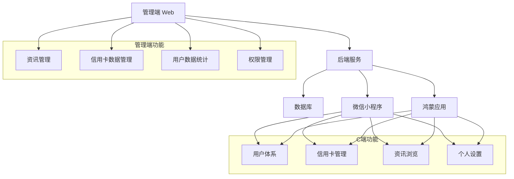
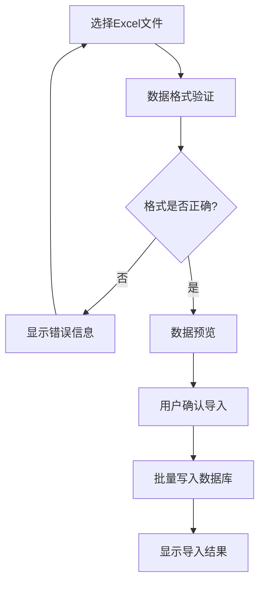
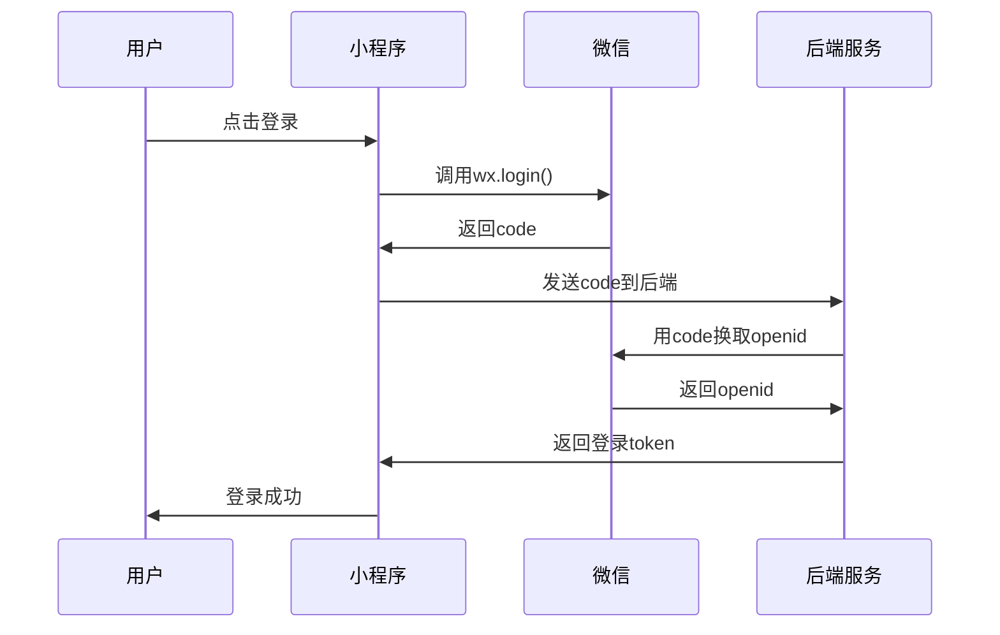
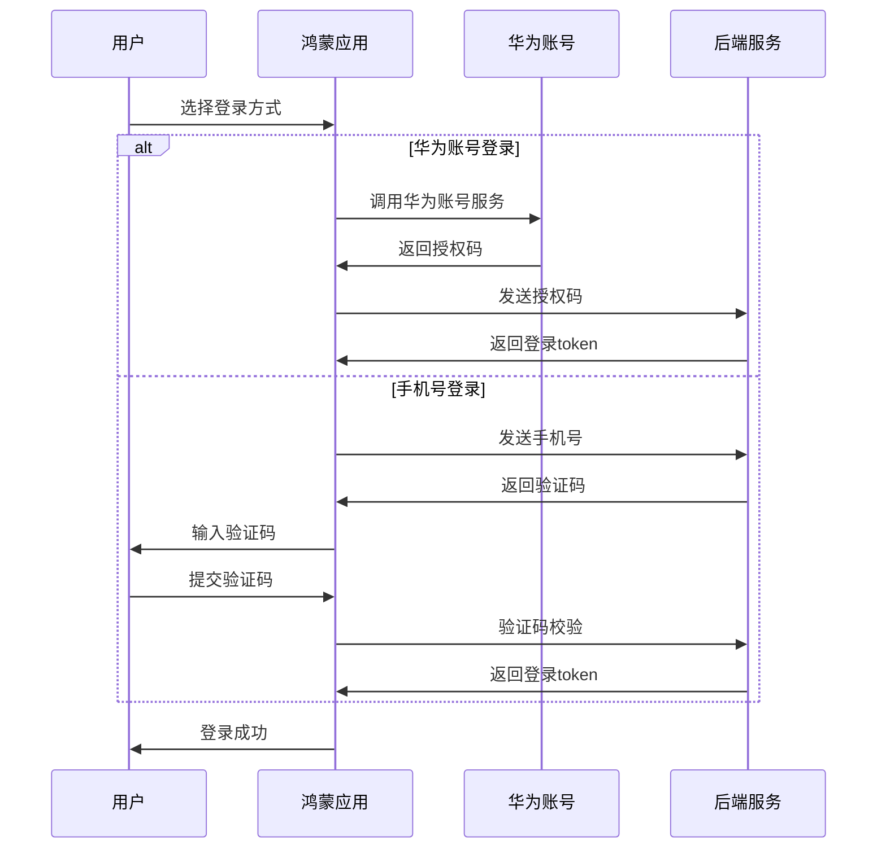
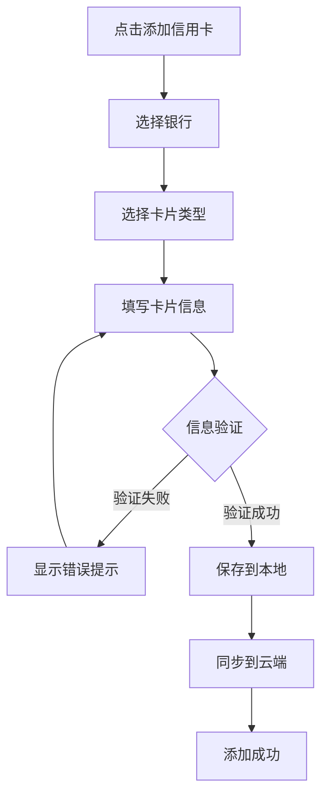
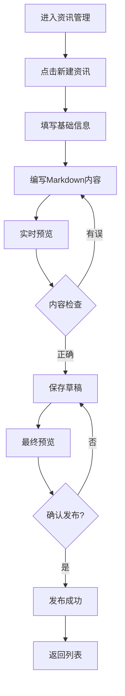
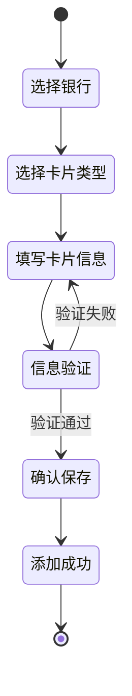
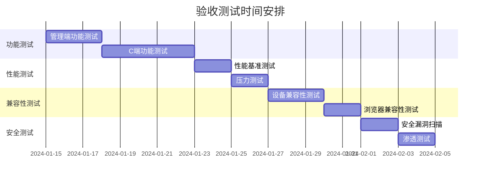

# PrimeCard Hub 第一阶段 PRD 文档

## 文档信息

| 项目 | 内容 |
|------|------|
| 文档版本 | V1.0 |
| 创建日期 |  |
| 更新日期 |  |
| 产品经理 | - |
| 开发周期 | 1-2个月 |

---

# 1. 产品概述


### 1.1 文档目的

本文档明确 PrimeCard Hub 第一阶段（1-2 个月）的产品功能需求，按管理端与 C 端（微信小程序、鸿蒙端）拆分，作为设计、开发、测试的核心依据，确保团队对各端基础功能达成一致认知。

### 1.2 产品定位

第一阶段聚焦搭建基础框架：

- **管理端**：实现资讯与信用卡数据的基础管理，支撑 C 端内容展示。
- **C 端**：通过微信小程序与鸿蒙端，让用户便捷完成信用卡管理与资讯获取，为后续功能迭代奠定基础。

### 1.3 产品架构



### 1.4 目标用户

#### 1.4.1 管理端用户

| 用户类型 | 职责 | 使用场景 | 核心需求 |
|----------|------|----------|----------|
| 运营人员 | 资讯内容维护 | 日常发布银行优惠资讯 | 高效的内容编辑和发布工具 |
| 数据管理员 | 信用卡数据维护 | 更新银行卡片信息 | 批量数据操作和管理功能 |
| 产品经理 | 数据监控分析 | 查看用户使用情况 | 清晰的数据统计和报表 |

#### 1.4.2 C端用户画像

| 用户群体 | 年龄段 | 特征 | 使用动机 | 平台偏好 |
|----------|--------|------|----------|----------|
| 信用卡新手 | 22-30岁 | 刚开始使用信用卡，需要学习 | 了解信用卡知识，管理账单 | 微信小程序 |
| 信用卡达人 | 25-40岁 | 持有多张信用卡，追求优惠 | 获取最新优惠信息，精细化管理 | 微信小程序/鸿蒙应用 |
| 华为用户 | 25-45岁 | 使用华为/鸿蒙设备 | 原生应用体验，系统集成 | 鸿蒙应用 |

---

# 2. 管理端功能需求


### 2.1 基础管理功能

#### 2.1.1 管理员登录与权限

- 支持账号密码登录（仅内部人员使用），登录后需验证管理员权限（默认单角色，后续可扩展）。
- 登录状态保持：默认 2 小时无操作自动登出，支持手动退出。

#### 2.1.2 资讯管理

##### 资讯发布（支持Markdown格式）

**基础信息录入：**
- 标题：支持纯文本，最大长度100字符
- 来源银行：下拉选择（预设银行列表）
- 发布时间：自动获取当前时间，支持手动调整
- 缩略图：支持上传jpg/png格式，建议尺寸16:9，最大2MB
- 标签：支持多标签，如"免年费"、"高返现"、"新户礼"等

**正文内容（Markdown格式）：**

支持以下Markdown语法：

| 语法类型 | Markdown语法 | 渲染效果 | 使用场景 |
|----------|--------------|----------|----------|
| 标题 | `# ## ###` | 一级、二级、三级标题 | 内容结构化 |
| 加粗 | `**文本**` | **加粗文本** | 重点信息强调 |
| 斜体 | `*文本*` | *斜体文本* | 次要信息标注 |
| 列表 | `- 项目` | • 无序列表 | 权益罗列 |
| 有序列表 | `1. 项目` | 1. 有序列表 | 步骤说明 |
| 链接 | `[文本](URL)` | 可点击链接 | 外部资源引用 |
| 图片 | `` | 嵌入图片 | 图文并茂展示 |
| 表格 | `\| 列1 \| 列2 \|` | 表格展示 | 数据对比 |
| 引用 | `> 文本` | 引用块 | 重要提示 |
| 代码 | `` `代码` `` | 行内代码 | 优惠码展示 |

**资讯模板示例：**

```markdown
# 招商银行信用卡新户专享优惠

## 活动概述
招商银行推出新户专享优惠活动，**首刷即享好礼**！

## 活动详情

### 申请条件
- 新户定义：近12个月未持有招商银行信用卡
- 年龄要求：18-65周岁
- 收入要求：月收入3000元以上

### 优惠内容

| 卡片类型 | 首刷礼 | 年费政策 |
|----------|--------|----------|
| 普卡 | 100元刷卡金 | 首年免年费 |
| 金卡 | 200元刷卡金 | 首年免年费 |
| 白金卡 | 500元刷卡金 | 刚性年费 |

### 参与方式
1. 在线申请信用卡
2. 收到卡片后激活
3. 30天内完成首笔消费
4. 刷卡金自动到账

> **重要提示：** 活动截止时间为2024年12月31日，名额有限，先到先得！

### 申请链接
[立即申请](https://example.com/apply)

## 相关推荐
- [招商银行全币种国际卡](link1)
- [招商银行车主卡](link2)
```

**编辑器功能：**
- 实时预览：左侧编辑，右侧实时预览渲染效果
- 语法高亮：Markdown语法着色显示
- 工具栏：常用格式快捷按钮（加粗、斜体、插入链接等）
- 图片上传：拖拽上传，自动生成Markdown图片语法
- 保存草稿：自动保存，防止内容丢失

##### 资讯编辑与删除

- 已发布资讯可修改内容（修改后需重新提交生效），支持版本历史查看
- 支持批量删除过期资讯，删除前需二次确认
- 编辑记录：记录修改人、修改时间、修改内容

##### 资讯审核

- 第一阶段简化审核流程，发布即生效（后续可增加多级审核）
- 支持资讯状态管理：草稿、已发布、已下线
- 定时发布：支持设置未来发布时间


#### 2.1.3 信用卡信息管理

##### 信用卡数据录入

**数据字段定义：**

| 字段名称 | 数据类型 | 是否必填 | 说明 | 示例 |
|----------|----------|----------|------|------|
| 银行名称 | 文本 | 是 | 发卡银行全称 | 招商银行 |
| 卡片名称 | 文本 | 是 | 信用卡产品名称 | 招商银行经典白金卡 |
| 卡片类型 | 枚举 | 是 | 普卡/金卡/白金卡/钻石卡 | 白金卡 |
| 核心权益标签 | 标签 | 是 | 多选标签，最多5个 | 免年费,高返现,机场贵宾厅 |
| 申请条件 | 文本 | 是 | 支持Markdown格式 | 年收入10万以上 |
| 年费政策 | 文本 | 是 | 年费收取规则 | 首年免费，次年刷满12笔免年费 |
| 卡片图片 | 图片 | 否 | 卡面图片，建议尺寸400x250 | card_image.jpg |
| 申请链接 | URL | 否 | 银行官方申请链接 | https://bank.com/apply |
| 创建时间 | 时间戳 | 自动 | 系统自动生成 | 2024-12-01 10:30:00 |
| 更新时间 | 时间戳 | 自动 | 系统自动更新 | 2024-12-01 15:20:00 |

**权益标签库：**

| 分类 | 标签选项 |
|------|----------|
| 年费相关 | 免年费、首年免费、终身免费、刚性年费 |
| 返现相关 | 高返现、无上限返现、分类返现、全场返现 |
| 积分相关 | 高积分、积分不过期、积分兑换优惠 |
| 出行相关 | 机场贵宾厅、航空里程、酒店权益、租车优惠 |
| 消费相关 | 餐饮优惠、购物返现、加油优惠、网购返现 |
| 新户礼遇 | 新户礼品、首刷礼、开卡礼、推荐奖励 |

##### 数据批量操作

**批量导入流程：**



**导出功能：**
- 支持按银行筛选导出
- 支持自定义字段导出
- 导出格式：Excel (.xlsx)、CSV (.csv)
- 导出文件命名规则：`信用卡数据_银行名称_导出时间.xlsx`

#### 2.1.4 基础数据统计

##### 数据统计面板

**核心指标展示：**

| 指标类别 | 指标名称 | 统计维度 | 更新频率 |
|----------|----------|----------|----------|
| 用户数据 | 总用户数 | 累计注册用户 | 实时 |
| 用户数据 | 活跃用户数 | 近7天/30天登录用户 | 每日更新 |
| 用户数据 | 新增用户数 | 当日/当周/当月新增 | 实时 |
| 内容数据 | 资讯总数 | 已发布资讯数量 | 实时 |
| 内容数据 | 资讯浏览量 | 总浏览量/日均浏览量 | 每小时更新 |
| 内容数据 | 热门资讯 | 浏览量TOP10 | 每日更新 |
| 卡片数据 | 信用卡总数 | 平台收录卡片数量 | 实时 |
| 卡片数据 | 用户添加卡片数 | 用户添加的卡片总量 | 实时 |
| 卡片数据 | 热门银行 | 用户添加最多的银行TOP5 | 每日更新 |

**数据可视化图表：**

1. **用户增长趋势图**（折线图）
   - X轴：时间（最近30天）
   - Y轴：用户数量
   - 显示：新增用户、累计用户

2. **资讯浏览量分析**（柱状图）
   - X轴：日期（最近7天）
   - Y轴：浏览量
   - 显示：每日浏览量、平均浏览量

3. **银行分布饼图**
   - 显示用户添加信用卡的银行分布
   - 支持点击查看详细数据

4. **平台使用情况**（环形图）
   - 微信小程序用户占比
   - 鸿蒙应用用户占比

##### 数据导出功能

**报表类型：**

| 报表名称 | 包含数据 | 导出格式 | 生成周期 |
|----------|----------|----------|----------|
| 用户统计报表 | 用户注册、活跃、留存数据 | Excel | 按需/定时 |
| 内容统计报表 | 资讯发布、浏览、互动数据 | Excel | 按需/定时 |
| 运营数据报表 | 综合运营指标 | PDF/Excel | 周报/月报 |

---

# 3. C端功能需求（微信小程序 + 鸿蒙端)


### 3.1 共性功能（双端通用）

#### 3.1.1 用户体系模块

##### 注册/登录流程

**微信小程序登录流程：**



**鸿蒙端登录流程：**



**登录方式对比：**

| 平台 | 登录方式 | 优势 | 限制 |
|------|----------|------|------|
| 微信小程序 | 微信快捷登录 | 无需注册，一键登录 | 依赖微信生态 |
| 鸿蒙端 | 华为账号登录 | 系统级集成，体验流畅 | 需要华为账号 |
| 鸿蒙端 | 手机号注册 | 通用性强，支持所有用户 | 需要验证码验证 |

##### 个人信息管理

**用户信息字段：**

| 字段名称 | 数据来源 | 是否可编辑 | 微信小程序 | 鸿蒙端 |
|----------|----------|------------|------------|--------|
| 头像 | 第三方账号/手动上传 | 是 | 微信头像 | 华为账号头像/自定义 |
| 昵称 | 第三方账号/手动输入 | 是 | 微信昵称 | 华为账号昵称/自定义 |
| 手机号 | 手动输入/授权获取 | 是 | 可选绑定 | 注册必填 |
| 用户ID | 系统生成 | 否 | 自动生成 | 自动生成 |
| 注册时间 | 系统记录 | 否 | 自动记录 | 自动记录 |
| 最后登录 | 系统记录 | 否 | 自动更新 | 自动更新 |

#### 3.1.2 信用卡管理模块

##### 信用卡添加流程



**信息填写字段：**

| 字段名称 | 输入方式 | 验证规则 | 必填 | 示例 |
|----------|----------|----------|------|------|
| 银行名称 | 下拉选择 | 预设银行列表 | 是 | 招商银行 |
| 卡片类型 | 下拉选择 | 普卡/金卡/白金卡/钻石卡 | 是 | 白金卡 |
| 卡号 | 手动输入/拍照识别 | Luhn算法验证 | 是 | 6225 8888 **** 1234 |
| 持卡人姓名 | 手动输入 | 2-20个字符 | 是 | 张三 |
| 信用额度 | 数字输入 | 1000-1000000 | 否 | 50000 |
| 账单日 | 日期选择 | 1-31日 | 是 | 每月5日 |
| 还款日 | 自动计算/手动调整 | 账单日后15-25天 | 是 | 每月25日 |
| 卡片备注 | 文本输入 | 最多50字符 | 否 | 日常消费卡 |

##### 卡片展示与管理

**列表展示信息：**

| 显示元素 | 内容 | 样式说明 |
|----------|------|----------|
| 银行Logo | 银行标识图标 | 32x32px，圆角 |
| 卡片名称 | 银行+卡片类型 | 主标题，16px字体 |
| 卡号尾号 | 后4位数字 | 脱敏显示，如"****1234" |
| 可用额度 | 剩余额度/总额度 | 副标题，14px字体 |
| 账单日提醒 | 距离账单日天数 | 状态标签，颜色区分 |

**排序与筛选：**

| 功能 | 选项 | 说明 |
|------|------|------|
| 排序 | 添加时间（默认） | 最新添加的在前 |
| 排序 | 银行名称 | 按银行名称字母顺序 |
| 排序 | 账单日 | 按账单日期先后顺序 |
| 筛选 | 银行筛选 | 支持多选银行 |
| 搜索 | 关键词搜索 | 支持银行名、备注搜索 |

#### 3.1.3 资讯聚合模块

##### 资讯列表展示

**信息流布局：**

| 元素 | 位置 | 尺寸 | 内容 |
|------|------|------|------|
| 缩略图 | 左侧 | 80x60px | 资讯配图，默认银行Logo |
| 标题 | 右上 | 2行最多 | 资讯标题，超出省略 |
| 银行信息 | 右中 | 1行 | 银行名称+发布时间 |
| 标签 | 右下 | 1行 | 权益标签，最多显示3个 |

**加载与刷新：**

| 操作 | 触发方式 | 加载数量 | 性能要求 |
|------|----------|----------|----------|
| 首次加载 | 进入页面 | 10条 | ≤2秒 |
| 下拉刷新 | 下拉手势 | 最新10条 | ≤1秒 |
| 上拉加载 | 滑动到底部 | 追加10条 | ≤1秒 |
| 搜索加载 | 输入关键词 | 匹配结果 | ≤1.5秒 |

##### 开卡信息展示

**网格布局设计：**

```
┌─────────┬─────────┬─────────┐
│ 银行A   │ 银行B   │ 银行C   │
│ Logo    │ Logo    │ Logo    │
│ 热门卡1 │ 热门卡1 │ 热门卡1 │
│ 标签    │ 标签    │ 标签    │
├─────────┼─────────┼─────────┤
│ 银行D   │ 银行E   │ 银行F   │
│ Logo    │ Logo    │ Logo    │
│ 热门卡1 │ 热门卡1 │ 热门卡1 │
│ 标签    │ 标签    │ 标签    │
└─────────┴─────────┴─────────┘
```

**筛选功能：**

| 筛选维度 | 选项 | 实现方式 |
|----------|------|----------|
| 银行类型 | 国有银行/股份制银行/城商行 | 顶部Tab切换 |
| 卡片等级 | 普卡/金卡/白金卡/钻石卡 | 下拉筛选 |
| 权益类型 | 返现/积分/出行/消费 | 多选标签 |
| 年费政策 | 免年费/首年免费/刚性年费 | 单选筛选 |

#### 3.1.4 基础设置模块

##### 通知设置

**通知类型配置：**

| 通知类型 | 默认状态 | 触发条件 | 微信小程序 | 鸿蒙端 |
|----------|----------|----------|------------|--------|
| 优惠资讯通知 | 开启 | 新资讯发布 | 模板消息 | 系统通知 |
| 账单提醒 | 开启 | 账单日前3天 | 模板消息 | 系统通知 |
| 还款提醒 | 开启 | 还款日前1天 | 模板消息 | 系统通知 |
| 系统通知 | 开启 | 系统维护/更新 | 模板消息 | 系统通知 |

##### 意见反馈

**反馈表单字段：**

| 字段名称 | 类型 | 限制 | 必填 |
|----------|------|------|------|
| 反馈类型 | 单选 | 功能建议/问题反馈/其他 | 是 |
| 反馈内容 | 文本域 | 10-500字符 | 是 |
| 联系方式 | 文本 | 手机号/邮箱格式 | 否 |
| 截图上传 | 图片 | 最多3张，每张≤5MB | 否 |

### 3.2 微信小程序适配要点

#### 3.2.1 技术规范

| 规范类型 | 要求 | 说明 |
|----------|------|------|
| 微信版本 | ≥8.0.0 | 支持最新API特性 |
| 基础库版本 | ≥2.10.0 | 确保组件兼容性 |
| 包体积限制 | 主包≤2MB，总包≤20MB | 分包加载优化 |
| 页面层级 | ≤10层 | 避免页面栈溢出 |

#### 3.2.2 界面适配

**设计规范遵循：**

| 元素 | 微信规范 | 具体要求 |
|------|----------|----------|
| 导航栏 | 微信原生导航栏 | 高度44px，支持自定义标题 |
| 按钮样式 | 微信标准按钮 | 主按钮绿色，次按钮白色边框 |
| 弹窗尺寸 | 微信标准弹窗 | 最大宽度300px，圆角8px |
| 颜色主题 | 支持深色模式 | 自动适配用户系统设置 |
| 字体大小 | 微信标准字号 | 主标题16px，正文14px，辅助文字12px |

#### 3.2.3 性能优化

**加载优化策略：**

| 优化项 | 目标 | 实现方案 |
|--------|------|----------|
| 首屏加载 | ≤3秒 | 关键资源预加载，非关键资源懒加载 |
| 图片加载 | 单张≤500KB | 图片压缩，WebP格式优先 |
| 网络请求 | 并发≤5个 | 请求合并，缓存策略 |
| 内存使用 | ≤100MB | 及时释放无用资源 |

#### 3.2.4 数据存储

**本地存储策略：**

| 数据类型 | 存储方式 | 容量限制 | 加密要求 |
|----------|----------|----------|----------|
| 用户信息 | wx.setStorageSync | ≤10MB | AES加密 |
| 信用卡信息 | wx.setStorageSync | ≤10MB | AES加密 |
| 缓存数据 | wx.setStorageSync | ≤10MB | 无需加密 |
| 临时文件 | wx.saveFile | ≤200MB | 无需加密 |

### 3.3 鸿蒙端适配要点

#### 3.3.1 技术规范

| 规范类型 | 要求 | 说明 |
|----------|------|------|
| 系统版本 | HarmonyOS ≥2.0 | 支持分布式特性 |
| API Level | ≥7 | 确保API兼容性 |
| 应用类型 | 原子化服务 | 免安装，即用即走 |
| 包体积 | ≤10MB | 快速下载和启动 |

#### 3.3.2 界面适配

**设计规范遵循：**

| 元素 | 鸿蒙规范 | 具体要求 |
|------|----------|----------|
| 导航栏 | 鸿蒙原生导航 | 高度56dp，支持返回手势 |
| 按钮样式 | 鸿蒙标准按钮 | 主按钮蓝色，圆角16dp |
| 弹窗设计 | 鸿蒙标准弹窗 | 毛玻璃效果，圆角24dp |
| 颜色主题 | 支持深色模式 | 自动适配系统主题 |
| 字体适配 | 系统字体大小 | 支持用户自定义字体大小 |

#### 3.3.3 性能要求

**性能指标：**

| 性能项 | 目标值 | 测试方法 |
|--------|--------|----------|
| 冷启动时间 | ≤2.5秒 | 从点击图标到首屏显示 |
| 热启动时间 | ≤1秒 | 从后台切换到前台 |
| 页面切换 | ≤0.3秒 | 页面间跳转响应时间 |
| 内存占用 | ≤150MB | 正常使用状态下内存占用 |
| CPU使用率 | ≤30% | 正常操作时CPU占用 |

#### 3.3.4 权限管理

**权限申请策略：**

| 权限类型 | 申请时机 | 用途说明 | 是否必需 |
|----------|----------|----------|----------|
| 网络权限 | 应用启动时 | 获取资讯和同步数据 | 是 |
| 存储权限 | 首次保存时 | 保存用户数据和缓存 | 是 |
| 相机权限 | 拍照识别时 | 识别信用卡信息 | 否 |
| 通知权限 | 首次设置时 | 发送提醒通知 | 否 |

---

# 4. 非功能需求


### 4.1 性能需求

#### 4.1.1 管理端性能指标

| 性能指标 | 目标值 | 测试条件 | 监控方式 |
|----------|--------|----------|----------|
| 页面加载时间 | ≤2秒 | 1000条数据量 | 浏览器开发者工具 |
| 资讯发布响应 | ≤1秒 | 包含图片的资讯 | 后端日志监控 |
| 数据导出时间 | ≤5秒 | 1000条记录 | 服务器性能监控 |
| 并发用户数 | ≥10人 | 同时操作 | 压力测试 |

#### 4.1.2 C端性能指标

**微信小程序性能要求：**

| 性能指标 | 目标值 | 测试场景 | 优化策略 |
|----------|--------|----------|----------|
| 首屏加载 | ≤3秒 | 4G网络环境 | 资源预加载、代码分包 |
| 列表滑动 | 60fps | 100条数据滑动 | 虚拟列表、懒加载 |
| 图片加载 | ≤2秒 | 单张500KB图片 | 图片压缩、CDN加速 |
| 内存占用 | ≤100MB | 正常使用30分钟 | 内存泄漏检测 |

**鸿蒙端性能要求：**

| 性能指标 | 目标值 | 测试场景 | 优化策略 |
|----------|--------|----------|----------|
| 冷启动时间 | ≤2.5秒 | 首次安装启动 | 启动优化、预编译 |
| 热启动时间 | ≤1秒 | 后台切换前台 | 状态保持、快速恢复 |
| 页面切换 | ≤0.3秒 | 页面间跳转 | 页面预加载、动画优化 |
| 电池消耗 | ≤5%/小时 | 正常使用 | 后台任务优化 |

### 4.2 兼容性需求

#### 4.2.1 管理端兼容性

**浏览器兼容性：**

| 浏览器 | 版本要求 | 支持特性 | 测试重点 |
|--------|----------|----------|----------|
| Chrome | ≥90 | 全功能支持 | 主要测试浏览器 |
| Edge | ≥90 | 全功能支持 | 兼容性测试 |
| Firefox | ≥88 | 基础功能支持 | 功能验证 |
| Safari | ≥14 | 基础功能支持 | macOS用户支持 |

**屏幕分辨率适配：**

| 分辨率 | 适配策略 | 布局调整 |
|--------|----------|----------|
| 1366×768 | 最小支持分辨率 | 紧凑布局 |
| 1920×1080 | 标准分辨率 | 标准布局 |
| 2560×1440 | 高分辨率 | 宽松布局 |
| 超宽屏 | 响应式适配 | 侧边栏固定 |

#### 4.2.2 C端兼容性

**微信小程序兼容性：**

| 设备类型 | 系统版本 | 微信版本 | 测试机型 |
|----------|----------|----------|----------|
| iOS | ≥12.0 | ≥8.0.0 | iPhone 8及以上 |
| Android | ≥7.0 | ≥8.0.0 | 主流Android机型 |
| 屏幕尺寸 | 4.7-6.7英寸 | 自适应布局 | 不同尺寸适配 |

**鸿蒙端兼容性：**

| 设备类型 | 系统版本 | API Level | 测试设备 |
|----------|----------|-----------|----------|
| 华为手机 | HarmonyOS ≥2.0 | ≥7 | Mate/P系列 |
| 华为平板 | HarmonyOS ≥2.0 | ≥7 | MatePad系列 |
| 其他设备 | HarmonyOS ≥3.0 | ≥9 | 第三方厂商设备 |

### 4.3 安全需求

#### 4.3.1 数据安全

**数据加密策略：**

| 数据类型 | 加密方式 | 密钥管理 | 存储位置 |
|----------|----------|----------|----------|
| 用户密码 | BCrypt哈希 | 服务端Salt | 数据库 |
| 信用卡号 | AES-256加密 | 密钥服务器 | 加密数据库 |
| 个人信息 | AES-128加密 | 本地密钥 | 本地存储 |
| 通信数据 | TLS 1.3 | 证书管理 | 传输层 |

**数据备份策略：**

| 备份类型 | 频率 | 保留期限 | 存储位置 |
|----------|------|----------|----------|
| 全量备份 | 每日 | 30天 | 云存储 |
| 增量备份 | 每小时 | 7天 | 本地存储 |
| 关键数据 | 实时同步 | 永久 | 异地备份 |

#### 4.3.2 访问控制

**权限控制矩阵：**

| 用户角色 | 资讯管理 | 数据管理 | 用户管理 | 系统设置 |
|----------|----------|----------|----------|----------|
| 超级管理员 | ✓ | ✓ | ✓ | ✓ |
| 运营人员 | ✓ | ✗ | ✗ | ✗ |
| 数据管理员 | ✗ | ✓ | ✗ | ✗ |
| 只读用户 | 查看 | 查看 | ✗ | ✗ |

**API安全策略：**

| 安全措施 | 实现方式 | 验证频率 |
|----------|----------|----------|
| 接口签名 | HMAC-SHA256 | 每次请求 |
| 访问频率限制 | 令牌桶算法 | 实时监控 |
| IP白名单 | 管理端限制 | 登录验证 |
| 异常检测 | 行为分析 | 持续监控 |

#### 4.3.3 隐私保护

**数据脱敏规则：**

| 数据类型 | 脱敏方式 | 显示格式 | 应用场景 |
|----------|----------|----------|----------|
| 手机号 | 中间4位隐藏 | 138****5678 | 前端显示 |
| 信用卡号 | 只显示后4位 | ****1234 | 列表展示 |
| 身份证号 | 中间10位隐藏 | 110***********1234 | 敏感信息 |
| 邮箱地址 | 用户名部分隐藏 | a***@example.com | 联系信息 |

---

# 5. 交互设计要点


### 5.1 管理端交互设计

#### 5.1.1 资讯发布流程

**操作流程设计：**



**交互细节规范：**

| 操作 | 交互反馈 | 响应时间 | 错误处理 |
|------|----------|----------|----------|
| 保存草稿 | 顶部提示"草稿已保存" | ≤0.5秒 | 网络错误时本地缓存 |
| 上传图片 | 进度条显示上传进度 | ≤3秒 | 失败时显示重试按钮 |
| 发布资讯 | 加载动画+成功提示 | ≤1秒 | 失败时保留编辑内容 |
| 预览切换 | 无缝切换，保持滚动位置 | ≤0.2秒 | 渲染错误时显示源码 |

#### 5.1.2 数据管理交互

**批量操作设计：**

| 功能 | 触发方式 | 确认机制 | 撤销机制 |
|------|----------|----------|----------|
| 批量删除 | 勾选+删除按钮 | 二次确认弹窗 | 30秒内可撤销 |
| 批量导出 | 筛选+导出按钮 | 格式选择弹窗 | 下载链接有效期24小时 |
| 批量编辑 | 勾选+编辑按钮 | 预览变更内容 | 逐条确认机制 |

### 5.2 C端交互设计（双端通用）

#### 5.2.1 信用卡添加交互

**步骤化引导设计：**



**输入验证与反馈：**

| 字段 | 验证规则 | 实时反馈 | 错误提示 |
|------|----------|----------|----------|
| 卡号 | Luhn算法+长度检查 | 输入时格式化显示 | "卡号格式不正确" |
| 姓名 | 2-20字符，中英文 | 字符计数显示 | "姓名长度为2-20个字符" |
| 额度 | 数字，1000-1000000 | 千分位格式化 | "额度范围1000-100万" |
| 日期 | 1-31日 | 日历选择器 | "请选择有效日期" |

#### 5.2.2 导航与页面切换

**底部导航设计：**

| 导航项 | 图标状态 | 页面指示 | 角标提醒 |
|--------|----------|----------|----------|
| 首页 | 选中/未选中 | 高亮显示 | 新资讯数量 |
| 信用卡 | 选中/未选中 | 高亮显示 | 账单提醒数量 |
| 资讯 | 选中/未选中 | 高亮显示 | 未读资讯数量 |
| 我的 | 选中/未选中 | 高亮显示 | 系统通知数量 |

**页面切换动画：**

| 切换类型 | 动画效果 | 持续时间 | 适用场景 |
|----------|----------|----------|----------|
| 标签页切换 | 淡入淡出 | 200ms | 底部导航 |
| 页面跳转 | 右滑进入 | 300ms | 详情页进入 |
| 返回上级 | 左滑退出 | 300ms | 返回操作 |
| 弹窗显示 | 缩放+淡入 | 250ms | 模态弹窗 |

#### 5.2.3 反馈与提示设计

**提示类型规范：**

| 提示类型 | 显示位置 | 显示时长 | 样式规范 |
|----------|----------|----------|----------|
| 成功提示 | 页面顶部 | 2秒 | 绿色背景，白色文字 |
| 错误提示 | 页面顶部 | 3秒 | 红色背景，白色文字 |
| 警告提示 | 页面顶部 | 2.5秒 | 橙色背景，白色文字 |
| 加载提示 | 页面中央 | 持续显示 | 半透明遮罩+转圈动画 |

### 5.3 平台差异化交互

#### 5.3.1 微信小程序特有交互

| 交互特性 | 实现方式 | 用户体验 |
|----------|----------|----------|
| 分享功能 | 右上角菜单+页面内按钮 | 分享到微信好友/朋友圈 |
| 下拉刷新 | 原生下拉刷新 | 符合微信用户习惯 |
| 返回操作 | 左上角返回+手势返回 | 多种返回方式 |
| 长按操作 | 长按卡片显示菜单 | 快捷操作入口 |

#### 5.3.2 鸿蒙端特有交互

| 交互特性 | 实现方式 | 用户体验 |
|----------|----------|----------|
| 手势导航 | 支持系统手势 | 原生系统体验 |
| 分屏显示 | 适配分屏模式 | 多任务处理 |
| 悬浮窗口 | 支持小窗模式 | 便捷查看信息 |
| 语音输入 | 集成语音识别 | 快速输入体验 |

---

# 6. 验收标准


### 6.1 管理端验收标准

#### 6.1.1 功能验收

**核心功能测试用例：**

| 功能模块 | 测试用例 | 预期结果 | 验收标准 |
|----------|----------|----------|----------|
| 用户登录 | 正确账号密码登录 | 成功进入管理后台 | 2秒内完成登录 |
| 资讯发布 | 发布包含Markdown的资讯 | 资讯成功发布并在C端显示 | 1秒内发布成功 |
| 图片上传 | 上传2MB以内图片 | 图片成功上传并显示 | 3秒内上传完成 |
| 数据导出 | 导出1000条信用卡数据 | 生成Excel文件可下载 | 5秒内生成文件 |
| 批量删除 | 选择多条资讯批量删除 | 数据成功删除，C端不再显示 | 操作成功无误 |

#### 6.1.2 性能验收

**性能指标测试：**

| 性能项 | 测试条件 | 目标值 | 测试方法 |
|--------|----------|--------|----------|
| 页面加载 | 1000条数据列表 | ≤2秒 | Chrome DevTools |
| 并发处理 | 10个用户同时操作 | 无阻塞 | 压力测试工具 |
| 内存使用 | 连续使用2小时 | ≤500MB | 系统监控 |
| 响应时间 | 各类操作响应 | ≤1秒 | 接口监控 |

### 6.2 C端验收标准（微信小程序 + 鸿蒙端）

#### 6.2.1 功能验收

**双端通用功能测试：**

| 功能模块 | 测试场景 | 微信小程序 | 鸿蒙端 | 验收标准 |
|----------|----------|------------|--------|----------|
| 用户登录 | 首次登录 | 微信授权登录 | 华为账号/手机号登录 | 登录成功，获取用户信息 |
| 信用卡添加 | 添加新卡片 | 手动输入信息 | 手动输入+拍照识别 | 信息保存成功，列表显示 |
| 资讯浏览 | 查看资讯列表 | 下拉刷新，上拉加载 | 下拉刷新，上拉加载 | 数据加载正常，交互流畅 |
| 数据同步 | 跨设备同步 | 云端同步 | 云端同步 | 数据一致性保证 |

#### 6.2.2 兼容性验收

**设备兼容性测试：**

| 测试维度 | 微信小程序 | 鸿蒙端 | 测试设备 |
|----------|------------|--------|----------|
| 系统版本 | iOS 12+, Android 7+ | HarmonyOS 2.0+ | 主流机型覆盖 |
| 屏幕尺寸 | 4.7-6.7英寸 | 4.7-12.9英寸 | 不同尺寸适配 |
| 分辨率 | 375×667 - 414×896 | 720×1280 - 2560×1600 | 界面正常显示 |
| 网络环境 | 2G/3G/4G/5G/WiFi | 2G/3G/4G/5G/WiFi | 各网络环境正常 |

#### 6.2.3 性能验收

**性能基准测试：**

| 性能指标 | 微信小程序目标 | 鸿蒙端目标 | 测试工具 |
|----------|----------------|------------|----------|
| 首屏加载 | ≤3秒 | ≤2.5秒 | 性能监控工具 |
| 页面切换 | ≤0.5秒 | ≤0.3秒 | 手动计时 |
| 内存占用 | ≤100MB | ≤150MB | 系统监控 |
| 电池消耗 | ≤3%/小时 | ≤5%/小时 | 电池监控 |

### 6.3 安全验收标准

#### 6.3.1 数据安全测试

**安全测试用例：**

| 安全项 | 测试内容 | 验收标准 | 测试方法 |
|--------|----------|----------|----------|
| 数据加密 | 敏感信息存储加密 | AES加密，密钥安全 | 数据库检查 |
| 传输安全 | HTTPS通信 | 所有接口HTTPS | 网络抓包 |
| 权限控制 | 接口访问权限 | 无权限访问被拒绝 | 接口测试 |
| 数据脱敏 | 前端显示脱敏 | 敏感信息正确脱敏 | 界面检查 |

#### 6.3.2 隐私保护验收

**隐私保护检查：**

| 检查项 | 要求 | 验收标准 |
|--------|------|----------|
| 权限申请 | 仅申请必要权限 | 权限说明清晰，用途明确 |
| 数据收集 | 最小化数据收集 | 仅收集功能必需数据 |
| 用户同意 | 隐私政策同意 | 首次使用需用户同意 |
| 数据删除 | 用户可删除数据 | 提供数据删除功能 |

### 6.4 验收流程

#### 6.4.1 测试阶段



#### 6.4.2 验收标准

**通过标准：**

| 验收项 | 通过标准 | 备注 |
|--------|----------|------|
| 功能完整性 | 100%核心功能正常 | 无阻塞性bug |
| 性能指标 | 90%指标达标 | 关键指标必须达标 |
| 兼容性 | 95%设备正常运行 | 主流设备全覆盖 |
| 安全性 | 100%安全检查通过 | 无高危安全漏洞 |

---

# 7. 附录

### 7.1 技术栈说明

#### 7.1.1 管理端技术栈

| 技术分类 | 技术选型 | 版本要求 | 说明 |
|----------|----------|----------|------|
| 前端框架 | Vue.js | ≥3.0 | 响应式前端框架 |
| UI组件库 | Element Plus | ≥2.0 | 管理后台UI组件 |
| 状态管理 | Pinia | ≥2.0 | 状态管理工具 |
| 构建工具 | Vite | ≥4.0 | 快速构建工具 |
| 编辑器 | Monaco Editor | ≥0.34 | Markdown编辑器 |

#### 7.1.2 C端技术栈

**微信小程序：**

| 技术分类 | 技术选型 | 版本要求 |
|----------|----------|----------|
| 开发框架 | 原生小程序 | 基础库≥2.10.0 |
| UI组件 | WeUI | ≥2.0 |
| 状态管理 | 自定义Store | - |
| 网络请求 | wx.request | - |

**鸿蒙端：**

| 技术分类 | 技术选型 | 版本要求 |
|----------|----------|----------|
| 开发语言 | ArkTS | ≥3.2 |
| UI框架 | ArkUI | ≥3.2 |
| 系统能力 | HarmonyOS SDK | ≥API 9 |

#### 7.1.3 后端技术栈

| 技术分类 | 技术选型 | 版本要求 | 说明 |
|----------|----------|----------|------|
| 开发语言 | Node.js | ≥16.0 | 服务端开发语言 |
| Web框架 | Express.js | ≥4.18 | Web应用框架 |
| 数据库 | MySQL | ≥8.0 | 关系型数据库 |
| 缓存 | Redis | ≥6.0 | 内存数据库 |
| 文件存储 | 阿里云OSS | - | 对象存储服务 |

### 7.2 名词解释

| 术语 | 解释 |
|------|------|
| PRD | Product Requirements Document，产品需求文档 |
| C端 | Consumer端，面向消费者的应用端 |
| Luhn算法 | 信用卡号码验证算法 |
| AES | Advanced Encryption Standard，高级加密标准 |
| HTTPS | HyperText Transfer Protocol Secure，安全超文本传输协议 |
| CDN | Content Delivery Network，内容分发网络 |
| API | Application Programming Interface，应用程序编程接口 |

### 7.3 参考资料

| 资料类型 | 资料名称 | 链接/来源 |
|----------|----------|-----------|
| 设计规范 | 微信小程序设计指南 | 微信开放平台 |
| 设计规范 | 鸿蒙应用UX设计规范 | 华为开发者联盟 |
| 技术文档 | 微信小程序开发文档 | 微信开放平台 |
| 技术文档 | HarmonyOS应用开发指南 | 华为开发者联盟 |
| 行业标准 | 银行卡号码标准 | 中国人民银行 |

### 7.4 修订记录

| 版本 | 修订日期 | 修订人 | 修订内容 |
|------|----------|--------|----------|
| V1.0 | 2024-12-01 | 产品团队 | 初始版本，完成基础需求定义 |
| V1.1 | 2024-12-15 | 产品团队 | 完善Markdown格式说明，添加图表 |
| V1.2 | 2024-12-20 | 产品团队 | 补充技术规范和验收标准 |

---

**文档结束**

> 本文档为PrimeCard Hub第一阶段产品需求文档，包含管理端和C端（微信小程序、鸿蒙端）的完整功能需求、技术规范和验收标准。文档采用Markdown格式编写，支持资讯发布的富文本编辑，并通过图表和表格详细描述了产品架构、用户流程和交互设计。
