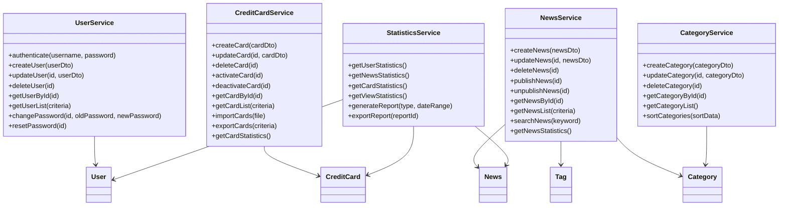

# PrimeCard Hub 管理端详细设计文档

## 文档信息

| 项目 | 内容 |
|------|------|
| 文档名称 | PrimeCard Hub 管理端详细设计文档 |
| 版本 | v1.0 |
| 创建日期 | 2024-01-15 |
| 最后更新 | 2024-01-15 |
| 产品经理 | 产品团队 |
| 技术负责人 | 技术团队 |
| 开发周期 | 10周 |

---

# 1. 领域模型设计

## 1.1 核心领域概念

### 1.1.1 领域模型图

```mermaid
classDiagram
    class User {
        +Long id
        +String username
        +String email
        +String password
        +UserRole role
        +UserStatus status
        +DateTime createdAt
        +DateTime updatedAt
        +login()
        +logout()
        +updateProfile()
        +changePassword()
    }
    
    class News {
        +Long id
        +String title
        +String content
        +String summary
        +NewsCategory category
        +NewsStatus status
        +String coverImage
        +String[] tags
        +Long authorId
        +Integer viewCount
        +DateTime publishTime
        +DateTime createdAt
        +DateTime updatedAt
        +publish()
        +unpublish()
        +updateContent()
        +addTag()
    }
    
    class CreditCard {
        +Long id
        +String bankName
        +String cardName
        +String cardType
        +String cardLevel
        +String annualFee
        +String[] benefits
        +String applyUrl
        +String cardImage
        +CardStatus status
        +DateTime createdAt
        +DateTime updatedAt
        +activate()
        +deactivate()
        +updateBenefits()
    }
    
    class Category {
        +Long id
        +String name
        +String description
        +String icon
        +Integer sortOrder
        +CategoryStatus status
        +DateTime createdAt
        +DateTime updatedAt
        +addNews()
        +removeNews()
    }
    
    class Tag {
        +Long id
        +String name
        +String color
        +Integer usageCount
        +DateTime createdAt
        +DateTime updatedAt
        +incrementUsage()
        +decrementUsage()
    }
    
    class NewsTag {
        +Long newsId
        +Long tagId
        +DateTime createdAt
    }
    
    class UserSession {
        +String sessionId
        +Long userId
        +String token
        +String refreshToken
        +DateTime expiresAt
        +DateTime createdAt
        +refresh()
        +invalidate()
    }
    
    User ||--o{ News : "创建"
    News }o--|| Category : "属于"
    News }o--o{ Tag : "标记"
    News ||--o{ NewsTag : "关联"
    Tag ||--o{ NewsTag : "关联"
    User ||--o{ UserSession : "会话"
```

### 1.1.2 领域实体定义

#### 用户实体（User）
```typescript
interface User {
  id: number;
  username: string;
  email: string;
  password: string; // 加密存储
  role: 'admin' | 'editor' | 'viewer';
  status: 'active' | 'inactive' | 'suspended';
  avatar?: string;
  lastLoginAt?: Date;
  createdAt: Date;
  updatedAt: Date;
}
```

#### 资讯实体（News）
```typescript
interface News {
  id: number;
  title: string;
  content: string; // Markdown格式
  summary: string;
  categoryId: number;
  status: 'draft' | 'published' | 'archived';
  coverImage?: string;
  tags: string[];
  authorId: number;
  viewCount: number;
  publishTime?: Date;
  createdAt: Date;
  updatedAt: Date;
}
```

#### 信用卡实体（CreditCard）
```typescript
interface CreditCard {
  id: number;
  bankName: string;
  cardName: string;
  cardType: 'credit' | 'debit' | 'prepaid';
  cardLevel: 'standard' | 'gold' | 'platinum' | 'diamond';
  annualFee: string;
  benefits: string[];
  applyUrl: string;
  cardImage: string;
  status: 'active' | 'inactive';
  createdAt: Date;
  updatedAt: Date;
}
```

## 1.2 聚合根设计

### 1.2.1 用户聚合
```typescript
class UserAggregate {
  private user: User;
  private sessions: UserSession[];
  
  constructor(user: User) {
    this.user = user;
    this.sessions = [];
  }
  
  // 业务方法
  login(password: string): UserSession {
    if (!this.validatePassword(password)) {
      throw new Error('密码错误');
    }
    
    const session = new UserSession(this.user.id);
    this.sessions.push(session);
    this.user.lastLoginAt = new Date();
    
    return session;
  }
  
  logout(sessionId: string): void {
    const sessionIndex = this.sessions.findIndex(s => s.sessionId === sessionId);
    if (sessionIndex !== -1) {
      this.sessions.splice(sessionIndex, 1);
    }
  }
  
  changePassword(oldPassword: string, newPassword: string): void {
    if (!this.validatePassword(oldPassword)) {
      throw new Error('原密码错误');
    }
    
    this.user.password = this.hashPassword(newPassword);
    this.user.updatedAt = new Date();
  }
  
  private validatePassword(password: string): boolean {
    // 密码验证逻辑
    return true;
  }
  
  private hashPassword(password: string): string {
    // 密码加密逻辑
    return password;
 ### 4.2.2 创建用户

**接口地址：** `POST /api/users`

**请求参数：**
```json
{
  "username": "newuser",
  "email": "newuser@example.com",
  "password": "123456",
  "role": "editor",
  "avatar": "https://example.com/avatar.jpg"
}
```

**响应示例：**
```json
{
  "code": 200,
  "message": "用户创建成功",
  "data": {
    "id": 2,
    "username": "newuser",
    "email": "newuser@example.com",
    "role": "editor",
    "status": "active",
    "avatar": "https://example.com/avatar.jpg",
    "createdAt": "2024-01-15T10:30:00Z"
  }
}
```

### 4.2.3 更新用户

**接口地址：** `PUT /api/users/:id`

**请求参数：**
```json
{
  "username": "updateduser",
  "email": "updated@example.com",
  "role": "admin",
  "status": "active",
  "avatar": "https://example.com/new-avatar.jpg"
}
```

### 4.2.4 删除用户

**接口地址：** `DELETE /api/users/:id`

**响应示例：**
```json
{
  "code": 200,
  "message": "用户删除成功",
  "data": null
}
```

### 4.2.5 批量删除用户

**接口地址：** `DELETE /api/users/batch`

**请求参数：**
```json
{
  "ids": [1, 2, 3]
}
```

## 4.3 资讯管理接口

### 4.3.1 获取资讯列表

**接口地址：** `GET /api/news`

**查询参数：**
| 参数 | 类型 | 必填 | 说明 |
|------|------|------|------|
| page | number | 否 | 页码，默认1 |
| size | number | 否 | 页面大小，默认10 |
| title | string | 否 | 标题模糊搜索 |
| categoryId | number | 否 | 分类ID |
| status | string | 否 | 状态筛选 |
| authorId | number | 否 | 作者ID |
| startDate | string | 否 | 开始日期 |
| endDate | string | 否 | 结束日期 |

**响应示例：**
```json
{
  "code": 200,
  "message": "获取成功",
  "data": {
    "list": [
      {
        "id": 1,
        "title": "信用卡新政策解读",
        "summary": "详细解读最新的信用卡政策变化...",
        "content": "完整的文章内容...",
        "categoryId": 1,
        "categoryName": "政策解读",
        "authorId": 1,
        "authorName": "admin",
        "status": "published",
        "publishTime": "2024-01-15T10:00:00Z",
        "viewCount": 1250,
        "tags": [
          {"id": 1, "name": "政策", "color": "#1890ff"},
          {"id": 2, "name": "信用卡", "color": "#52c41a"}
        ],
        "createdAt": "2024-01-15T09:00:00Z",
        "updatedAt": "2024-01-15T09:30:00Z"
      }
    ],
    "pagination": {
      "page": 1,
      "size": 10,
      "total": 1,
      "totalPages": 1,
      "hasNext": false,
      "hasPrev": false
    }
  }
}
```

### 4.3.2 获取资讯详情

**接口地址：** `GET /api/news/:id`

**响应示例：**
```json
{
  "code": 200,
  "message": "获取成功",
  "data": {
    "id": 1,
    "title": "信用卡新政策解读",
    "summary": "详细解读最新的信用卡政策变化...",
    "content": "完整的文章内容...",
    "categoryId": 1,
    "categoryName": "政策解读",
    "authorId": 1,
    "authorName": "admin",
    "status": "published",
    "publishTime": "2024-01-15T10:00:00Z",
    "viewCount": 1250,
    "tags": [
      {"id": 1, "name": "政策", "color": "#1890ff"},
      {"id": 2, "name": "信用卡", "color": "#52c41a"}
    ],
    "createdAt": "2024-01-15T09:00:00Z",
    "updatedAt": "2024-01-15T09:30:00Z"
  }
}
```

### 4.3.3 创建资讯

**接口地址：** `POST /api/news`

**请求参数：**
```json
{
  "title": "新的信用卡资讯",
  "summary": "这是一篇关于信用卡的新资讯",
  "content": "详细的文章内容...",
  "categoryId": 1,
  "status": "draft",
  "publishTime": "2024-01-16T10:00:00Z",
  "tagIds": [1, 2]
}
```

### 4.3.4 更新资讯

**接口地址：** `PUT /api/news/:id`

**请求参数：**
```json
{
  "title": "更新后的标题",
  "summary": "更新后的摘要",
  "content": "更新后的内容...",
  "categoryId": 2,
  "status": "published",
  "publishTime": "2024-01-16T10:00:00Z",
  "tagIds": [1, 3]
}
```

### 4.3.5 删除资讯

**接口地址：** `DELETE /api/news/:id`

### 4.3.6 批量删除资讯

**接口地址：** `DELETE /api/news/batch`

**请求参数：**
```json
{
  "ids": [1, 2, 3]
}
```

### 4.3.7 发布资讯

**接口地址：** `POST /api/news/:id/publish`

**响应示例：**
```json
{
  "code": 200,
  "message": "资讯发布成功",
  "data": {
    "id": 1,
    "status": "published",
    "publishTime": "2024-01-15T10:30:00Z"
  }
}
```

### 4.3.8 撤回资讯

**接口地址：** `POST /api/news/:id/unpublish`

## 4.4 分类管理接口

### 4.4.1 获取分类列表

**接口地址：** `GET /api/categories`

**响应示例：**
```json
{
  "code": 200,
  "message": "获取成功",
  "data": [
    {
      "id": 1,
      "name": "政策解读",
      "description": "信用卡相关政策解读",
      "icon": "policy-icon",
      "sortOrder": 1,
      "status": "active",
      "newsCount": 15,
      "createdAt": "2024-01-01T00:00:00Z"
    }
  ]
}
```

### 4.4.2 创建分类

**接口地址：** `POST /api/categories`

**请求参数：**
```json
{
  "name": "新分类",
  "description": "分类描述",
  "icon": "category-icon",
  "sortOrder": 10
}
```

### 4.4.3 更新分类

**接口地址：** `PUT /api/categories/:id`

### 4.4.4 删除分类

**接口地址：** `DELETE /api/categories/:id`

## 4.5 标签管理接口

### 4.5.1 获取标签列表

**接口地址：** `GET /api/tags`

**查询参数：**
| 参数 | 类型 | 必填 | 说明 |
|------|------|------|------|
| page | number | 否 | 页码，默认1 |
| size | number | 否 | 页面大小，默认10 |
| name | string | 否 | 标签名称模糊搜索 |

**响应示例：**
```json
{
  "code": 200,
  "message": "获取成功",
  "data": {
    "list": [
      {
        "id": 1,
        "name": "政策",
        "color": "#1890ff",
        "usageCount": 25,
        "createdAt": "2024-01-01T00:00:00Z"
      }
    ],
    "pagination": {
      "page": 1,
      "size": 10,
      "total": 1,
      "totalPages": 1,
      "hasNext": false,
      "hasPrev": false
    }
  }
}
```

### 4.5.2 创建标签

**接口地址：** `POST /api/tags`

**请求参数：**
```json
{
  "name": "新标签",
  "color": "#52c41a"
}
```

### 4.5.3 更新标签

**接口地址：** `PUT /api/tags/:id`

### 4.5.4 删除标签

**接口地址：** `DELETE /api/tags/:id`

### 4.5.5 批量删除标签

**接口地址：** `DELETE /api/tags/batch`

## 4.6 信用卡管理接口

### 4.6.1 获取信用卡列表

**接口地址：** `GET /api/credit-cards`

**查询参数：**
| 参数 | 类型 | 必填 | 说明 |
|------|------|------|------|
| page | number | 否 | 页码，默认1 |
| size | number | 否 | 页面大小，默认10 |
| bankName | string | 否 | 银行名称模糊搜索 |
| cardName | string | 否 | 卡片名称模糊搜索 |
| cardType | string | 否 | 卡片类型筛选 |
| cardLevel | string | 否 | 卡片等级筛选 |
| status | string | 否 | 状态筛选 |

**响应示例：**
```json
{
  "code": 200,
  "message": "获取成功",
  "data": {
    "list": [
      {
        "id": 1,
        "bankName": "招商银行",
        "cardName": "招商银行信用卡经典版",
        "cardType": "credit",
        "cardLevel": "standard",
        "annualFee": "免年费",
        "benefits": [
          "首年免年费",
          "积分永久有效",
          "生日月双倍积分"
        ],
        "applyUrl": "https://bank.example.com/apply",
        "cardImage": "https://example.com/card-image.jpg",
        "status": "active",
        "createdAt": "2024-01-01T00:00:00Z",
        "updatedAt": "2024-01-15T10:00:00Z"
      }
    ],
    "pagination": {
      "page": 1,
      "size": 10,
      "total": 1,
      "totalPages": 1,
      "hasNext": false,
      "hasPrev": false
    }
  }
}
```

### 4.6.2 获取信用卡详情

**接口地址：** `GET /api/credit-cards/:id`

### 4.6.3 创建信用卡

**接口地址：** `POST /api/credit-cards`

**请求参数：**
```json
{
  "bankName": "中国银行",
  "cardName": "中银信用卡白金卡",
  "cardType": "credit",
  "cardLevel": "platinum",
  "annualFee": "3600元/年",
  "benefits": [
    "机场贵宾厅服务",
    "高额保险保障",
    "专属客服热线"
  ],
  "applyUrl": "https://bank.example.com/apply/platinum",
  "cardImage": "https://example.com/platinum-card.jpg"
}
```

### 4.6.4 更新信用卡

**接口地址：** `PUT /api/credit-cards/:id`

### 4.6.5 删除信用卡

**接口地址：** `DELETE /api/credit-cards/:id`

### 4.6.6 批量删除信用卡

**接口地址：** `DELETE /api/credit-cards/batch`

## 4.7 文件上传接口

### 4.7.1 上传图片

**接口地址：** `POST /api/upload/image`

**请求参数：** `multipart/form-data`
- file: 图片文件（支持jpg, png, gif, webp格式，最大5MB）

**响应示例：**
```json
{
  "code": 200,
  "message": "上传成功",
  "data": {
    "url": "https://oss.example.com/images/2024/01/15/abc123.jpg",
    "filename": "abc123.jpg",
    "size": 1024000,
    "mimeType": "image/jpeg"
  }
}
```

### 4.7.2 上传文档

**接口地址：** `POST /api/upload/document`

**请求参数：** `multipart/form-data`
- file: 文档文件（支持pdf, doc, docx格式，最大10MB）

### 4.7.3 批量上传

**接口地址：** `POST /api/upload/batch`

**请求参数：** `multipart/form-data`
- files: 多个文件

## 4.8 统计分析接口

### 4.8.1 获取仪表板数据

**接口地址：** `GET /api/dashboard/stats`

**响应示例：**
```json
{
  "code": 200,
  "message": "获取成功",
  "data": {
    "overview": {
      "totalUsers": 1250,
      "totalNews": 856,
      "totalCreditCards": 125,
      "todayViews": 3420
    },
    "newsStats": {
      "publishedCount": 750,
      "draftCount": 106,
      "todayPublished": 5
    },
    "userStats": {
      "activeUsers": 1180,
      "newUsersToday": 12,
      "adminCount": 3,
      "editorCount": 15
    },
    "viewTrend": [
      {"date": "2024-01-01", "views": 2800},
      {"date": "2024-01-02", "views": 3200},
      {"date": "2024-01-03", "views": 2950}
    ]
  }
}
```

### 4.8.2 获取资讯统计

**接口地址：** `GET /api/dashboard/news-stats`

**查询参数：**
| 参数 | 类型 | 必填 | 说明 |
|------|------|------|------|
| startDate | string | 否 | 开始日期 |
| endDate | string | 否 | 结束日期 |
| groupBy | string | 否 | 分组方式：day/week/month |

### 4.8.3 获取用户活跃度统计

**接口地址：** `GET /api/dashboard/user-activity`

---

# 5. 错误码定义

## 5.1 通用错误码

| 错误码 | 说明 | HTTP状态码 |
|--------|------|------------|
| 200 | 成功 | 200 |
| 400 | 请求参数错误 | 400 |
| 401 | 未授权 | 401 |
| 403 | 禁止访问 | 403 |
| 404 | 资源不存在 | 404 |
| 409 | 资源冲突 | 409 |
| 422 | 请求参数验证失败 | 422 |
| 429 | 请求过于频繁 | 429 |
| 500 | 服务器内部错误 | 500 |

## 5.2 业务错误码

| 错误码 | 说明 |
|--------|------|
| 1001 | 用户名或密码错误 |
| 1002 | 用户已被禁用 |
| 1003 | Token已过期 |
| 1004 | Token无效 |
| 1005 | 用户名已存在 |
| 1006 | 邮箱已存在 |
| 2001 | 资讯不存在 |
| 2002 | 资讯已发布，无法删除 |
| 2003 | 分类不存在 |
| 2004 | 分类下存在资讯，无法删除 |
| 2005 | 标签不存在 |
| 3001 | 信用卡不存在 |
| 3002 | 银行名称已存在 |
| 4001 | 文件格式不支持 |
| 4002 | 文件大小超出限制 |
| 4003 | 文件上传失败 |

---

# 6. 数据验证规则

## 6.1 用户数据验证

```typescript
const userValidationRules = {
  username: {
    required: true,
    minLength: 3,
    maxLength: 20,
    pattern: /^[a-zA-Z0-9_]+$/,
    message: '用户名只能包含字母、数字和下划线，长度3-20位'
  },
  email: {
    required: true,
    pattern: /^[^\s@]+@[^\s@]+\.[^\s@]+$/,
    message: '请输入有效的邮箱地址'
  },
  password: {
    required: true,
    minLength: 6,
    maxLength: 20,
    pattern: /^(?=.*[a-z])(?=.*[A-Z])(?=.*\d)[a-zA-Z\d@$!%*?&]{6,}$/,
    message: '密码至少包含一个大写字母、一个小写字母和一个数字，长度6-20位'
  },
  role: {
    required: true,
    enum: ['admin', 'editor', 'viewer'],
    message: '角色必须是admin、editor或viewer之一'
  }
};
```

## 6.2 资讯数据验证

```typescript
const newsValidationRules = {
  title: {
    required: true,
    minLength: 5,
    maxLength: 100,
    message: '标题长度必须在5-100字符之间'
  },
  summary: {
    required: true,
    minLength: 10,
    maxLength: 500,
    message: '摘要长度必须在10-500字符之间'
  },
  content: {
    required: true,
    minLength: 50,
    message: '内容长度至少50字符'
  },
  categoryId: {
    required: true,
    type: 'number',
    message: '必须选择一个分类'
  },
  status: {
    required: true,
    enum: ['draft', 'published', 'archived'],
    message: '状态必须是draft、published或archived之一'
  }
};
```

## 6.3 信用卡数据验证

```typescript
const creditCardValidationRules = {
  bankName: {
    required: true,
    minLength: 2,
    maxLength: 50,
    message: '银行名称长度必须在2-50字符之间'
  },
  cardName: {
    required: true,
    minLength: 5,
    maxLength: 100,
    message: '卡片名称长度必须在5-100字符之间'
  },
  cardType: {
    required: true,
    enum: ['credit', 'debit', 'prepaid'],
    message: '卡片类型必须是credit、debit或prepaid之一'
  },
  cardLevel: {
    required: true,
    enum: ['standard', 'gold', 'platinum', 'diamond'],
    message: '卡片等级必须是standard、gold、platinum或diamond之一'
  },
  applyUrl: {
    required: true,
    pattern: /^https?:\/\/.+/,
    message: '申请链接必须是有效的URL'
  }
};
```

---

# 7. 安全设计

## 7.1 认证与授权

### 7.1.1 JWT Token设计

```typescript
interface JWTPayload {
  userId: number;
  username: string;
  role: string;
  iat: number;  // 签发时间
  exp: number;  // 过期时间
}

// Token配置
const tokenConfig = {
  accessTokenExpiry: '2h',      // 访问令牌2小时过期
  refreshTokenExpiry: '7d',     // 刷新令牌7天过期
  algorithm: 'HS256',
  issuer: 'primecard-hub',
  audience: 'primecard-management'
};
```

### 7.1.2 权限控制矩阵

| 功能模块 | admin | editor | viewer |
|----------|-------|--------|--------|
| 用户管理 | ✅ | ❌ | ❌ |
| 资讯管理 | ✅ | ✅ | ❌ |
| 分类管理 | ✅ | ✅ | ❌ |
| 标签管理 | ✅ | ✅ | ❌ |
| 信用卡管理 | ✅ | ✅ | ❌ |
| 文件上传 | ✅ | ✅ | ❌ |
| 统计查看 | ✅ | ✅ | ✅ |

### 7.1.3 API安全中间件

```typescript
// 认证中间件
const authMiddleware = (req: Request, res: Response, next: NextFunction) => {
  const token = req.headers.authorization?.replace('Bearer ', '');
  
  if (!token) {
    return res.status(401).json({
      code: 401,
      message: '未提供认证令牌'
    });
  }
  
  try {
    const decoded = jwt.verify(token, process.env.JWT_SECRET) as JWTPayload;
    req.user = decoded;
    next();
  } catch (error) {
    return res.status(401).json({
      code: 1003,
      message: 'Token已过期或无效'
    });
  }
};

// 权限检查中间件
const roleMiddleware = (allowedRoles: string[]) => {
  return (req: Request, res: Response, next: NextFunction) => {
    if (!allowedRoles.includes(req.user.role)) {
      return res.status(403).json({
        code: 403,
        message: '权限不足'
      });
    }
    next();
  };
};
```

## 7.2 数据安全

### 7.2.1 密码加密

```typescript
import bcrypt from 'bcrypt';

class PasswordService {
  private static readonly SALT_ROUNDS = 12;
  
  static async hashPassword(password: string): Promise<string> {
    return bcrypt.hash(password, this.SALT_ROUNDS);
  }
  
  static async comparePassword(password: string, hash: string): Promise<boolean> {
    return bcrypt.compare(password, hash);
  }
}
```

### 7.2.2 敏感数据脱敏

```typescript
class DataMaskingService {
  static maskEmail(email: string): string {
    const [username, domain] = email.split('@');
    const maskedUsername = username.slice(0, 2) + '*'.repeat(username.length - 2);
    return `${maskedUsername}@${domain}`;
  }
  
  static maskPhone(phone: string): string {
    return phone.replace(/(\d{3})\d{4}(\d{4})/, '$1****$2');
  }
  
  static maskIdCard(idCard: string): string {
    return idCard.replace(/(\d{6})\d{8}(\d{4})/, '$1********$2');
  }
}
```

### 7.2.3 SQL注入防护

```typescript
// 使用Sequelize ORM防止SQL注入
const getUserById = async (id: number) => {
  return await User.findByPk(id, {
    attributes: { exclude: ['password'] }
  });
};

// 参数化查询
const searchNews = async (keyword: string) => {
  return await News.findAll({
    where: {
      title: {
        [Op.like]: `%${keyword}%`
      }
    }
  });
};
```

---

# 8. 性能优化

## 8.1 数据库优化

### 8.1.1 查询优化

```sql
-- 使用EXPLAIN分析查询性能
EXPLAIN SELECT n.*, c.name as category_name, u.username as author_name
FROM news n
LEFT JOIN categories c ON n.category_id = c.id
LEFT JOIN users u ON n.author_id = u.id
WHERE n.status = 'published'
ORDER BY n.publish_time DESC
LIMIT 10 OFFSET 0;

-- 优化后的查询（添加复合索引）
ALTER TABLE news ADD INDEX idx_status_publish_time (status, publish_time);
```

### 8.1.2 缓存策略

```typescript
import Redis from 'ioredis';

class CacheService {
  private redis: Redis;
  
  constructor() {
    this.redis = new Redis({
      host: process.env.REDIS_HOST,
      port: parseInt(process.env.REDIS_PORT || '6379'),
      password: process.env.REDIS_PASSWORD
    });
  }
  
  // 缓存资讯列表
  async cacheNewsList(key: string, data: any, ttl: number = 300) {
    await this.redis.setex(key, ttl, JSON.stringify(data));
  }
  
  // 获取缓存的资讯列表
  async getCachedNewsList(key: string) {
    const cached = await this.redis.get(key);
    return cached ? JSON.parse(cached) : null;
  }
  
  // 清除相关缓存
  async clearNewsCache() {
    const keys = await this.redis.keys('news:*');
    if (keys.length > 0) {
      await this.redis.del(...keys);
    }
  }
}
```

## 8.2 API性能优化

### 8.2.1 分页优化

```typescript
class PaginationService {
  static async paginateQuery(
    model: any,
    options: {
      page: number;
      size: number;
      where?: any;
      include?: any;
      order?: any;
    }
  ) {
    const { page = 1, size = 10, where, include, order } = options;
    const offset = (page - 1) * size;
    
    const { count, rows } = await model.findAndCountAll({
      where,
      include,
      order,
      limit: size,
      offset,
      distinct: true
    });
    
    return {
      list: rows,
      pagination: {
        page,
        size,
        total: count,
        totalPages: Math.ceil(count / size),
        hasNext: page < Math.ceil(count / size),
        hasPrev: page > 1
      }
    };
  }
}
```

### 8.2.2 响应压缩

```typescript
import compression from 'compression';

// 启用gzip压缩
app.use(compression({
  filter: (req, res) => {
    if (req.headers['x-no-compression']) {
      return false;
    }
    return compression.filter(req, res);
  },
  level: 6,
  threshold: 1024
}));
```

---

# 9. 监控与日志

## 9.1 应用监控

### 9.1.1 健康检查

```typescript
// 健康检查端点
app.get('/health', async (req, res) => {
  const health = {
    status: 'ok',
    timestamp: new Date().toISOString(),
    uptime: process.uptime(),
    checks: {
      database: await checkDatabase(),
      redis: await checkRedis(),
      memory: checkMemory(),
      disk: await checkDisk()
    }
  };
  
  const isHealthy = Object.values(health.checks).every(check => check.status === 'ok');
  
  res.status(isHealthy ? 200 : 503).json(health);
});

async function checkDatabase() {
  try {
    await sequelize.authenticate();
    return { status: 'ok', message: 'Database connection successful' };
  } catch (error) {
    return { status: 'error', message: error.message };
  }
}
```

### 9.1.2 性能监控

```typescript
import { performance } from 'perf_hooks';

// API响应时间监控中间件
const performanceMiddleware = (req: Request, res: Response, next: NextFunction) => {
  const start = performance.now();
  
  res.on('finish', () => {
    const duration = performance.now() - start;
    
    // 记录慢查询（超过1秒）
    if (duration > 1000) {
      logger.warn('Slow API detected', {
        method: req.method,
        url: req.url,
        duration: `${duration.toFixed(2)}ms`,
        userAgent: req.get('User-Agent'),
        ip: req.ip
      });
    }
    
    // 记录API调用统计
    metrics.recordApiCall(req.method, req.route?.path || req.url, res.statusCode, duration);
  });
  
  next();
};
```

## 9.2 日志管理

### 9.2.1 日志配置

```typescript
import winston from 'winston';

const logger = winston.createLogger({
  level: process.env.LOG_LEVEL || 'info',
  format: winston.format.combine(
    winston.format.timestamp(),
    winston.format.errors({ stack: true }),
    winston.format.json()
  ),
  defaultMeta: { service: 'primecard-management' },
  transports: [
    new winston.transports.File({ 
      filename: 'logs/error.log', 
      level: 'error',
      maxsize: 5242880, // 5MB
      maxFiles: 5
    }),
    new winston.transports.File({ 
      filename: 'logs/combined.log',
      maxsize: 5242880,
      maxFiles: 10
    })
  ]
});

if (process.env.NODE_ENV !== 'production') {
  logger.add(new winston.transports.Console({
    format: winston.format.simple()
  }));
}
```

### 9.2.2 操作日志

```typescript
class AuditLogger {
  static logUserAction(userId: number, action: string, resource: string, details?: any) {
    logger.info('User action', {
      userId,
      action,
      resource,
      details,
      timestamp: new Date().toISOString(),
      ip: req.ip,
      userAgent: req.get('User-Agent')
    });
  }
  
  static logDataChange(userId: number, table: string, recordId: number, changes: any) {
    logger.info('Data change', {
      userId,
      table,
      recordId,
      changes,
      timestamp: new Date().toISOString()
    });
  }
}

// 使用示例
AuditLogger.logUserAction(1, 'CREATE', 'news', { title: '新资讯标题' });
AuditLogger.logDataChange(1, 'news', 123, { status: 'draft -> published' });
```

---

# 10. 部署配置

## 10.1 环境配置

### 10.1.1 环境变量

```bash
# .env.production
NODE_ENV=production
PORT=3000

# 数据库配置
DB_HOST=localhost
DB_PORT=3306
DB_NAME=primecard_hub
DB_USER=primecard_user
DB_PASSWORD=your_secure_password

# Redis配置
REDIS_HOST=localhost
REDIS_PORT=6379
REDIS_PASSWORD=your_redis_password

# JWT配置
JWT_SECRET=your_jwt_secret_key
JWT_EXPIRES_IN=2h
REFRESH_TOKEN_EXPIRES_IN=7d

# 文件上传配置
UPLOAD_MAX_SIZE=10485760  # 10MB
ALLOWED_IMAGE_TYPES=jpg,jpeg,png,gif,webp
ALLOWED_DOCUMENT_TYPES=pdf,doc,docx

# 阿里云OSS配置
OSS_ACCESS_KEY_ID=your_access_key_id
OSS_ACCESS_KEY_SECRET=your_access_key_secret
OSS_BUCKET=primecard-hub
OSS_REGION=oss-cn-hangzhou
OSS_ENDPOINT=https://oss-cn-hangzhou.aliyuncs.com

# 邮件配置
SMTP_HOST=smtp.example.com
SMTP_PORT=587
SMTP_USER=noreply@example.com
SMTP_PASSWORD=your_smtp_password

# 日志配置
LOG_LEVEL=info
LOG_MAX_SIZE=5242880  # 5MB
LOG_MAX_FILES=10
```

### 10.1.2 Docker配置

```dockerfile
# Dockerfile
FROM node:18-alpine

WORKDIR /app

# 复制package文件
COPY package*.json ./

# 安装依赖
RUN npm ci --only=production

# 复制源代码
COPY . .

# 构建应用
RUN npm run build

# 创建非root用户
RUN addgroup -g 1001 -S nodejs
RUN adduser -S nodejs -u 1001

# 更改文件所有者
RUN chown -R nodejs:nodejs /app
USER nodejs

# 暴露端口
EXPOSE 3000

# 健康检查
HEALTHCHECK --interval=30s --timeout=3s --start-period=5s --retries=3 \
  CMD curl -f http://localhost:3000/health || exit 1

# 启动应用
CMD ["npm", "start"]
```

```yaml
# docker-compose.yml
version: '3.8'

services:
  app:
    build: .
    ports:
      - "3000:3000"
    environment:
      - NODE_ENV=production
    env_file:
      - .env.production
    depends_on:
      - mysql
      - redis
    restart: unless-stopped
    volumes:
      - ./logs:/app/logs

  mysql:
    image: mysql:8.0
    environment:
      MYSQL_ROOT_PASSWORD: root_password
      MYSQL_DATABASE: primecard_hub
      MYSQL_USER: primecard_user
      MYSQL_PASSWORD: user_password
    ports:
      - "3306:3306"
    volumes:
      - mysql_data:/var/lib/mysql
      - ./init.sql:/docker-entrypoint-initdb.d/init.sql
    restart: unless-stopped

  redis:
    image: redis:7-alpine
    command: redis-server --requirepass redis_password
    ports:
      - "6379:6379"
    volumes:
      - redis_data:/data
    restart: unless-stopped

  nginx:
    image: nginx:alpine
    ports:
      - "80:80"
      - "443:443"
    volumes:
      - ./nginx.conf:/etc/nginx/nginx.conf
      - ./ssl:/etc/nginx/ssl
    depends_on:
      - app
    restart: unless-stopped

volumes:
  mysql_data:
  redis_data:
```

## 10.2 CI/CD配置

### 10.2.1 GitHub Actions

```yaml
# .github/workflows/deploy.yml
name: Deploy to Production

on:
  push:
    branches: [ main ]

jobs:
  test:
    runs-on: ubuntu-latest
    
    steps:
    - uses: actions/checkout@v3
    
    - name: Setup Node.js
      uses: actions/setup-node@v3
      with:
        node-version: '18'
        cache: 'npm'
    
    - name: Install dependencies
      run: npm ci
    
    - name: Run tests
      run: npm test
    
    - name: Run linting
      run: npm run lint
    
    - name: Run type checking
      run: npm run type-check

  build-and-deploy:
    needs: test
    runs-on: ubuntu-latest
    
    steps:
    - uses: actions/checkout@v3
    
    - name: Build Docker image
      run: |
        docker build -t primecard-hub:${{ github.sha }} .
        docker tag primecard-hub:${{ github.sha }} primecard-hub:latest
    
    - name: Deploy to server
      uses: appleboy/ssh-action@v0.1.5
      with:
        host: ${{ secrets.HOST }}
        username: ${{ secrets.USERNAME }}
        key: ${{ secrets.SSH_KEY }}
        script: |
          cd /opt/primecard-hub
          docker-compose pull
          docker-compose up -d
          docker system prune -f
```

---

# 11. 总结

本文档详细描述了PrimeCard Hub管理端的完整技术设计，包括：

## 11.1 核心特性

1. **完整的领域模型设计**：基于DDD思想，清晰定义了用户、资讯、信用卡等核心领域对象
2. **规范的数据库设计**：包含完整的表结构、索引优化和分区策略
3. **RESTful API设计**：提供完整的接口文档，支持CRUD操作和业务流程
4. **安全性保障**：JWT认证、权限控制、数据加密和防护措施
5. **性能优化**：缓存策略、查询优化和响应压缩
6. **监控与日志**：健康检查、性能监控和操作审计
7. **部署配置**：Docker容器化和CI/CD自动化部署

## 11.2 技术亮点

- 使用TypeScript提供类型安全
- 采用Sequelize ORM防止SQL注入
- Redis缓存提升性能
- Winston日志管理
- Docker容器化部署
- GitHub Actions自动化CI/CD

## 11.3 扩展性考虑

- 微服务架构支持水平扩展
- 数据库分区支持大数据量
- 缓存策略支持高并发
- 监控体系支持运维管理

该设计文档为开发团队提供了完整的技术指导，确保项目的高质量交付和后续维护。

### 1.2.2 资讯聚合
```typescript
class NewsAggregate {
  private news: News;
  private category: Category;
  private tags: Tag[];
  
  constructor(news: News) {
    this.news = news;
  }
  
  // 业务方法
  publish(): void {
    if (this.news.status === 'draft') {
      this.news.status = 'published';
      this.news.publishTime = new Date();
      this.news.updatedAt = new Date();
    }
  }
  
  unpublish(): void {
    if (this.news.status === 'published') {
      this.news.status = 'draft';
      this.news.publishTime = undefined;
      this.news.updatedAt = new Date();
    }
  }
  
  updateContent(title: string, content: string, summary: string): void {
    this.news.title = title;
    this.news.content = content;
    this.news.summary = summary;
    this.news.updatedAt = new Date();
  }
  
  addTag(tag: Tag): void {
    if (!this.tags.find(t => t.id === tag.id)) {
      this.tags.push(tag);
      tag.incrementUsage();
    }
  }
  
  removeTag(tagId: number): void {
    const tagIndex = this.tags.findIndex(t => t.id === tagId);
    if (tagIndex !== -1) {
      const tag = this.tags[tagIndex];
      this.tags.splice(tagIndex, 1);
      tag.decrementUsage();
    }
  }
  
 ```

---

# 2. 对象模型设计

## 2.1 数据传输对象（DTO）

### 2.1.1 用户相关DTO

```typescript
// 用户登录请求DTO
interface LoginRequestDTO {
  username: string;
  password: string;
  rememberMe?: boolean;
}

// 用户登录响应DTO
interface LoginResponseDTO {
  token: string;
  refreshToken: string;
  user: UserInfoDTO;
  expiresIn: number;
}

// 用户信息DTO
interface UserInfoDTO {
  id: number;
  username: string;
  email: string;
  role: string;
  status: string;
  avatar?: string;
  lastLoginAt?: string;
  createdAt: string;
}

// 用户创建请求DTO
interface CreateUserRequestDTO {
  username: string;
  email: string;
  password: string;
  role: 'admin' | 'editor' | 'viewer';
}

// 用户更新请求DTO
interface UpdateUserRequestDTO {
  email?: string;
  role?: string;
  status?: string;
  avatar?: string;
}
```

### 2.1.2 资讯相关DTO

```typescript
// 资讯创建请求DTO
interface CreateNewsRequestDTO {
  title: string;
  content: string;
  summary: string;
  categoryId: number;
  tags: string[];
  coverImage?: string;
  publishTime?: string;
}

// 资讯更新请求DTO
interface UpdateNewsRequestDTO {
  title?: string;
  content?: string;
  summary?: string;
  categoryId?: number;
  tags?: string[];
  coverImage?: string;
  status?: 'draft' | 'published' | 'archived';
}

// 资讯列表响应DTO
interface NewsListResponseDTO {
  id: number;
  title: string;
  summary: string;
  category: CategoryInfoDTO;
  status: string;
  author: UserInfoDTO;
  viewCount: number;
  publishTime?: string;
  createdAt: string;
  updatedAt: string;
}

// 资讯详情响应DTO
interface NewsDetailResponseDTO extends NewsListResponseDTO {
  content: string;
  tags: TagInfoDTO[];
}
```

### 2.1.3 信用卡相关DTO

```typescript
// 信用卡创建请求DTO
interface CreateCreditCardRequestDTO {
  bankName: string;
  cardName: string;
  cardType: 'credit' | 'debit' | 'prepaid';
  cardLevel: 'standard' | 'gold' | 'platinum' | 'diamond';
  annualFee: string;
  benefits: string[];
  applyUrl: string;
  cardImage: string;
}

// 信用卡响应DTO
interface CreditCardResponseDTO {
  id: number;
  bankName: string;
  cardName: string;
  cardType: string;
  cardLevel: string;
  annualFee: string;
  benefits: string[];
  applyUrl: string;
  cardImage: string;
  status: string;
  createdAt: string;
  updatedAt: string;
}
```

## 2.2 值对象设计

### 2.2.1 分页对象
```typescript
class Pagination {
  constructor(
    public readonly page: number,
    public readonly size: number,
    public readonly total: number
  ) {
    if (page < 1) throw new Error('页码必须大于0');
    if (size < 1 || size > 100) throw new Error('页面大小必须在1-100之间');
  }
  
  get offset(): number {
    return (this.page - 1) * this.size;
  }
  
  get totalPages(): number {
    return Math.ceil(this.total / this.size);
  }
  
  get hasNext(): boolean {
    return this.page < this.totalPages;
  }
  
  get hasPrev(): boolean {
    return this.page > 1;
  }
}
```

### 2.2.2 查询条件对象
```typescript
class NewsQueryCondition {
  constructor(
    public readonly title?: string,
    public readonly categoryId?: number,
    public readonly status?: string,
    public readonly authorId?: number,
    public readonly startDate?: Date,
    public readonly endDate?: Date,
    public readonly tags?: string[]
  ) {}
  
  toWhereClause(): object {
    const where: any = {};
    
    if (this.title) {
      where.title = { [Op.like]: `%${this.title}%` };
    }
    
    if (this.categoryId) {
      where.categoryId = this.categoryId;
    }
    
    if (this.status) {
      where.status = this.status;
    }
    
    if (this.authorId) {
      where.authorId = this.authorId;
    }
    
    if (this.startDate && this.endDate) {
      where.createdAt = {
        [Op.between]: [this.startDate, this.endDate]
      };
    }
    
    return where;
  }
}
```

---

# 3. 数据库设计

## 3.1 数据库表结构

### 3.1.1 用户表（users）

```sql
CREATE TABLE `users` (
  `id` bigint(20) NOT NULL AUTO_INCREMENT COMMENT '用户ID',
  `username` varchar(50) NOT NULL COMMENT '用户名',
  `email` varchar(100) NOT NULL COMMENT '邮箱',
  `password` varchar(255) NOT NULL COMMENT '密码（加密）',
  `role` enum('admin','editor','viewer') NOT NULL DEFAULT 'viewer' COMMENT '角色',
  `status` enum('active','inactive','suspended') NOT NULL DEFAULT 'active' COMMENT '状态',
  `avatar` varchar(255) DEFAULT NULL COMMENT '头像URL',
  `last_login_at` datetime DEFAULT NULL COMMENT '最后登录时间',
  `created_at` datetime NOT NULL DEFAULT CURRENT_TIMESTAMP COMMENT '创建时间',
  `updated_at` datetime NOT NULL DEFAULT CURRENT_TIMESTAMP ON UPDATE CURRENT_TIMESTAMP COMMENT '更新时间',
  PRIMARY KEY (`id`),
  UNIQUE KEY `uk_username` (`username`),
  UNIQUE KEY `uk_email` (`email`),
  KEY `idx_role` (`role`),
  KEY `idx_status` (`status`),
  KEY `idx_created_at` (`created_at`)
) ENGINE=InnoDB DEFAULT CHARSET=utf8mb4 COMMENT='用户表';
```

### 3.1.2 资讯表（news）

```sql
CREATE TABLE `news` (
  `id` bigint(20) NOT NULL AUTO_INCREMENT COMMENT '资讯ID',
  `title` varchar(200) NOT NULL COMMENT '标题',
  `content` longtext NOT NULL COMMENT '内容（Markdown格式）',
  `summary` varchar(500) NOT NULL COMMENT '摘要',
  `category_id` bigint(20) NOT NULL COMMENT '分类ID',
  `status` enum('draft','published','archived') NOT NULL DEFAULT 'draft' COMMENT '状态',
  `cover_image` varchar(255) DEFAULT NULL COMMENT '封面图片URL',
  `author_id` bigint(20) NOT NULL COMMENT '作者ID',
  `view_count` int(11) NOT NULL DEFAULT '0' COMMENT '浏览次数',
  `publish_time` datetime DEFAULT NULL COMMENT '发布时间',
  `created_at` datetime NOT NULL DEFAULT CURRENT_TIMESTAMP COMMENT '创建时间',
  `updated_at` datetime NOT NULL DEFAULT CURRENT_TIMESTAMP ON UPDATE CURRENT_TIMESTAMP COMMENT '更新时间',
  PRIMARY KEY (`id`),
  KEY `idx_category_id` (`category_id`),
  KEY `idx_author_id` (`author_id`),
  KEY `idx_status` (`status`),
  KEY `idx_publish_time` (`publish_time`),
  KEY `idx_created_at` (`created_at`),
  FULLTEXT KEY `ft_title_content` (`title`,`content`),
  CONSTRAINT `fk_news_category` FOREIGN KEY (`category_id`) REFERENCES `categories` (`id`),
  CONSTRAINT `fk_news_author` FOREIGN KEY (`author_id`) REFERENCES `users` (`id`)
### 3.1.3 分类表（categories）

```sql
CREATE TABLE `categories` (
  `id` bigint(20) NOT NULL AUTO_INCREMENT COMMENT '分类ID',
  `name` varchar(50) NOT NULL COMMENT '分类名称',
  `description` varchar(200) DEFAULT NULL COMMENT '分类描述',
  `icon` varchar(100) DEFAULT NULL COMMENT '分类图标',
  `sort_order` int(11) NOT NULL DEFAULT '0' COMMENT '排序',
  `status` enum('active','inactive') NOT NULL DEFAULT 'active' COMMENT '状态',
  `created_at` datetime NOT NULL DEFAULT CURRENT_TIMESTAMP COMMENT '创建时间',
  `updated_at` datetime NOT NULL DEFAULT CURRENT_TIMESTAMP ON UPDATE CURRENT_TIMESTAMP COMMENT '更新时间',
  PRIMARY KEY (`id`),
  UNIQUE KEY `uk_name` (`name`),
  KEY `idx_sort_order` (`sort_order`),
  KEY `idx_status` (`status`)
) ENGINE=InnoDB DEFAULT CHARSET=utf8mb4 COMMENT='分类表';
```

### 3.1.4 标签表（tags）

```sql
CREATE TABLE `tags` (
  `id` bigint(20) NOT NULL AUTO_INCREMENT COMMENT '标签ID',
  `name` varchar(30) NOT NULL COMMENT '标签名称',
  `color` varchar(7) DEFAULT '#1890ff' COMMENT '标签颜色',
  `usage_count` int(11) NOT NULL DEFAULT '0' COMMENT '使用次数',
  `created_at` datetime NOT NULL DEFAULT CURRENT_TIMESTAMP COMMENT '创建时间',
  `updated_at` datetime NOT NULL DEFAULT CURRENT_TIMESTAMP ON UPDATE CURRENT_TIMESTAMP COMMENT '更新时间',
  PRIMARY KEY (`id`),
  UNIQUE KEY `uk_name` (`name`),
  KEY `idx_usage_count` (`usage_count`)
) ENGINE=InnoDB DEFAULT CHARSET=utf8mb4 COMMENT='标签表';
```

### 3.1.5 资讯标签关联表（news_tags）

```sql
CREATE TABLE `news_tags` (
  `news_id` bigint(20) NOT NULL COMMENT '资讯ID',
  `tag_id` bigint(20) NOT NULL COMMENT '标签ID',
  `created_at` datetime NOT NULL DEFAULT CURRENT_TIMESTAMP COMMENT '创建时间',
  PRIMARY KEY (`news_id`,`tag_id`),
  KEY `idx_tag_id` (`tag_id`),
  CONSTRAINT `fk_news_tags_news` FOREIGN KEY (`news_id`) REFERENCES `news` (`id`) ON DELETE CASCADE,
  CONSTRAINT `fk_news_tags_tag` FOREIGN KEY (`tag_id`) REFERENCES `tags` (`id`) ON DELETE CASCADE
) ENGINE=InnoDB DEFAULT CHARSET=utf8mb4 COMMENT='资讯标签关联表';
```

### 3.1.6 信用卡表（credit_cards）

```sql
CREATE TABLE `credit_cards` (
  `id` bigint(20) NOT NULL AUTO_INCREMENT COMMENT '信用卡ID',
  `bank_name` varchar(50) NOT NULL COMMENT '银行名称',
  `card_name` varchar(100) NOT NULL COMMENT '卡片名称',
  `card_type` enum('credit','debit','prepaid') NOT NULL DEFAULT 'credit' COMMENT '卡片类型',
  `card_level` enum('standard','gold','platinum','diamond') NOT NULL DEFAULT 'standard' COMMENT '卡片等级',
  `annual_fee` varchar(50) NOT NULL COMMENT '年费',
  `benefits` json DEFAULT NULL COMMENT '权益列表',
  `apply_url` varchar(255) NOT NULL COMMENT '申请链接',
  `card_image` varchar(255) NOT NULL COMMENT '卡片图片',
  `status` enum('active','inactive') NOT NULL DEFAULT 'active' COMMENT '状态',
  `created_at` datetime NOT NULL DEFAULT CURRENT_TIMESTAMP COMMENT '创建时间',
  `updated_at` datetime NOT NULL DEFAULT CURRENT_TIMESTAMP ON UPDATE CURRENT_TIMESTAMP COMMENT '更新时间',
  PRIMARY KEY (`id`),
  KEY `idx_bank_name` (`bank_name`),
  KEY `idx_card_type` (`card_type`),
  KEY `idx_card_level` (`card_level`),
  KEY `idx_status` (`status`)
) ENGINE=InnoDB DEFAULT CHARSET=utf8mb4 COMMENT='信用卡表';
```

### 3.1.7 用户会话表（user_sessions）

```sql
CREATE TABLE `user_sessions` (
  `session_id` varchar(128) NOT NULL COMMENT '会话ID',
  `user_id` bigint(20) NOT NULL COMMENT '用户ID',
  `token` varchar(512) NOT NULL COMMENT 'JWT Token',
  `refresh_token` varchar(512) NOT NULL COMMENT '刷新Token',
  `expires_at` datetime NOT NULL COMMENT '过期时间',
  `created_at` datetime NOT NULL DEFAULT CURRENT_TIMESTAMP COMMENT '创建时间',
  PRIMARY KEY (`session_id`),
  KEY `idx_user_id` (`user_id`),
  KEY `idx_expires_at` (`expires_at`),
  CONSTRAINT `fk_sessions_user` FOREIGN KEY (`user_id`) REFERENCES `users` (`id`) ON DELETE CASCADE
) ENGINE=InnoDB DEFAULT CHARSET=utf8mb4 COMMENT='用户会话表';
```

## 3.2 数据库索引优化

### 3.2.1 复合索引设计

```sql
-- 资讯表复合索引
ALTER TABLE `news` ADD INDEX `idx_status_publish_time` (`status`, `publish_time`);
ALTER TABLE `news` ADD INDEX `idx_category_status_created` (`category_id`, `status`, `created_at`);
ALTER TABLE `news` ADD INDEX `idx_author_status` (`author_id`, `status`);

-- 用户表复合索引
ALTER TABLE `users` ADD INDEX `idx_role_status` (`role`, `status`);

-- 信用卡表复合索引
ALTER TABLE `credit_cards` ADD INDEX `idx_bank_type_level` (`bank_name`, `card_type`, `card_level`);
```

### 3.2.2 分区策略

```sql
-- 按月分区资讯表（适用于大数据量场景）
ALTER TABLE `news` PARTITION BY RANGE (YEAR(created_at) * 100 + MONTH(created_at)) (
  PARTITION p202401 VALUES LESS THAN (202402),
  PARTITION p202402 VALUES LESS THAN (202403),
  PARTITION p202403 VALUES LESS THAN (202404),
  -- ... 更多分区
  PARTITION p_future VALUES LESS THAN MAXVALUE
);
```

---

# 4. 接口文档

## 4.1 认证接口

### 4.1.1 用户登录

**接口地址：** `POST /api/auth/login`

**请求参数：**
```json
{
  "username": "admin",
  "password": "123456",
  "rememberMe": false
}
```

**响应示例：**
```json
{
  "code": 200,
  "message": "登录成功",
  "data": {
    "token": "eyJhbGciOiJIUzI1NiIsInR5cCI6IkpXVCJ9...",
    "refreshToken": "eyJhbGciOiJIUzI1NiIsInR5cCI6IkpXVCJ9...",
    "user": {
      "id": 1,
      "username": "admin",
      "email": "admin@example.com",
      "role": "admin",
      "status": "active",
      "avatar": "https://example.com/avatar.jpg",
      "lastLoginAt": "2024-01-15T10:30:00Z",
      "createdAt": "2024-01-01T00:00:00Z"
    },
    "expiresIn": 7200
  }
}
```

### 4.1.2 用户登出

**接口地址：** `POST /api/auth/logout`

**请求头：**
```
Authorization: Bearer {token}
```

**响应示例：**
```json
{
  "code": 200,
  "message": "登出成功",
  "data": null
}
```

### 4.1.3 刷新Token

**接口地址：** `POST /api/auth/refresh`

**请求参数：**
```json
{
  "refreshToken": "eyJhbGciOiJIUzI1NiIsInR5cCI6IkpXVCJ9..."
}
```

**响应示例：**
```json
{
  "code": 200,
  "message": "Token刷新成功",
  "data": {
    "token": "eyJhbGciOiJIUzI1NiIsInR5cCI6IkpXVCJ9...",
    "expiresIn": 7200
  }
}
```

## 4.2 用户管理接口

### 4.2.1 获取用户列表

**接口地址：** `GET /api/users`

**查询参数：**
| 参数 | 类型 | 必填 | 说明 |
|------|------|------|------|
| page | number | 否 | 页码，默认1 |
| size | number | 否 | 页面大小，默认10 |
| username | string | 否 | 用户名模糊搜索 |
| role | string | 否 | 角色筛选 |
| status | string | 否 | 状态筛选 |

**响应示例：**
```json
{
  "code": 200,
  "message": "获取成功",
  "data": {
    "list": [
      {
        "id": 1,
        "username": "admin",
        "email": "admin@example.com",
        "role": "admin",
        "status": "active",
        "avatar": "https://example.com/avatar.jpg",
        "lastLoginAt": "2024-01-15T10:30:00Z",
        "createdAt": "2024-01-01T00:00:00Z"
      }
    ],
    "pagination": {
      "page": 1,
      "size": 10,
      "total": 1,
      "totalPages": 1,
      "hasNext": false,
      "hasPrev": false
    }
  }
}
```

## 1.1 核心领域概念

### 1.1.1 领域模型图

```mermaid
classDiagram
    class User {
        +Long id
        +String username
        +String email
        +String password
        +UserRole role
        +UserStatus status
        +Date createdAt
        +Date updatedAt
        +login()
        +logout()
        +updateProfile()
        +changePassword()
    }
    
    class News {
        +Long id
        +String title
        +String content
        +String summary
        +NewsCategory category
        +NewsStatus status
        +String coverImage
        +String tags
        +Long authorId
        +Date publishTime
        +Date createdAt
        +Date updatedAt
        +publish()
        +unpublish()
        +updateContent()
        +addTag()
    }
    
    class CreditCard {
        +Long id
        +String cardName
        +String bankName
        +String cardType
        +String cardLevel
        +BigDecimal annualFee
        +String benefits
        +String applyUrl
        +String cardImage
        +CardStatus status
        +Date createdAt
        +Date updatedAt
        +activate()
        +deactivate()
        +updateBenefits()
    }
    
    class Category {
        +Long id
        +String name
        +String description
        +String icon
        +Integer sortOrder
        +CategoryStatus status
        +Date createdAt
        +Date updatedAt
        +addNews()
        +removeNews()
    }
    
    class Tag {
        +Long id
        +String name
        +String color
        +Integer usageCount
        +Date createdAt
        +Date updatedAt
        +incrementUsage()
        +decrementUsage()
    }
    
    class UserCreditCard {
        +Long id
        +Long userId
        +Long cardId
        +Date addedAt
        +String nickname
        +String notes
        +CardUserStatus status
        +activate()
        +deactivate()
        +updateNotes()
    }
    
    class NewsView {
        +Long id
        +Long newsId
        +Long userId
        +String userAgent
        +String ipAddress
        +Date viewTime
        +record()
    }
    
    User ||--o{ News : "创建"
    User ||--o{ UserCreditCard : "拥有"
    News }o--|| Category : "属于"
    News }o--o{ Tag : "标记"
    CreditCard ||--o{ UserCreditCard : "被添加"
    News ||--o{ NewsView : "被查看"
```

### 1.1.2 领域服务



## 1.2 聚合根设计

### 1.2.1 用户聚合

```typescript
// 用户聚合根
class UserAggregate {
  private id: UserId;
  private username: Username;
  private email: Email;
  private password: Password;
  private role: UserRole;
  private status: UserStatus;
  private profile: UserProfile;
  private createdAt: Date;
  private updatedAt: Date;
  
  constructor(
    username: Username,
    email: Email,
    password: Password,
    role: UserRole
  ) {
    this.id = UserId.generate();
    this.username = username;
    this.email = email;
    this.password = password;
    this.role = role;
    this.status = UserStatus.ACTIVE;
    this.createdAt = new Date();
    this.updatedAt = new Date();
  }
  
  // 业务方法
  authenticate(password: string): boolean {
    return this.password.verify(password);
  }
  
  changePassword(oldPassword: string, newPassword: string): void {
    if (!this.authenticate(oldPassword)) {
      throw new Error('原密码错误');
    }
    this.password = Password.create(newPassword);
    this.updatedAt = new Date();
  }
  
  updateProfile(profile: UserProfile): void {
    this.profile = profile;
    this.updatedAt = new Date();
  }
  
  deactivate(): void {
    this.status = UserStatus.INACTIVE;
    this.updatedAt = new Date();
  }
}
```

### 1.2.2 资讯聚合

```typescript
// 资讯聚合根
class NewsAggregate {
  private id: NewsId;
  private title: NewsTitle;
  private content: NewsContent;
  private summary: NewsSummary;
  private category: CategoryId;
  private status: NewsStatus;
  private coverImage: ImageUrl;
  private tags: Set<TagId>;
  private author: UserId;
  private publishTime: Date;
  private createdAt: Date;
  private updatedAt: Date;
  
  constructor(
    title: NewsTitle,
    content: NewsContent,
    category: CategoryId,
    author: UserId
  ) {
    this.id = NewsId.generate();
    this.title = title;
    this.content = content;
    this.category = category;
    this.author = author;
    this.status = NewsStatus.DRAFT;
    this.tags = new Set();
    this.createdAt = new Date();
    this.updatedAt = new Date();
  }
  
  // 业务方法
  publish(): void {
    if (this.status === NewsStatus.PUBLISHED) {
      throw new Error('资讯已发布');
    }
    this.status = NewsStatus.PUBLISHED;
    this.publishTime = new Date();
    this.updatedAt = new Date();
  }
  
  unpublish(): void {
    if (this.status !== NewsStatus.PUBLISHED) {
      throw new Error('资讯未发布');
    }
    this.status = NewsStatus.DRAFT;
    this.updatedAt = new Date();
  }
  
  addTag(tagId: TagId): void {
    this.tags.add(tagId);
    this.updatedAt = new Date();
  }
  
  removeTag(tagId: TagId): void {
    this.tags.delete(tagId);
    this.updatedAt = new Date();
  }
  
  updateContent(title: NewsTitle, content: NewsContent): void {
    this.title = title;
    this.content = content;
    this.updatedAt = new Date();
  }
}
```

---

# 2. 对象模型设计

## 2.1 实体对象（Entity）

### 2.1.1 用户实体

```typescript
// 用户实体
export class User {
  constructor(
    public readonly id: number,
    public username: string,
    public email: string,
    public password: string,
    public role: UserRole,
    public status: UserStatus,
    public profile?: UserProfile,
    public readonly createdAt: Date = new Date(),
    public updatedAt: Date = new Date()
  ) {}
  
  // 业务逻辑方法
  isActive(): boolean {
    return this.status === UserStatus.ACTIVE;
  }
  
  hasRole(role: UserRole): boolean {
    return this.role === role;
  }
  
  canManageNews(): boolean {
    return this.role === UserRole.ADMIN || this.role === UserRole.EDITOR;
  }
  
  canManageUsers(): boolean {
    return this.role === UserRole.ADMIN;
  }
}

// 用户角色枚举
export enum UserRole {
  ADMIN = 'admin',
  EDITOR = 'editor',
  VIEWER = 'viewer'
}

// 用户状态枚举
export enum UserStatus {
  ACTIVE = 'active',
  INACTIVE = 'inactive',
  SUSPENDED = 'suspended'
}

// 用户档案值对象
export class UserProfile {
  constructor(
    public readonly firstName: string,
    public readonly lastName: string,
    public readonly avatar?: string,
    public readonly phone?: string,
    public readonly department?: string
  ) {}
  
  getFullName(): string {
    return `${this.firstName} ${this.lastName}`;
  }
}
```

### 2.1.2 资讯实体

```typescript
// 资讯实体
export class News {
  constructor(
    public readonly id: number,
    public title: string,
    public content: string,
    public summary: string,
    public categoryId: number,
    public status: NewsStatus,
    public authorId: number,
    public coverImage?: string,
    public tags: string[] = [],
    public publishTime?: Date,
    public readonly createdAt: Date = new Date(),
    public updatedAt: Date = new Date()
  ) {}
  
  // 业务逻辑方法
  isPublished(): boolean {
    return this.status === NewsStatus.PUBLISHED;
  }
  
  isDraft(): boolean {
    return this.status === NewsStatus.DRAFT;
  }
  
  canEdit(): boolean {
    return this.status !== NewsStatus.ARCHIVED;
  }
  
  getWordCount(): number {
    return this.content.length;
  }
  
  hasTag(tag: string): boolean {
    return this.tags.includes(tag);
  }
}

// 资讯状态枚举
export enum NewsStatus {
  DRAFT = 'draft',
  PUBLISHED = 'published',
  ARCHIVED = 'archived'
}

// 资讯分类枚举
export enum NewsCategory {
  CREDIT_CARD = 'credit_card',
  PROMOTION = 'promotion',
  GUIDE = 'guide',
  NEWS = 'news'
}
```

### 2.1.3 信用卡实体

```typescript
// 信用卡实体
export class CreditCard {
  constructor(
    public readonly id: number,
    public cardName: string,
    public bankName: string,
    public cardType: CardType,
    public cardLevel: CardLevel,
    public annualFee: number,
    public benefits: string[],
    public applyUrl: string,
    public status: CardStatus,
    public cardImage?: string,
    public description?: string,
    public readonly createdAt: Date = new Date(),
    public updatedAt: Date = new Date()
  ) {}
  
  // 业务逻辑方法
  isActive(): boolean {
    return this.status === CardStatus.ACTIVE;
  }
  
  hasBenefit(benefit: string): boolean {
    return this.benefits.includes(benefit);
  }
  
  isFreeFee(): boolean {
    return this.annualFee === 0;
  }
  
  isPremiumCard(): boolean {
    return this.cardLevel === CardLevel.PLATINUM || 
           this.cardLevel === CardLevel.DIAMOND;
  }
}

// 卡片类型枚举
export enum CardType {
  CREDIT = 'credit',
  DEBIT = 'debit',
  PREPAID = 'prepaid'
}

// 卡片等级枚举
export enum CardLevel {
  STANDARD = 'standard',
  GOLD = 'gold',
  PLATINUM = 'platinum',
  DIAMOND = 'diamond'
}

// 卡片状态枚举
export enum CardStatus {
  ACTIVE = 'active',
  INACTIVE = 'inactive',
  DISCONTINUED = 'discontinued'
}
```

## 2.2 值对象（Value Object）

### 2.2.1 分页对象

```typescript
// 分页请求值对象
export class PageRequest {
  constructor(
    public readonly page: number = 1,
    public readonly size: number = 10,
    public readonly sort?: string,
    public readonly order: 'asc' | 'desc' = 'desc'
  ) {
    if (page < 1) throw new Error('页码必须大于0');
    if (size < 1 || size > 100) throw new Error('页面大小必须在1-100之间');
  }
  
  getOffset(): number {
    return (this.page - 1) * this.size;
  }
  
  getLimit(): number {
    return this.size;
  }
}

// 分页响应值对象
export class PageResponse<T> {
  constructor(
    public readonly data: T[],
    public readonly total: number,
    public readonly page: number,
    public readonly size: number
  ) {}
  
  getTotalPages(): number {
    return Math.ceil(this.total / this.size);
  }
  
  hasNext(): boolean {
    return this.page < this.getTotalPages();
  }
  
  hasPrevious(): boolean {
    return this.page > 1;
  }
}
```

### 2.2.2 查询条件对象

```typescript
// 资讯查询条件
export class NewsQueryCriteria {
  constructor(
    public readonly title?: string,
    public readonly categoryId?: number,
    public readonly status?: NewsStatus,
    public readonly authorId?: number,
    public readonly tags?: string[],
    public readonly startDate?: Date,
    public readonly endDate?: Date
  ) {}
  
  hasFilters(): boolean {
    return !!(this.title || this.categoryId || this.status || 
             this.authorId || this.tags?.length || 
             this.startDate || this.endDate);
  }
}

// 信用卡查询条件
export class CreditCardQueryCriteria {
  constructor(
    public readonly cardName?: string,
    public readonly bankName?: string,
    public readonly cardType?: CardType,
    public readonly cardLevel?: CardLevel,
    public readonly status?: CardStatus,
    public readonly minAnnualFee?: number,
    public readonly maxAnnualFee?: number
  ) {}
  
  hasFilters(): boolean {
    return !!(this.cardName || this.bankName || this.cardType || 
             this.cardLevel || this.status || 
             this.minAnnualFee !== undefined || 
             this.maxAnnualFee !== undefined);
  }
}
```

## 2.3 数据传输对象（DTO）

### 2.3.1 请求DTO

```typescript
// 用户创建请求DTO
export class CreateUserRequest {
  @IsNotEmpty({ message: '用户名不能为空' })
  @Length(3, 20, { message: '用户名长度必须在3-20字符之间' })
  username: string;
  
  @IsEmail({}, { message: '邮箱格式不正确' })
  email: string;
  
  @IsNotEmpty({ message: '密码不能为空' })
  @MinLength(6, { message: '密码长度至少6位' })
  password: string;
  
  @IsEnum(UserRole, { message: '用户角色不正确' })
  role: UserRole;
  
  @IsOptional()
  @ValidateNested()
  profile?: UserProfileDto;
}

// 资讯创建请求DTO
export class CreateNewsRequest {
  @IsNotEmpty({ message: '标题不能为空' })
  @Length(1, 100, { message: '标题长度必须在1-100字符之间' })
  title: string;
  
  @IsNotEmpty({ message: '内容不能为空' })
  content: string;
  
  @IsOptional()
  @Length(0, 200, { message: '摘要长度不能超过200字符' })
  summary?: string;
  
  @IsNumber({}, { message: '分类ID必须是数字' })
  categoryId: number;
  
  @IsOptional()
  @IsUrl({}, { message: '封面图片URL格式不正确' })
  coverImage?: string;
  
  @IsOptional()
  @IsArray()
  @IsString({ each: true })
  tags?: string[];
}

// 信用卡创建请求DTO
export class CreateCreditCardRequest {
  @IsNotEmpty({ message: '卡片名称不能为空' })
  @Length(1, 50, { message: '卡片名称长度必须在1-50字符之间' })
  cardName: string;
  
  @IsNotEmpty({ message: '银行名称不能为空' })
  @Length(1, 30, { message: '银行名称长度必须在1-30字符之间' })
  bankName: string;
  
  @IsEnum(CardType, { message: '卡片类型不正确' })
  cardType: CardType;
  
  @IsEnum(CardLevel, { message: '卡片等级不正确' })
  cardLevel: CardLevel;
  
  @IsNumber({}, { message: '年费必须是数字' })
  @Min(0, { message: '年费不能为负数' })
  annualFee: number;
  
  @IsArray()
  @IsString({ each: true })
  benefits: string[];
  
  @IsUrl({}, { message: '申请链接格式不正确' })
  applyUrl: string;
  
  @IsOptional()
  @IsUrl({}, { message: '卡片图片URL格式不正确' })
  cardImage?: string;
  
  @IsOptional()
  description?: string;
}
```

### 2.3.2 响应DTO

```typescript
// 用户响应DTO
export class UserResponse {
  id: number;
  username: string;
  email: string;
  role: UserRole;
  status: UserStatus;
  profile?: UserProfileDto;
  createdAt: Date;
  updatedAt: Date;
  
  static fromEntity(user: User): UserResponse {
    return {
      id: user.id,
      username: user.username,
      email: user.email,
      role: user.role,
      status: user.status,
      profile: user.profile,
      createdAt: user.createdAt,
      updatedAt: user.updatedAt
    };
  }
}

// 资讯响应DTO
export class NewsResponse {
  id: number;
  title: string;
  content: string;
  summary: string;
  category: CategoryResponse;
  status: NewsStatus;
  author: UserResponse;
  coverImage?: string;
  tags: string[];
  publishTime?: Date;
  createdAt: Date;
  updatedAt: Date;
  
  static fromEntity(news: News, category: Category, author: User): NewsResponse {
    return {
      id: news.id,
      title: news.title,
      content: news.content,
      summary: news.summary,
      category: CategoryResponse.fromEntity(category),
      status: news.status,
      author: UserResponse.fromEntity(author),
      coverImage: news.coverImage,
      tags: news.tags,
      publishTime: news.publishTime,
      createdAt: news.createdAt,
      updatedAt: news.updatedAt
    };
  }
}

// 信用卡响应DTO
export class CreditCardResponse {
  id: number;
  cardName: string;
  bankName: string;
  cardType: CardType;
  cardLevel: CardLevel;
  annualFee: number;
  benefits: string[];
  applyUrl: string;
  status: CardStatus;
  cardImage?: string;
  description?: string;
  createdAt: Date;
  updatedAt: Date;
  
  static fromEntity(card: CreditCard): CreditCardResponse {
    return {
      id: card.id,
      cardName: card.cardName,
      bankName: card.bankName,
      cardType: card.cardType,
      cardLevel: card.cardLevel,
      annualFee: card.annualFee,
      benefits: card.benefits,
      applyUrl: card.applyUrl,
      status: card.status,
      cardImage: card.cardImage,
      description: card.description,
      createdAt: card.createdAt,
      updatedAt: card.updatedAt
    };
  }
}
```

---

# 3. 数据库设计

## 3.1 数据库架构

### 3.1.1 数据库选型

| 组件 | 技术选型 | 版本 | 说明 |
|------|----------|------|------|
| 主数据库 | MySQL | 8.0+ | 关系型数据库，支持事务 |
| 缓存数据库 | Redis | 6.0+ | 内存数据库，提升性能 |
| 搜索引擎 | Elasticsearch | 7.0+ | 全文搜索（可选） |
| 文件存储 | 阿里云OSS | - | 对象存储服务 |

### 3.1.2 数据库连接配置

```sql
-- 数据库创建
CREATE DATABASE primecard_hub 
CHARACTER SET utf8mb4 
COLLATE utf8mb4_unicode_ci;

-- 用户创建
CREATE USER 'primecard_user'@'%' IDENTIFIED BY 'secure_password';
GRANT SELECT, INSERT, UPDATE, DELETE ON primecard_hub.* TO 'primecard_user'@'%';
FLUSH PRIVILEGES;
```

## 3.2 核心数据表设计

### 3.2.1 用户相关表

```sql
-- 用户表
CREATE TABLE users (
    id BIGINT PRIMARY KEY AUTO_INCREMENT COMMENT '用户ID',
    username VARCHAR(50) NOT NULL UNIQUE COMMENT '用户名',
    email VARCHAR(100) NOT NULL UNIQUE COMMENT '邮箱',
    password_hash VARCHAR(255) NOT NULL COMMENT '密码哈希',
    role ENUM('admin', 'editor', 'viewer') NOT NULL DEFAULT 'viewer' COMMENT '用户角色',
    status ENUM('active', 'inactive', 'suspended') NOT NULL DEFAULT 'active' COMMENT '用户状态',
    first_name VARCHAR(50) COMMENT '名',
    last_name VARCHAR(50) COMMENT '姓',
    avatar VARCHAR(255) COMMENT '头像URL',
    phone VARCHAR(20) COMMENT '电话',
    department VARCHAR(100) COMMENT '部门',
    last_login_at TIMESTAMP NULL COMMENT '最后登录时间',
    created_at TIMESTAMP DEFAULT CURRENT_TIMESTAMP COMMENT '创建时间',
    updated_at TIMESTAMP DEFAULT CURRENT_TIMESTAMP ON UPDATE CURRENT_TIMESTAMP COMMENT '更新时间',
    
    INDEX idx_username (username),
    INDEX idx_email (email),
    INDEX idx_role (role),
    INDEX idx_status (status),
    INDEX idx_created_at (created_at)
) ENGINE=InnoDB DEFAULT CHARSET=utf8mb4 COLLATE=utf8mb4_unicode_ci COMMENT='用户表';

-- 用户会话表
CREATE TABLE user_sessions (
    id BIGINT PRIMARY KEY AUTO_INCREMENT COMMENT '会话ID',
    user_id BIGINT NOT NULL COMMENT '用户ID',
    token_hash VARCHAR(255) NOT NULL UNIQUE COMMENT 'Token哈希',
    refresh_token_hash VARCHAR(255) NOT NULL UNIQUE COMMENT '刷新Token哈希',
    user_agent TEXT COMMENT '用户代理',
    ip_address VARCHAR(45) COMMENT 'IP地址',
    expires_at TIMESTAMP NOT NULL COMMENT '过期时间',
    created_at TIMESTAMP DEFAULT CURRENT_TIMESTAMP COMMENT '创建时间',
    
    FOREIGN KEY (user_id) REFERENCES users(id) ON DELETE CASCADE,
    INDEX idx_user_id (user_id),
    INDEX idx_token_hash (token_hash),
    INDEX idx_expires_at (expires_at)
) ENGINE=InnoDB DEFAULT CHARSET=utf8mb4 COLLATE=utf8mb4_unicode_ci COMMENT='用户会话表';
```

### 3.2.2 资讯相关表

```sql
-- 资讯分类表
CREATE TABLE news_categories (
    id BIGINT PRIMARY KEY AUTO_INCREMENT COMMENT '分类ID',
    name VARCHAR(50) NOT NULL UNIQUE COMMENT '分类名称',
    description TEXT COMMENT '分类描述',
    icon VARCHAR(255) COMMENT '分类图标',
    sort_order INT NOT NULL DEFAULT 0 COMMENT '排序顺序',
    status ENUM('active', 'inactive') NOT NULL DEFAULT 'active' COMMENT '状态',
    created_at TIMESTAMP DEFAULT CURRENT_TIMESTAMP COMMENT '创建时间',
    updated_at TIMESTAMP DEFAULT CURRENT_TIMESTAMP ON UPDATE CURRENT_TIMESTAMP COMMENT '更新时间',
    
    INDEX idx_name (name),
    INDEX idx_sort_order (sort_order),
    INDEX idx_status (status)
) ENGINE=InnoDB DEFAULT CHARSET=utf8mb4 COLLATE=utf8mb4_unicode_ci COMMENT='资讯分类表';

-- 资讯表
CREATE TABLE news (
    id BIGINT PRIMARY KEY AUTO_INCREMENT COMMENT '资讯ID',
    title VARCHAR(200) NOT NULL COMMENT '标题',
    content LONGTEXT NOT NULL COMMENT '内容（Markdown格式）',
    summary VARCHAR(500) COMMENT '摘要',
    category_id BIGINT NOT NULL COMMENT '分类ID',
    status ENUM('draft', 'published', 'archived') NOT NULL DEFAULT 'draft' COMMENT '状态',
    author_id BIGINT NOT NULL COMMENT '作者ID',
    cover_image VARCHAR(255) COMMENT '封面图片URL',
    view_count INT NOT NULL DEFAULT 0 COMMENT '浏览次数',
    like_count INT NOT NULL DEFAULT 0 COMMENT '点赞次数',
    publish_time TIMESTAMP NULL COMMENT '发布时间',
    created_at TIMESTAMP DEFAULT CURRENT_TIMESTAMP COMMENT '创建时间',
    updated_at TIMESTAMP DEFAULT CURRENT_TIMESTAMP ON UPDATE CURRENT_TIMESTAMP COMMENT '更新时间',
    
    FOREIGN KEY (category_id) REFERENCES news_categories(id),
    FOREIGN KEY (author_id) REFERENCES users(id),
    INDEX idx_title (title),
    INDEX idx_category_id (category_id),
    INDEX idx_status (status),
    INDEX idx_author_id (author_id),
    INDEX idx_publish_time (publish_time),
    INDEX idx_created_at (created_at),
    FULLTEXT idx_content (title, content)
) ENGINE=InnoDB DEFAULT CHARSET=utf8mb4 COLLATE=utf8mb4_unicode_ci COMMENT='资讯表';

-- 标签表
CREATE TABLE tags (
    id BIGINT PRIMARY KEY AUTO_INCREMENT COMMENT '标签ID',
    name VARCHAR(50) NOT NULL UNIQUE COMMENT '标签名称',
    color VARCHAR(7) NOT NULL DEFAULT '#1890ff' COMMENT '标签颜色',
    usage_count INT NOT NULL DEFAULT 0 COMMENT '使用次数',
    created_at TIMESTAMP DEFAULT CURRENT_TIMESTAMP COMMENT '创建时间',
    updated_at TIMESTAMP DEFAULT CURRENT_TIMESTAMP ON UPDATE CURRENT_TIMESTAMP COMMENT '更新时间',
    
    INDEX idx_name (name),
    INDEX idx_usage_count (usage_count)
) ENGINE=InnoDB DEFAULT CHARSET=utf8mb4 COLLATE=utf8mb4_unicode_ci COMMENT='标签表';

-- 资讯标签关联表
CREATE TABLE news_tags (
    id BIGINT PRIMARY KEY AUTO_INCREMENT COMMENT '关联ID',
    news_id BIGINT NOT NULL COMMENT '资讯ID',
    tag_id BIGINT NOT NULL COMMENT '标签ID',
    created_at TIMESTAMP DEFAULT CURRENT_TIMESTAMP COMMENT '创建时间',
    
    FOREIGN KEY (news_id) REFERENCES news(id) ON DELETE CASCADE,
    FOREIGN KEY (tag_id) REFERENCES tags(id) ON DELETE CASCADE,
    UNIQUE KEY uk_news_tag (news_id, tag_id),
    INDEX idx_news_id (news_id),
    INDEX idx_tag_id (tag_id)
) ENGINE=InnoDB DEFAULT CHARSET=utf8mb4 COLLATE=utf8mb4_unicode_ci COMMENT='资讯标签关联表';
```

### 3.2.3 信用卡相关表

```sql
-- 银行表
CREATE TABLE banks (
    id BIGINT PRIMARY KEY AUTO_INCREMENT COMMENT '银行ID',
    name VARCHAR(100) NOT NULL UNIQUE COMMENT '银行名称',
    code VARCHAR(20) NOT NULL UNIQUE COMMENT '银行代码',
    logo VARCHAR(255) COMMENT '银行Logo',
    website VARCHAR(255) COMMENT '官方网站',
    status ENUM('active', 'inactive') NOT NULL DEFAULT 'active' COMMENT '状态',
    created_at TIMESTAMP DEFAULT CURRENT_TIMESTAMP COMMENT '创建时间',
    updated_at TIMESTAMP DEFAULT CURRENT_TIMESTAMP ON UPDATE CURRENT_TIMESTAMP COMMENT '更新时间',
    
    INDEX idx_name (name),
    INDEX idx_code (code),
    INDEX idx_status (status)
) ENGINE=InnoDB DEFAULT CHARSET=utf8mb4 COLLATE=utf8mb4_unicode_ci COMMENT='银行表';

-- 信用卡表
CREATE TABLE credit_cards (
    id BIGINT PRIMARY KEY AUTO_INCREMENT COMMENT '信用卡ID',
    card_name VARCHAR(100) NOT NULL COMMENT '卡片名称',
    bank_id BIGINT NOT NULL COMMENT '银行ID',
    card_type ENUM('credit', 'debit', 'prepaid') NOT NULL DEFAULT 'credit' COMMENT '卡片类型',
    card_level ENUM('standard', 'gold', 'platinum', 'diamond') NOT NULL DEFAULT 'standard' COMMENT '卡片等级',
    annual_fee DECIMAL(10,2) NOT NULL DEFAULT 0.00 COMMENT '年费',
    apply_url VARCHAR(500) NOT NULL COMMENT '申请链接',
    card_image VARCHAR(255) COMMENT '卡片图片URL',
    description TEXT COMMENT '卡片描述',
    status ENUM('active', 'inactive', 'discontinued') NOT NULL DEFAULT 'active' COMMENT '状态',
    sort_order INT NOT NULL DEFAULT 0 COMMENT '排序顺序',
    created_at TIMESTAMP DEFAULT CURRENT_TIMESTAMP COMMENT '创建时间',
    updated_at TIMESTAMP DEFAULT CURRENT_TIMESTAMP ON UPDATE CURRENT_TIMESTAMP COMMENT '更新时间',
    
    FOREIGN KEY (bank_id) REFERENCES banks(id),
    INDEX idx_card_name (card_name),
    INDEX idx_bank_id (bank_id),
    INDEX idx_card_type (card_type),
    INDEX idx_card_level (card_level),
    INDEX idx_annual_fee (annual_fee),
    INDEX idx_status (status),
    INDEX idx_sort_order (sort_order)
) ENGINE=InnoDB DEFAULT CHARSET=utf8mb4 COLLATE=utf8mb4_unicode_ci COMMENT='信用卡表';

-- 权益标签表
CREATE TABLE benefit_tags (
    id BIGINT PRIMARY KEY AUTO_INCREMENT COMMENT '权益标签ID',
    name VARCHAR(50) NOT NULL UNIQUE COMMENT '权益名称',
    category VARCHAR(50) NOT NULL COMMENT '权益分类',
    icon VARCHAR(255) COMMENT '权益图标',
    description TEXT COMMENT '权益描述',
    color VARCHAR(7) NOT NULL DEFAULT '#1890ff' COMMENT '标签颜色',
    created_at TIMESTAMP DEFAULT CURRENT_TIMESTAMP COMMENT '创建时间',
    updated_at TIMESTAMP DEFAULT CURRENT_TIMESTAMP ON UPDATE CURRENT_TIMESTAMP COMMENT '更新时间',
    
    INDEX idx_name (name),
    INDEX idx_category (category)
) ENGINE=InnoDB DEFAULT CHARSET=utf8mb4 COLLATE=utf8mb4_unicode_ci COMMENT='权益标签表';

-- 信用卡权益关联表
CREATE TABLE credit_card_benefits (
    id BIGINT PRIMARY KEY AUTO_INCREMENT COMMENT '关联ID',
    card_id BIGINT NOT NULL COMMENT '信用卡ID',
    benefit_tag_id BIGINT NOT NULL COMMENT '权益标签ID',
    benefit_detail TEXT COMMENT '权益详情',
    created_at TIMESTAMP DEFAULT CURRENT_TIMESTAMP COMMENT '创建时间',
    
    FOREIGN KEY (card_id) REFERENCES credit_cards(id) ON DELETE CASCADE,
    FOREIGN KEY (benefit_tag_id) REFERENCES benefit_tags(id) ON DELETE CASCADE,
    UNIQUE KEY uk_card_benefit (card_id, benefit_tag_id),
    INDEX idx_card_id (card_id),
    INDEX idx_benefit_tag_id (benefit_tag_id)
) ENGINE=InnoDB DEFAULT CHARSET=utf8mb4 COLLATE=utf8mb4_unicode_ci COMMENT='信用卡权益关联表';
```

### 3.2.4 统计和日志表

```sql
-- 操作日志表
CREATE TABLE operation_logs (
    id BIGINT PRIMARY KEY AUTO_INCREMENT COMMENT '日志ID',
    user_id BIGINT NOT NULL COMMENT '操作用户ID',
    operation_type VARCHAR(50) NOT NULL COMMENT '操作类型',
    resource_type VARCHAR(50) NOT NULL COMMENT '资源类型',
    resource_id BIGINT COMMENT '资源ID',
    operation_detail JSON COMMENT '操作详情',
    ip_address VARCHAR(45) COMMENT 'IP地址',
    user_agent TEXT COMMENT '用户代理',
    created_at TIMESTAMP DEFAULT CURRENT_TIMESTAMP COMMENT '创建时间',
    
    FOREIGN KEY (user_id) REFERENCES users(id),
    INDEX idx_user_id (user_id),
    INDEX idx_operation_type (operation_type),
    INDEX idx_resource_type (resource_type),
    INDEX idx_resource_id (resource_id),
    INDEX idx_created_at (created_at)
) ENGINE=InnoDB DEFAULT CHARSET=utf8mb4 COLLATE=utf8mb4_unicode_ci COMMENT='操作日志表';

-- 数据统计表
CREATE TABLE statistics (
    id BIGINT PRIMARY KEY AUTO_INCREMENT COMMENT '统计ID',
    stat_date DATE NOT NULL COMMENT '统计日期',
    stat_type VARCHAR(50) NOT NULL COMMENT '统计类型',
    stat_key VARCHAR(100) NOT NULL COMMENT '统计键',
    stat_value BIGINT NOT NULL DEFAULT 0 COMMENT '统计值',
    created_at TIMESTAMP DEFAULT CURRENT_TIMESTAMP COMMENT '创建时间',
    updated_at TIMESTAMP DEFAULT CURRENT_TIMESTAMP ON UPDATE CURRENT_TIMESTAMP COMMENT '更新时间',
    
    UNIQUE KEY uk_stat (stat_date, stat_type, stat_key),
    INDEX idx_stat_date (stat_date),
    INDEX idx_stat_type (stat_type),
    INDEX idx_stat_key (stat_key)
) ENGINE=InnoDB DEFAULT CHARSET=utf8mb4 COLLATE=utf8mb4_unicode_ci COMMENT='数据统计表';

-- 文件上传记录表
CREATE TABLE file_uploads (
    id BIGINT PRIMARY KEY AUTO_INCREMENT COMMENT '文件ID',
    user_id BIGINT NOT NULL COMMENT '上传用户ID',
    original_name VARCHAR(255) NOT NULL COMMENT '原始文件名',
    file_name VARCHAR(255) NOT NULL COMMENT '存储文件名',
    file_path VARCHAR(500) NOT NULL COMMENT '文件路径',
    file_size BIGINT NOT NULL COMMENT '文件大小（字节）',
    file_type VARCHAR(100) NOT NULL COMMENT '文件类型',
    mime_type VARCHAR(100) NOT NULL COMMENT 'MIME类型',
    file_hash VARCHAR(64) NOT NULL COMMENT '文件哈希',
    status ENUM('uploading', 'completed', 'failed', 'deleted') NOT NULL DEFAULT 'uploading' COMMENT '状态',
    created_at TIMESTAMP DEFAULT CURRENT_TIMESTAMP COMMENT '创建时间',
    updated_at TIMESTAMP DEFAULT CURRENT_TIMESTAMP ON UPDATE CURRENT_TIMESTAMP COMMENT '更新时间',
    
    FOREIGN KEY (user_id) REFERENCES users(id),
    INDEX idx_user_id (user_id),
    INDEX idx_file_name (file_name),
    INDEX idx_file_hash (file_hash),
    INDEX idx_status (status),
    INDEX idx_created_at (created_at)
) ENGINE=InnoDB DEFAULT CHARSET=utf8mb4 COLLATE=utf8mb4_unicode_ci COMMENT='文件上传记录表';
```

## 3.3 数据库索引优化

### 3.3.1 复合索引设计

```sql
-- 资讯表复合索引
ALTER TABLE news ADD INDEX idx_status_publish_time (status, publish_time);
ALTER TABLE news ADD INDEX idx_category_status_publish_time (category_id, status, publish_time);
ALTER TABLE news ADD INDEX idx_author_status_created_at (author_id, status, created_at);

-- 信用卡表复合索引
ALTER TABLE credit_cards ADD INDEX idx_bank_status_level (bank_id, status, card_level);
ALTER TABLE credit_cards ADD INDEX idx_type_level_fee (card_type, card_level, annual_fee);

-- 操作日志表复合索引
ALTER TABLE operation_logs ADD INDEX idx_user_operation_time (user_id, operation_type, created_at);
ALTER TABLE operation_logs ADD INDEX idx_resource_time (resource_type, resource_id, created_at);
```

### 3.3.2 分区表设计

```sql
-- 操作日志表按月分区
ALTER TABLE operation_logs PARTITION BY RANGE (YEAR(created_at) * 100 + MONTH(created_at)) (
    PARTITION p202401 VALUES LESS THAN (202402),
    PARTITION p202402 VALUES LESS THAN (202403),
    PARTITION p202403 VALUES LESS THAN (202404),
    PARTITION p202404 VALUES LESS THAN (202405),
    PARTITION p202405 VALUES LESS THAN (202406),
    PARTITION p202406 VALUES LESS THAN (202407),
    PARTITION p202407 VALUES LESS THAN (202408),
    PARTITION p202408 VALUES LESS THAN (202409),
    PARTITION p202409 VALUES LESS THAN (202410),
    PARTITION p202410 VALUES LESS THAN (202411),
    PARTITION p202411 VALUES LESS THAN (202412),
    PARTITION p202412 VALUES LESS THAN (202501),
    PARTITION p_future VALUES LESS THAN MAXVALUE
);
```

---

# 4. 接口文档

## 4.1 API设计规范

### 4.1.1 基础规范

**Base URL:** `https://api.primecardhub.com/v1`

**请求头规范:**
```http
Content-Type: application/json
Authorization: Bearer {token}
X-Request-ID: {uuid}
```

**响应格式规范:**
```json
{
  "code": 200,
  "message": "success",
  "data": {},
  "timestamp": 1703123456789,
  "requestId": "uuid"
}
```

**错误码规范:**
| 错误码 | 说明 | 示例 |
|--------|------|------|
| 200 | 成功 | 操作成功 |
| 400 | 请求参数错误 | 参数验证失败 |
| 401 | 未授权 | Token无效或过期 |
| 403 | 禁止访问 | 权限不足 |
| 404 | 资源不存在 | 用户不存在 |
| 409 | 资源冲突 | 用户名已存在 |
| 422 | 业务逻辑错误 | 资讯已发布，无法删除 |
| 500 | 服务器内部错误 | 系统异常 |

## 4.2 认证授权接口

### 4.2.1 用户登录

**接口地址:** `POST /auth/login`

**请求参数:**
```json
{
  "username": "admin",
  "password": "123456"
}
```

**响应示例:**
```json
{
  "code": 200,
  "message": "登录成功",
  "data": {
    "token": "eyJhbGciOiJIUzI1NiIsInR5cCI6IkpXVCJ9...",
    "refreshToken": "eyJhbGciOiJIUzI1NiIsInR5cCI6IkpXVCJ9...",
    "expiresIn": 7200,
    "user": {
      "id": 1,
      "username": "admin",
      "email": "admin@example.com",
      "role": "admin",
      "profile": {
        "firstName": "管理员",
        "lastName": "用户",
        "avatar": "https://example.com/avatar.jpg"
      }
    }
  },
  "timestamp": 1703123456789
}
```

### 4.2.2 刷新Token

**接口地址:** `POST /auth/refresh`

**请求参数:**
```json
{
  "refreshToken": "eyJhbGciOiJIUzI1NiIsInR5cCI6IkpXVCJ9..."
}
```

**响应示例:**
```json
{
  "code": 200,
  "message": "Token刷新成功",
  "data": {
    "token": "eyJhbGciOiJIUzI1NiIsInR5cCI6IkpXVCJ9...",
    "expiresIn": 7200
  },
  "timestamp": 1703123456789
}
```

### 4.2.3 用户登出

**接口地址:** `POST /auth/logout`

**请求头:**
```http
Authorization: Bearer {token}
```

**响应示例:**
```json
{
  "code": 200,
  "message": "登出成功",
  "data": null,
  "timestamp": 1703123456789
}
```

## 4.3 用户管理接口

### 4.3.1 获取用户列表

**接口地址:** `GET /users`

**查询参数:**
| 参数 | 类型 | 必填 | 说明 |
|------|------|------|------|
| page | number | 否 | 页码，默认1 |
| size | number | 否 | 页面大小，默认10 |
| username | string | 否 | 用户名筛选 |
| email | string | 否 | 邮箱筛选 |
| role | string | 否 | 角色筛选 |
| status | string | 否 | 状态筛选 |

**响应示例:**
```json
{
  "code": 200,
  "message": "获取成功",
  "data": {
    "list": [
      {
        "id": 1,
        "username": "admin",
        "email": "admin@example.com",
        "role": "admin",
        "status": "active",
        "profile": {
          "firstName": "管理员",
          "lastName": "用户",
          "avatar": "https://example.com/avatar.jpg",
          "department": "技术部"
        },
        "lastLoginAt": "2024-01-15T10:30:00Z",
        "createdAt": "2024-01-01T00:00:00Z",
        "updatedAt": "2024-01-15T10:30:00Z"
      }
    ],
    "pagination": {
      "page": 1,
      "size": 10,
      "total": 25,
      "totalPages": 3
    }
  },
  "timestamp": 1703123456789
}
```

### 4.3.2 创建用户

**接口地址:** `POST /users`

**请求参数:**
```json
{
  "username": "newuser",
  "email": "newuser@example.com",
  "password": "123456",
  "role": "editor",
  "profile": {
    "firstName": "新",
    "lastName": "用户",
    "phone": "13800138000",
    "department": "编辑部"
  }
}
```

**响应示例:**
```json
{
  "code": 200,
  "message": "用户创建成功",
  "data": {
    "id": 26,
    "username": "newuser",
    "email": "newuser@example.com",
    "role": "editor",
    "status": "active",
    "profile": {
      "firstName": "新",
      "lastName": "用户",
      "phone": "13800138000",
      "department": "编辑部"
    },
    "createdAt": "2024-01-15T12:00:00Z",
    "updatedAt": "2024-01-15T12:00:00Z"
  },
  "timestamp": 1703123456789
}
```

### 4.3.3 更新用户

**接口地址:** `PUT /users/{id}`

**路径参数:**
| 参数 | 类型 | 必填 | 说明 |
|------|------|------|------|
| id | number | 是 | 用户ID |

**请求参数:**
```json
{
  "email": "updated@example.com",
  "role": "admin",
  "status": "active",
  "profile": {
    "firstName": "更新",
    "lastName": "用户",
    "phone": "13900139000",
    "department": "管理部"
  }
}
```

### 4.3.4 删除用户

**接口地址:** `DELETE /users/{id}`

**路径参数:**
| 参数 | 类型 | 必填 | 说明 |
|------|------|------|------|
| id | number | 是 | 用户ID |

**响应示例:**
```json
{
  "code": 200,
  "message": "用户删除成功",
  "data": null,
  "timestamp": 1703123456789
}
```

## 4.4 资讯管理接口

### 4.4.1 获取资讯列表

**接口地址:** `GET /news`

**查询参数:**
| 参数 | 类型 | 必填 | 说明 |
|------|------|------|------|
| page | number | 否 | 页码，默认1 |
| size | number | 否 | 页面大小，默认10 |
| title | string | 否 | 标题筛选 |
| categoryId | number | 否 | 分类ID筛选 |
| status | string | 否 | 状态筛选 |
| authorId | number | 否 | 作者ID筛选 |
| tags | string | 否 | 标签筛选，逗号分隔 |
| startDate | string | 否 | 开始日期 |
| endDate | string | 否 | 结束日期 |

**响应示例:**
```json
{
  "code": 200,
  "message": "获取成功",
  "data": {
    "list": [
      {
        "id": 1,
        "title": "2024年最值得申请的信用卡推荐",
        "summary": "为您推荐2024年最具性价比的信用卡产品...",
        "category": {
          "id": 1,
          "name": "信用卡推荐",
          "icon": "credit-card"
        },
        "status": "published",
        "author": {
          "id": 1,
          "username": "admin",
          "profile": {
            "firstName": "管理员",
            "lastName": "用户"
          }
        },
        "coverImage": "https://example.com/cover.jpg",
        "tags": ["信用卡", "推荐", "2024"],
        "viewCount": 1250,
        "likeCount": 89,
        "publishTime": "2024-01-10T08:00:00Z",
        "createdAt": "2024-01-09T16:00:00Z",
        "updatedAt": "2024-01-10T08:00:00Z"
      }
    ],
    "pagination": {
      "page": 1,
      "size": 10,
      "total": 156,
      "totalPages": 16
    }
  },
  "timestamp": 1703123456789
}
```

### 4.4.2 获取资讯详情

**接口地址:** `GET /news/{id}`

**路径参数:**
| 参数 | 类型 | 必填 | 说明 |
|------|------|------|------|
| id | number | 是 | 资讯ID |

**响应示例:**
```json
{
  "code": 200,
  "message": "获取成功",
  "data": {
    "id": 1,
    "title": "2024年最值得申请的信用卡推荐",
    "content": "# 2024年最值得申请的信用卡推荐\n\n## 前言\n\n随着金融市场的不断发展...",
    "summary": "为您推荐2024年最具性价比的信用卡产品...",
    "category": {
      "id": 1,
      "name": "信用卡推荐",
      "description": "信用卡产品推荐和评测",
      "icon": "credit-card"
    },
    "status": "published",
    "author": {
      "id": 1,
      "username": "admin",
      "email": "admin@example.com",
      "profile": {
        "firstName": "管理员",
        "lastName": "用户",
        "avatar": "https://example.com/avatar.jpg"
      }
    },
    "coverImage": "https://example.com/cover.jpg",
    "tags": ["信用卡", "推荐", "2024"],
    "viewCount": 1250,
    "likeCount": 89,
    "publishTime": "2024-01-10T08:00:00Z",
    "createdAt": "2024-01-09T16:00:00Z",
    "updatedAt": "2024-01-10T08:00:00Z"
  },
  "timestamp": 1703123456789
}
```

### 4.4.3 创建资讯

**接口地址:** `POST /news`

**请求参数:**
```json
{
  "title": "新资讯标题",
  "content": "# 新资讯标题\n\n这是资讯内容...",
  "summary": "这是资讯摘要",
  "categoryId": 1,
  "coverImage": "https://example.com/cover.jpg",
  "tags": ["标签1", "标签2"]
}
```

**响应示例:**
```json
{
  "code": 200,
  "message": "资讯创建成功",
  "data": {
    "id": 157,
    "title": "新资讯标题",
    "content": "# 新资讯标题\n\n这是资讯内容...",
    "summary": "这是资讯摘要",
    "category": {
      "id": 1,
      "name": "信用卡推荐"
    },
    "status": "draft",
    "author": {
      "id": 1,
      "username": "admin"
    },
    "coverImage": "https://example.com/cover.jpg",
    "tags": ["标签1", "标签2"],
    "viewCount": 0,
    "likeCount": 0,
    "createdAt": "2024-01-15T12:00:00Z",
    "updatedAt": "2024-01-15T12:00:00Z"
  },
  "timestamp": 1703123456789
}
```

### 4.4.4 更新资讯

**接口地址:** `PUT /news/{id}`

**路径参数:**
| 参数 | 类型 | 必填 | 说明 |
|------|------|------|------|
| id | number | 是 | 资讯ID |

**请求参数:**
```json
{
  "title": "更新后的标题",
  "content": "# 更新后的标题\n\n更新后的内容...",
  "summary": "更新后的摘要",
  "categoryId": 2,
  "coverImage": "https://example.com/new-cover.jpg",
  "tags": ["新标签1", "新标签2"]
}
```

### 4.4.5 发布资讯

**接口地址:** `POST /news/{id}/publish`

**路径参数:**
| 参数 | 类型 | 必填 | 说明 |
|------|------|------|------|
| id | number | 是 | 资讯ID |

**响应示例:**
```json
{
  "code": 200,
  "message": "资讯发布成功",
  "data": {
    "id": 157,
    "status": "published",
    "publishTime": "2024-01-15T12:30:00Z"
  },
  "timestamp": 1703123456789
}
```

### 4.4.6 取消发布资讯

**接口地址:** `POST /news/{id}/unpublish`

**路径参数:**
| 参数 | 类型 | 必填 | 说明 |
|------|------|------|------|
| id | number | 是 | 资讯ID |

### 4.4.7 删除资讯

**接口地址:** `DELETE /news/{id}`

**路径参数:**
| 参数 | 类型 | 必填 | 说明 |
|------|------|------|------|
| id | number | 是 | 资讯ID |

## 4.5 信用卡管理接口

### 4.5.1 获取信用卡列表

**接口地址:** `GET /credit-cards`

**查询参数:**
| 参数 | 类型 | 必填 | 说明 |
|------|------|------|------|
| page | number | 否 | 页码，默认1 |
| size | number | 否 | 页面大小，默认10 |
| cardName | string | 否 | 卡片名称筛选 |
| bankId | number | 否 | 银行ID筛选 |
| cardType | string | 否 | 卡片类型筛选 |
| cardLevel | string | 否 | 卡片等级筛选 |
| status | string | 否 | 状态筛选 |
| minAnnualFee | number | 否 | 最低年费 |
| maxAnnualFee | number | 否 | 最高年费 |

**响应示例:**
```json
{
  "code": 200,
  "message": "获取成功",
  "data": {
    "list": [
      {
        "id": 1,
        "cardName": "招商银行经典白金卡",
        "bank": {
          "id": 1,
          "name": "招商银行",
          "code": "CMB",
          "logo": "https://example.com/cmb-logo.png"
        },
        "cardType": "credit",
        "cardLevel": "platinum",
        "annualFee": 580.00,
        "benefits": [
          {
            "id": 1,
            "name": "机场贵宾厅",
            "category": "出行",
            "detail": "全球1000+机场贵宾厅免费使用"
          },
          {
            "id": 2,
            "name": "积分返现",
            "category": "消费",
            "detail": "消费积分1:1返现"
          }
        ],
        "applyUrl": "https://ccclub.cmbchina.com/apply",
        "cardImage": "https://example.com/card-image.jpg",
        "description": "招商银行经典白金卡，享受全方位金融服务",
        "status": "active",
        "createdAt": "2024-01-01T00:00:00Z",
        "updatedAt": "2024-01-15T10:00:00Z"
      }
    ],
    "pagination": {
      "page": 1,
      "size": 10,
      "total": 89,
      "totalPages": 9
    }
  },
  "timestamp": 1703123456789
}
```

### 4.5.2 获取信用卡详情

**接口地址:** `GET /credit-cards/{id}`

**路径参数:**
| 参数 | 类型 | 必填 | 说明 |
|------|------|------|------|
| id | number | 是 | 信用卡ID |

### 4.5.3 创建信用卡

**接口地址:** `POST /credit-cards`

**请求参数:**
```json
{
  "cardName": "新信用卡",
  "bankId": 1,
  "cardType": "credit",
  "cardLevel": "gold",
  "annualFee": 200.00,
  "benefitTagIds": [1, 2, 3],
  "apply