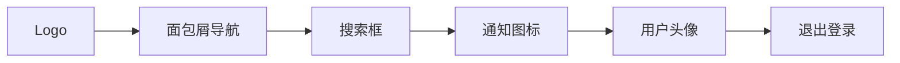
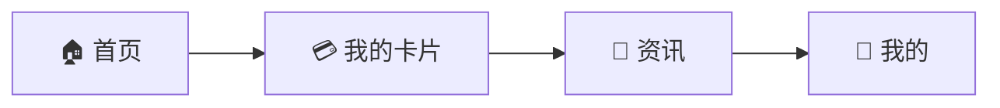

# PrimeCard Hub UI设计规范文档

## 文档信息

| 项目 | 内容 |
|------|------|
| 文档名称 | PrimeCard Hub UI设计规范 |
| 版本号 | V1.0 |
| 创建日期 | 2024-12-20 |
| 更新日期 | 2024-12-20 |
| 设计师 | UI设计团队 |
| 产品经理 | 产品团队 |

---

# 1. 设计概述

## 1.1 设计理念

PrimeCard Hub 采用现代化、简洁的设计风格，注重用户体验和信息的清晰传达。设计遵循以下核心原则：

- **简洁性**：界面简洁明了，减少用户认知负担
- **一致性**：跨平台保持设计语言的统一性
- **易用性**：操作流程简单直观，降低学习成本
- **专业性**：体现金融产品的专业性和可信度

## 1.2 设计目标

| 目标 | 描述 |
|------|------|
| 提升效率 | 管理端操作高效，C端浏览便捷 |
| 增强体验 | 流畅的交互体验，美观的视觉效果 |
| 保证一致 | 多端设计语言统一，品牌形象一致 |
| 适配性强 | 适配不同设备尺寸和平台特性 |

---

# 2. 设计系统

## 2.1 色彩系统

### 2.1.1 主色调

```css
/* 主品牌色 */
--primary-color: #1890FF;        /* 主蓝色 */
--primary-light: #40A9FF;        /* 浅蓝色 */
--primary-dark: #096DD9;         /* 深蓝色 */

/* 辅助色 */
--success-color: #52C41A;        /* 成功绿 */
--warning-color: #FAAD14;        /* 警告橙 */
--error-color: #FF4D4F;          /* 错误红 */
--info-color: #1890FF;           /* 信息蓝 */
```

### 2.1.2 中性色

```css
/* 文字颜色 */
--text-primary: #262626;         /* 主要文字 */
--text-secondary: #595959;       /* 次要文字 */
--text-disabled: #BFBFBF;        /* 禁用文字 */
--text-placeholder: #D9D9D9;     /* 占位文字 */

/* 背景颜色 */
--bg-primary: #FFFFFF;           /* 主背景 */
--bg-secondary: #FAFAFA;         /* 次背景 */
--bg-disabled: #F5F5F5;          /* 禁用背景 */

/* 边框颜色 */
--border-primary: #D9D9D9;       /* 主边框 */
--border-secondary: #F0F0F0;     /* 次边框 */
```

### 2.1.3 色彩应用示例

| 应用场景 | 颜色 | 使用说明 |
|----------|------|----------|
| 主要按钮 | #1890FF | 主要操作按钮，如"发布"、"保存" |
| 成功状态 | #52C41A | 操作成功提示，状态指示 |
| 警告提示 | #FAAD14 | 重要提醒，需要注意的信息 |
| 错误状态 | #FF4D4F | 错误提示，失败状态 |
| 链接文字 | #1890FF | 可点击的链接文字 |

## 2.2 字体系统

### 2.2.1 字体族

```css
/* 中文字体 */
font-family: -apple-system, BlinkMacSystemFont, 'Segoe UI', 'PingFang SC', 'Hiragino Sans GB', 'Microsoft YaHei', 'Helvetica Neue', Helvetica, Arial, sans-serif;

/* 数字字体 */
font-family: 'SF Mono', Monaco, Inconsolata, 'Roboto Mono', Consolas, 'Courier New', monospace;
```

### 2.2.2 字体规格

| 级别 | 字号 | 行高 | 字重 | 使用场景 |
|------|------|------|------|----------|
| H1 | 24px | 32px | 600 | 页面主标题 |
| H2 | 20px | 28px | 600 | 区块标题 |
| H3 | 16px | 24px | 600 | 小节标题 |
| Body-L | 16px | 24px | 400 | 正文大号 |
| Body-M | 14px | 22px | 400 | 正文中号 |
| Body-S | 12px | 20px | 400 | 正文小号 |
| Caption | 12px | 16px | 400 | 辅助说明 |

## 2.3 间距系统

### 2.3.1 基础间距

```css
/* 8px 基础单位 */
--space-xs: 4px;    /* 0.5x */
--space-sm: 8px;    /* 1x */
--space-md: 16px;   /* 2x */
--space-lg: 24px;   /* 3x */
--space-xl: 32px;   /* 4x */
--space-xxl: 48px;  /* 6x */
```

### 2.3.2 间距应用

| 间距 | 应用场景 |
|------|----------|
| 4px | 图标与文字间距、小元素内边距 |
| 8px | 按钮内边距、表单元素间距 |
| 16px | 卡片内边距、列表项间距 |
| 24px | 区块间距、页面内边距 |
| 32px | 大区块间距 |
| 48px | 页面顶部间距 |

## 2.4 圆角系统

```css
--radius-sm: 4px;    /* 小圆角 */
--radius-md: 8px;    /* 中圆角 */
--radius-lg: 12px;   /* 大圆角 */
--radius-xl: 16px;   /* 超大圆角 */
--radius-round: 50%; /* 圆形 */
```

## 2.5 阴影系统

```css
/* 卡片阴影 */
--shadow-sm: 0 1px 3px rgba(0, 0, 0, 0.12);
--shadow-md: 0 4px 12px rgba(0, 0, 0, 0.15);
--shadow-lg: 0 8px 24px rgba(0, 0, 0, 0.15);

/* 悬浮阴影 */
--shadow-hover: 0 2px 8px rgba(0, 0, 0, 0.15);
```

---

# 3. 管理端UI设计

## 3.1 整体布局

### 3.1.1 页面结构

```
┌─────────────────────────────────────────┐
│                 顶部导航栏                │
├─────────────┬───────────────────────────┤
│             │                           │
│   侧边导航   │        主内容区域          │
│             │                           │
│             │                           │
└─────────────┴───────────────────────────┘
```

### 3.1.2 布局规格

| 区域 | 尺寸 | 说明 |
|------|------|------|
| 顶部导航栏 | 高度64px | 固定高度，包含logo、用户信息 |
| 侧边导航 | 宽度240px | 可收缩至64px |
| 主内容区 | 自适应 | 最小宽度1200px |
| 内容边距 | 24px | 主内容区四周边距 |

## 3.2 导航设计

### 3.2.1 顶部导航栏



**设计规范：**
- 背景色：#FFFFFF
- 高度：64px
- Logo尺寸：32×32px
- 用户头像：32×32px圆形

### 3.2.2 侧边导航

**导航层级结构：**

```
📊 数据概览
📝 资讯管理
   ├── 资讯列表
   ├── 发布资讯
   └── 资讯分类
💳 信用卡管理
   ├── 卡片列表
   ├── 添加卡片
   └── 批量导入
👥 用户管理
⚙️ 系统设置
```

**交互状态：**

| 状态 | 背景色 | 文字色 | 说明 |
|------|--------|--------|------|
| 默认 | transparent | #595959 | 未选中状态 |
| 悬浮 | #F5F5F5 | #262626 | 鼠标悬浮 |
| 激活 | #E6F7FF | #1890FF | 当前选中 |

## 3.3 表单设计

### 3.3.1 表单布局

**资讯发布表单示例：**

```
┌─────────────────────────────────────────┐
│ 📝 发布资讯                              │
├─────────────────────────────────────────┤
│ 标题 *                                   │
│ [                                    ] │
│                                         │
│ 分类 *                                   │
│ [下拉选择                            ▼] │
│                                         │
│ 内容 *                                   │
│ ┌─────────────────────────────────────┐ │
│ │ Markdown编辑器                       │ │
│ │                                     │ │
│ │                                     │ │
│ └─────────────────────────────────────┘ │
│                                         │
│ 封面图片                                 │
│ [上传图片] 支持jpg、png，最大2MB          │
│                                         │
│ [ 保存草稿 ]  [ 预览 ]  [ 发布 ]        │
└─────────────────────────────────────────┘
```

### 3.3.2 表单元素规范

| 元素 | 高度 | 边框 | 圆角 | 内边距 |
|------|------|------|------|--------|
| 输入框 | 40px | 1px #D9D9D9 | 6px | 12px |
| 下拉框 | 40px | 1px #D9D9D9 | 6px | 12px |
| 文本域 | 最小120px | 1px #D9D9D9 | 6px | 12px |
| 按钮 | 40px | 无 | 6px | 16px 24px |

## 3.4 数据展示

### 3.4.1 表格设计

**资讯列表表格：**

| 列名 | 宽度 | 对齐 | 说明 |
|------|------|------|------|
| 标题 | 30% | 左对齐 | 可点击查看详情 |
| 分类 | 15% | 居中 | 标签样式显示 |
| 作者 | 15% | 居中 | 显示发布者 |
| 发布时间 | 20% | 居中 | YYYY-MM-DD HH:mm |
| 状态 | 10% | 居中 | 已发布/草稿 |
| 操作 | 10% | 居中 | 编辑/删除按钮 |

**表格样式：**
- 表头背景：#FAFAFA
- 行高：56px
- 边框：1px #F0F0F0
- 悬浮背景：#F5F5F5

### 3.4.2 卡片设计

**信用卡信息卡片：**

```
┌─────────────────────────────────────────┐
│ 💳 招商银行信用卡                        │
│                                         │
│ 卡片名称：招商银行Young卡                 │
│ 年费：免年费                             │
│ 申请条件：18-30岁                        │
│ 特色权益：餐饮5倍积分                     │
│                                         │
│ 更新时间：2024-12-20 10:30              │
│                                         │
│                    [ 编辑 ]  [ 删除 ]   │
└─────────────────────────────────────────┘
```

**卡片规范：**
- 背景：#FFFFFF
- 边框：1px #F0F0F0
- 圆角：8px
- 内边距：24px
- 阴影：0 2px 8px rgba(0,0,0,0.1)

---

# 4. C端UI设计（微信小程序）

## 4.1 整体风格

### 4.1.1 设计特点

- 遵循微信设计规范
- 简洁的卡片式布局
- 清晰的信息层级
- 便捷的操作流程

### 4.1.2 页面结构

```
┌─────────────────────────────────────────┐
│                状态栏                    │
├─────────────────────────────────────────┤
│                导航栏                    │
├─────────────────────────────────────────┤
│                                         │
│              主内容区                    │
│                                         │
├─────────────────────────────────────────┤
│               底部导航                   │
└─────────────────────────────────────────┘
```

## 4.2 底部导航

### 4.2.1 导航结构



### 4.2.2 导航规范

| 状态 | 图标色 | 文字色 | 背景 |
|------|--------|--------|------|
| 未选中 | #8C8C8C | #8C8C8C | #FFFFFF |
| 选中 | #1890FF | #1890FF | #FFFFFF |

**尺寸规范：**
- 高度：50px + 安全区域
- 图标：24×24px
- 文字：10px

## 4.3 首页设计

### 4.3.1 页面布局

```
┌─────────────────────────────────────────┐
│ 🔍 搜索信用卡                            │
├─────────────────────────────────────────┤
│ 📊 数据统计                              │
│ ┌─────────┬─────────┬─────────┬─────────┐ │
│ │ 12      │ 156     │ 89      │ 234     │ │
│ │ 我的卡片 │ 浏览资讯 │ 收藏    │ 积分    │ │
│ └─────────┴─────────┴─────────┴─────────┘ │
├─────────────────────────────────────────┤
│ 🔥 热门推荐                              │
│ ┌─────────────────────────────────────┐ │
│ │ [卡片图片] 招商银行Young卡           │ │
│ │ 年费：免年费                        │ │
│ │ 特色：餐饮5倍积分                   │ │
│ └─────────────────────────────────────┘ │
├─────────────────────────────────────────┤
│ 📰 最新资讯                              │
│ ┌─────────────────────────────────────┐ │
│ │ 📰 2024年信用卡优惠活动汇总          │ │
│ │ 💰 各大银行积分兑换攻略              │ │
│ │ 🎁 年末信用卡权益盘点               │ │
│ └─────────────────────────────────────┘ │
└─────────────────────────────────────────┘
```

### 4.3.2 组件设计

**搜索框：**
- 高度：36px
- 背景：#F7F7F7
- 圆角：18px
- 占位文字："搜索信用卡"

**统计卡片：**
- 背景：#FFFFFF
- 圆角：8px
- 内边距：16px
- 阴影：0 1px 3px rgba(0,0,0,0.1)

## 4.4 信用卡列表页

### 4.4.1 卡片设计

```
┌─────────────────────────────────────────┐
│ ┌─────────────────────────────────────┐ │
│ │ 💳 招商银行Young卡                   │ │
│ │                                     │ │
│ │ 卡号：**** **** **** 1234           │ │
│ │ 额度：¥50,000                       │ │
│ │ 账单日：每月5日                      │ │
│ │ 还款日：每月23日                     │ │
│ │                                     │ │
│ │ 状态：正常使用        [ 管理 ]       │ │
│ └─────────────────────────────────────┘ │
└─────────────────────────────────────────┘
```

### 4.4.2 卡片状态

| 状态 | 颜色 | 说明 |
|------|------|------|
| 正常使用 | #52C41A | 绿色标签 |
| 已注销 | #8C8C8C | 灰色标签 |
| 已冻结 | #FF4D4F | 红色标签 |

## 4.5 资讯详情页

### 4.5.1 页面结构

```
┌─────────────────────────────────────────┐
│ ← 2024年信用卡优惠活动汇总               │
├─────────────────────────────────────────┤
│ 📰 2024年信用卡优惠活动汇总              │
│                                         │
│ 发布时间：2024-12-20 10:30              │
│ 阅读量：1,234                           │
├─────────────────────────────────────────┤
│                                         │
│ [文章内容区域]                           │
│ 支持Markdown渲染                        │
│ - 标题                                   │
│ - 列表                                   │
│ - 图片                                   │
│ - 链接                                   │
│                                         │
├─────────────────────────────────────────┤
│ 💬 相关推荐                              │
│ • 各大银行积分兑换攻略                   │
│ • 年末信用卡权益盘点                     │
└─────────────────────────────────────────┘
```

---

# 5. C端UI设计（鸿蒙端）

## 5.1 设计适配

### 5.1.1 鸿蒙特色

- 遵循HarmonyOS设计语言
- 支持多设备协同
- 原子化服务设计
- 流畅的动效体验

### 5.1.2 与微信小程序差异

| 设计元素 | 微信小程序 | 鸿蒙端 |
|----------|------------|--------|
| 导航栏 | 微信风格 | 鸿蒙系统风格 |
| 按钮样式 | 圆角矩形 | 更圆润的设计 |
| 卡片阴影 | 轻微阴影 | 更明显的层次感 |
| 动画效果 | 简单过渡 | 丰富的动效 |

## 5.2 多设备适配

### 5.2.1 手机端

- 屏幕尺寸：4.7-6.7英寸
- 布局：单列布局
- 操作：触摸交互

### 5.2.2 平板端

- 屏幕尺寸：8-12.9英寸
- 布局：双列/多列布局
- 操作：触摸+鼠标

### 5.2.3 响应式设计

```css
/* 手机端 */
@media (max-width: 768px) {
  .card-grid {
    grid-template-columns: 1fr;
  }
}

/* 平板端 */
@media (min-width: 768px) {
  .card-grid {
    grid-template-columns: 1fr 1fr;
  }
}

/* 大屏设备 */
@media (min-width: 1024px) {
  .card-grid {
    grid-template-columns: repeat(3, 1fr);
  }
}
```

---

# 6. 组件库

## 6.1 基础组件

### 6.1.1 按钮组件

**主要按钮：**
```css
.btn-primary {
  background: #1890FF;
  color: #FFFFFF;
  border: none;
  border-radius: 6px;
  padding: 8px 16px;
  font-size: 14px;
  font-weight: 400;
}

.btn-primary:hover {
  background: #40A9FF;
}

.btn-primary:active {
  background: #096DD9;
}
```

**次要按钮：**
```css
.btn-secondary {
  background: #FFFFFF;
  color: #1890FF;
  border: 1px solid #1890FF;
  border-radius: 6px;
  padding: 8px 16px;
  font-size: 14px;
  font-weight: 400;
}
```

### 6.1.2 输入框组件

```css
.input {
  width: 100%;
  height: 40px;
  padding: 0 12px;
  border: 1px solid #D9D9D9;
  border-radius: 6px;
  font-size: 14px;
  color: #262626;
}

.input:focus {
  border-color: #1890FF;
  box-shadow: 0 0 0 2px rgba(24, 144, 255, 0.2);
}

.input::placeholder {
  color: #BFBFBF;
}
```

### 6.1.3 卡片组件

```css
.card {
  background: #FFFFFF;
  border: 1px solid #F0F0F0;
  border-radius: 8px;
  padding: 24px;
  box-shadow: 0 2px 8px rgba(0, 0, 0, 0.1);
}

.card:hover {
  box-shadow: 0 4px 12px rgba(0, 0, 0, 0.15);
}
```

## 6.2 业务组件

### 6.2.1 信用卡组件

```html
<div class="credit-card">
  <div class="card-header">
    
    <h3 class="card-name">招商银行Young卡</h3>
  </div>
  <div class="card-body">
    <div class="card-number">**** **** **** 1234</div>
    <div class="card-info">
      <span class="label">额度：</span>
      <span class="value">¥50,000</span>
    </div>
  </div>
  <div class="card-footer">
    <span class="status active">正常使用</span>
    <button class="btn-manage">管理</button>
  </div>
</div>
```

### 6.2.2 资讯卡片组件

```html
<div class="news-card">
  <div class="news-header">
    <h3 class="news-title">2024年信用卡优惠活动汇总</h3>
    <span class="news-category">优惠活动</span>
  </div>
  <div class="news-meta">
    <span class="publish-time">2024-12-20 10:30</span>
    <span class="read-count">1,234 阅读</span>
  </div>
  <div class="news-summary">
    本文汇总了2024年各大银行信用卡的优惠活动...
  </div>
</div>
```

---

# 7. 交互规范

## 7.1 动画效果

### 7.1.1 页面切换

```css
/* 页面进入动画 */
.page-enter {
  transform: translateX(100%);
  opacity: 0;
}

.page-enter-active {
  transform: translateX(0);
  opacity: 1;
  transition: all 0.3s ease;
}

/* 页面退出动画 */
.page-leave-active {
  transform: translateX(-100%);
  opacity: 0;
  transition: all 0.3s ease;
}
```

### 7.1.2 按钮交互

```css
.btn {
  transition: all 0.2s ease;
}

.btn:hover {
  transform: translateY(-1px);
  box-shadow: 0 4px 8px rgba(0, 0, 0, 0.15);
}

.btn:active {
  transform: translateY(0);
}
```

## 7.2 反馈机制

### 7.2.1 加载状态

| 场景 | 反馈方式 | 持续时间 |
|------|----------|----------|
| 页面加载 | 骨架屏 | 直到内容加载完成 |
| 按钮操作 | 按钮loading | 操作完成前 |
| 列表加载 | 底部loading | 数据加载期间 |
| 图片加载 | 占位图 | 图片加载完成前 |

### 7.2.2 错误处理

```html
<!-- 网络错误 -->
<div class="error-state">
  
  <h3>网络连接失败</h3>
  <p>请检查网络设置后重试</p>
  <button class="btn-retry">重试</button>
</div>

<!-- 空数据 -->
<div class="empty-state">
  
  <h3>暂无数据</h3>
  <p>还没有添加任何信用卡</p>
  <button class="btn-add">添加信用卡</button>
</div>
```

---

# 8. 响应式设计

## 8.1 断点设置

```css
/* 移动端 */
@media (max-width: 767px) {
  /* 手机样式 */
}

/* 平板端 */
@media (min-width: 768px) and (max-width: 1023px) {
  /* 平板样式 */
}

/* 桌面端 */
@media (min-width: 1024px) {
  /* 桌面样式 */
}

/* 大屏幕 */
@media (min-width: 1440px) {
  /* 大屏样式 */
}
```

## 8.2 布局适配

### 8.2.1 网格系统

```css
.container {
  max-width: 1200px;
  margin: 0 auto;
  padding: 0 16px;
}

.row {
  display: flex;
  flex-wrap: wrap;
  margin: 0 -8px;
}

.col {
  flex: 1;
  padding: 0 8px;
}

/* 响应式列 */
.col-12 { width: 100%; }
.col-6 { width: 50%; }
.col-4 { width: 33.333%; }
.col-3 { width: 25%; }

@media (max-width: 767px) {
  .col-sm-12 { width: 100%; }
}
```

---

# 9. 无障碍设计

## 9.1 颜色对比度

确保所有文字与背景的对比度符合WCAG 2.1 AA标准：

| 文字大小 | 最小对比度 |
|----------|------------|
| 正常文字 | 4.5:1 |
| 大号文字 | 3:1 |

## 9.2 键盘导航

- 所有交互元素支持Tab键导航
- 焦点状态清晰可见
- 支持Enter和Space键操作

## 9.3 屏幕阅读器

- 为图片添加alt属性
- 使用语义化HTML标签
- 提供aria-label属性

---

# 10. 设计交付

## 10.1 设计文件

### 10.1.1 Figma文件结构

```
PrimeCard Hub 设计文件/
├── 🎨 Design System/
│   ├── Colors
│   ├── Typography
│   ├── Components
│   └── Icons
├── 💻 管理端/
│   ├── 登录页
│   ├── 数据概览
│   ├── 资讯管理
│   └── 信用卡管理
├── 📱 微信小程序/
│   ├── 首页
│   ├── 我的卡片
│   ├── 资讯列表
│   └── 个人中心
└── 🔷 鸿蒙端/
    ├── 首页
    ├── 我的卡片
    ├── 资讯列表
    └── 个人中心
```

## 10.2 切图规范

### 10.2.1 图片格式

| 用途 | 格式 | 说明 |
|------|------|------|
| 图标 | SVG | 矢量图标，支持缩放 |
| 照片 | JPG | 压缩比高，适合照片 |
| 透明图片 | PNG | 支持透明背景 |
| 动画 | GIF/Lottie | 简单动画用GIF，复杂动画用Lottie |

### 10.2.2 图片尺寸

**图标尺寸：**
- 16×16px（小图标）
- 24×24px（常用图标）
- 32×32px（大图标）
- 48×48px（应用图标）

**图片尺寸：**
- 封面图：750×400px
- 头像：120×120px
- 银行Logo：60×60px

---

# 11. 开发对接

## 11.1 设计标注

使用Figma Dev Mode或蓝湖进行设计标注，包含：

- 尺寸标注
- 颜色值
- 字体规格
- 间距信息
- 动画参数

## 11.2 组件库

提供完整的组件库文档，包含：

- 组件API
- 使用示例
- 样式变量
- 交互状态

## 11.3 验收标准

### 11.3.1 视觉还原度

- 布局结构：100%还原
- 颜色规范：100%还原
- 字体规格：100%还原
- 间距规范：误差≤2px

### 11.3.2 交互体验

- 动画效果：流畅自然
- 响应速度：≤300ms
- 操作反馈：及时准确

---

**文档结束**

> 本UI设计规范文档为PrimeCard Hub项目提供了完整的视觉设计指南，涵盖了管理端和C端（微信小程序、鸿蒙端）的所有设计规范。文档包含设计系统、组件库、交互规范等内容，为开发团队提供了详细的实现指导。